# Web框架和Django基础

今日概要：

- 网络底层引入，到底什么是web框架？
- 常见web框架对比
- django快速上手（创建网站）
- 常见操作：虚拟环境、django项目、多app应用、纯净版
- 逐点剖析：路由、视图、模板、静态文件、ORM


## 1.web框架底层


### 1.1 网络通信

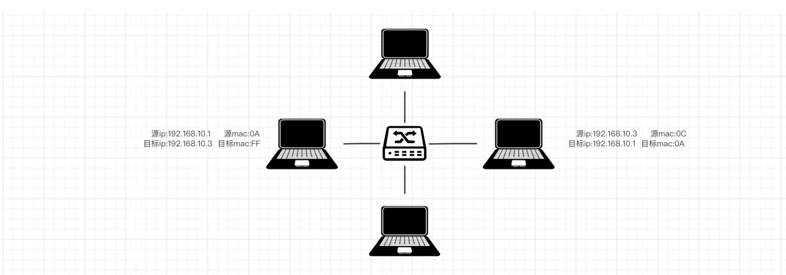

注意：局域网。


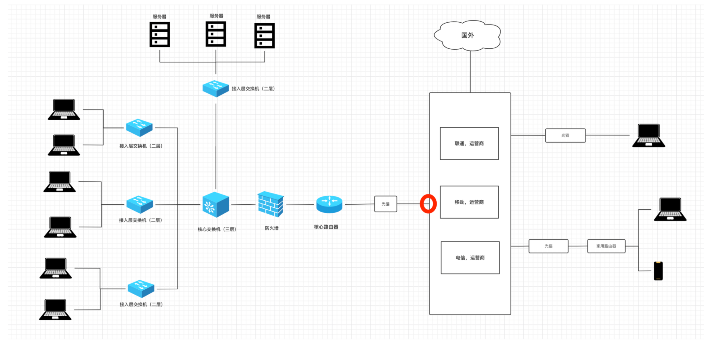

个人一般写程序，想要让别人访问：阿里云、腾讯云。

- 去云平台租服务器（含公网IP）
- 程序放在云服务器


让网络中可以互相通信的双发收发数据。

- 我的电脑【服务端】

  ```python
  import socket
  
  # 1.监听本机的IP和端口
  sock = socket.socket(socket.AF_INET, socket.SOCK_STREAM)
  sock.setsockopt(socket.SOL_SOCKET, socket.SO_REUSEADDR, 1)
  sock.bind(('192.168.10.3', 8001))  # 我自己的电脑IP，端口8001
  
  # 2.让多少人等待
  sock.listen(5)
  
  while True:
      # 3.等待连接请求的申请，有人来连接（阻塞）
      conn, addr = sock.accept()
  
      # 4.连接成功后立即发送
      conn.sendall("欢迎使用xx系统".encode("utf-8"))
  
      # 5.断开连接
      conn.close()
  
  
  # 6.停止服务端程序
  sock.close()
  ```

- 女朋友的电脑（同一个局域网）【客户端】

  ```python
  import socket
  
  # 1. 向指定IP发送连接请求
  client = socket.socket(socket.AF_INET, socket.SOCK_STREAM)
  client.connect(('192.168.10.3', 8001))
  
  # 2. 接收你发的消息
  message = client.recv(1024)
  print(message.decode("utf-8"))
  
  # 3.断开连接
  client.close()
  ```

- 姓王的好兄弟【客户端】

  ```python
  import socket
  
  # 1. 向指定IP发送连接请求
  client = socket.socket(socket.AF_INET, socket.SOCK_STREAM)
  client.connect(('192.168.10.3', 8001))
  
  # 2. 接收你发的消息
  message = client.recv(1024)
  print(message.decode("utf-8"))
  
  # 3.断开连接
  client.close()
  ```

  

  

  我们自己写时，通过socket模块可以实现网络上的两端进行通信。


### 1.2 常见软件架构

- bs架构

  ```
  浏览器：充当客户端
  服务器：网站
  ```

- cs架构，开发应用程序，例如：QQ、Pycharm、网易云音乐（安装在电脑上的软件）

  ```
  客户端：安装在电脑上的软件。 网易云音乐
  服务端：网易服务器
  ```

  

对于程序原来说：

- 网站，只需要写服务端程序。

  ```
  基于django开发的本质就是网站（web应用）
  电脑上浏览器本质上是socket实现网络通信。
  ```

- 软件，客户端 + 服务端。


### 1.3 手撸web框架

快速自己写以为网站（不能用django、flask等）。

```python
import socket

# 1.监听本机的IP和端口
sock = socket.socket(socket.AF_INET, socket.SOCK_STREAM)
sock.setsockopt(socket.SOL_SOCKET, socket.SO_REUSEADDR, 1)
sock.bind(('192.168.0.6', 9000))  # 我自己的电脑IP，端口8001

# 2.让多少人等待
sock.listen(5)

while True:
    # 3.等待连接请求的申请，有人来连接（阻塞） -> 登录浏览器来连接我
    conn, addr = sock.accept()

    # 4.收到浏览器发送的消息
    buf = conn.recv(2048)
    print(buf)

    # 5.给浏览器返回数据
    conn.send(b"HTTP/1.1 200 OK\r\n\r\n")
    conn.send(b"Hello, World")

    # 6.断开连接
    conn.close()

# 6.停止服务端程序
sock.close()
```


再引出一个知识点，浏览器再与服务端的网站进行通信时，多了几个规则。

- 服务端：网站

- 客户端：浏览器

  - 创建连接

  - 发送数据，固定格式

    ```
    # 请求头首行
    GET /xxx/xxx/?name=xxx&age=111 HTTP/1.1\r\n
    
    # 请求头
    Host: 192.168.0.6:9000\r\n
    Connection: keep-alive\r\n
    Upgrade-Insecure-Requests: 1\r\n
    User-Agent: Mozilla/5.0 (Macintosh; Intel Mac OS X 10_15_7) AppleWebKit/537.36 (KHTML, like Gecko) Chrome/102.0.0.0 Safari/537.36\r\n
    Accept: text/html,application/xhtml+xml,application/xml;q=0.9,image/avif,image/webp,image/apng,*/*;q=0.8,application/signed-exchange;v=b3;q=0.9\r\n
    Accept-Encoding: gzip, deflate\r\n
    Accept-Language: zh-CN,zh;q=0.9,en;q=0.8,zh-TW;q=0.7\r\n\r\n'
    ```

    ```
    # 请求头首行
    POST /xxx/xxx/ HTTP/1.1\r\n
    
    # 请求头
    Host: 192.168.0.6:9000\r\n
    Connection: keep-alive\r\n
    Upgrade-Insecure-Requests: 1\r\n
    User-Agent: Mozilla/5.0 (Macintosh; Intel Mac OS X 10_15_7) AppleWebKit/537.36 (KHTML, like Gecko) Chrome/102.0.0.0 Safari/537.36\r\n
    Accept: text/html,application/xhtml+xml,application/xml;q=0.9,image/avif,image/webp,image/apng,*/*;q=0.8,application/signed-exchange;v=b3;q=0.9\r\n
    Accept-Encoding: gzip, deflate\r\n
    Accept-Language: zh-CN,zh;q=0.9,en;q=0.8,zh-TW;q=0.7\r\n\r\n
    # 请求体
    username=admin&password=123
    ```

    ```
    浏览器本质上发送请求时，包含请求头和请求体。
    - GET请求
    	- 只有请求头 + 没有请求体
    	- 请求头之间用 \r\n
    	- 请求头和请求体之间用 \r\n\r\n
    	
    - POST请求
    	- 只有请求头 + 有请求体
    	- 请求头之间用 \r\n
    	- 请求头和请求体之间用 \r\n\r\n
    ```

  - 一次请求和一次响应后，断开连接。


告诉你两个关键点：

- http协议？

  ```
  http协议特点：无状态的短连接。
  http的应用：浏览器向服务端发送请求，就是按照http协议来的。
  	- 请求头+请求体 ；请求头和请求体之间用 \r\n\r\n ；请求头之间用 \r\n
  	- 一次请求和一次响应后，断开连接。  -> 短连接。  ->无状态如何体现？
  	- 后期记住 请求头+cookie
  ```

- GET请求和POST到底有什么区别？

  


## 2.web框架

常见的web框架：django、flask、tornado、sanic、fastapi..

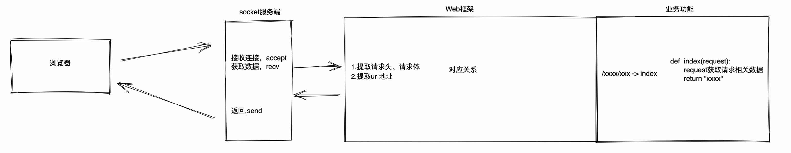

web应用程序：

- 用户网络通信的socket
- web框架
- 业务开发


以django为例：

- wsgiref模块、uwsgi、daphne    -> 本质上都是socket实现。
- 原来实现了框架


以flask为例：

- werkzurg、uwsgi、...
- flask框架


以tornado为例：

- tornado、werkzurg、uwsgi、...
- 框架


### 2.1 wsgiref

```python
from wsgiref.simple_server import make_server


def run_server(environ, start_response):
    start_response('200 OK', [('Content-Type', 'text/html')])
    return [bytes('<h1>Hello, web!</h1>', encoding='utf-8'), ]


if __name__ == '__main__':
    httpd = make_server('127.0.0.1', 8000, run_server)
    httpd.serve_forever()
```


### 2.2 werkzeug

```
pip install werkzeug
```

```python
from werkzeug.wrappers import Response


def application(environ, start_response):
    response = Response('Hello World!', mimetype='text/plain')
    return response(environ, start_response)


if __name__ == '__main__':
    from werkzeug.serving import run_simple

    run_simple('localhost', 4000, application)
```


### 2.3 各框架的区别

```
django、flask、tornado、sanic、fastapi..
```

- 内部集成功能的多少
  - django，内部提供了很多组件。 【相对大】
  - flask、tornado、sanic、fastapi...  本身自己功能很少+第三方组件。【相对小】

- 同步框架 vs 异步非阻塞

  - 异步非阻塞：tornado、sanic、fastapi、django

  - 同步：django、flask、bottle、webpy..

    ```
    1.django、flask
    2.tornado，异步非阻塞，特别NB。
    	- 同步：常见应用。
    	- 异步：IO应用 + conroutine装饰器 + redis/MySQL/...
    3.sanic，路飞小猿圈平台
    4.fastapi
    	- 参考flask
    	- py最新注解
    	- restfulAPI
    	- 异步
    	
    目前不看好：
    	- 增加编程的难度，功能&效率
    	- 项目中不会有那么IO操作 ---> 100功能/2-IO ---> celery
    ```


感受不深刻，只是听我讲完了，鬼吹这么NB东西到底是怎么实现的？

- socket & 多线程 & 多进程
- **IO多路复用**
- 顿悟

```
https://www.cnblogs.com/admin/p/6536518.html
```


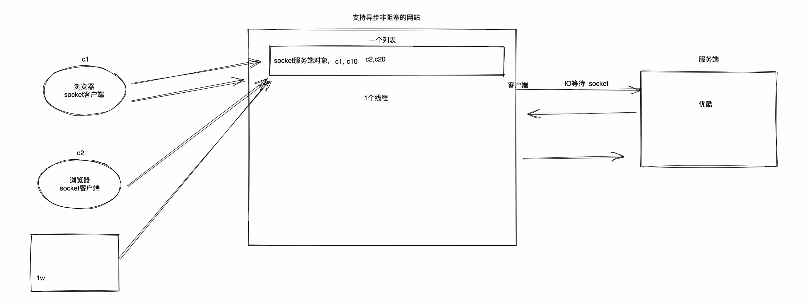


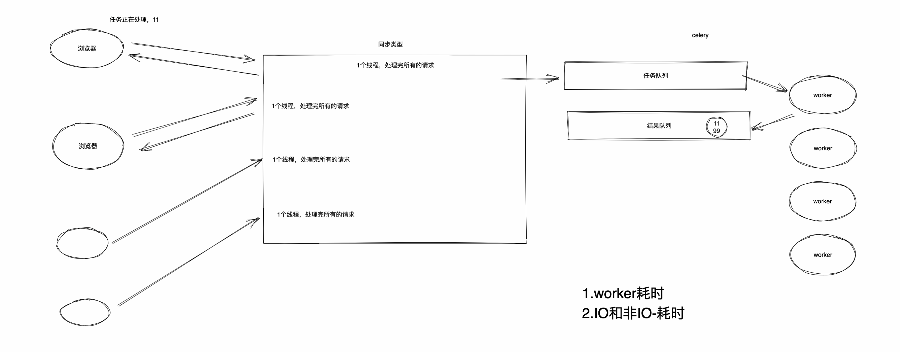


## 小结

1. django项目开发，在局域网部署访问。所有人访问云服务器。
2. bs架构、cs架构。
3. 基于socket实现web框架（所有web框架的祖宗）
4. 常见web框架的区别。
   - 功能
   - 异步非阻塞


## 3.快速上手django框架


### 3.1 安装

```
pip install django==3.2
```

```
C:\Python39
	- python.exe
	- Scripts
		- pip.exe
		- django-admin.exe
	- Lib
		- re.py
		- random.py
		- site-pakages
			- django==3.2
			  ...
```


### 3.2 命令行

- 创建项目

  ```
  cd 指定目录
  django-admin startproject mysite(项目名)
  ```


  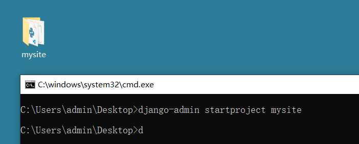

  

  ```
  mysite
  ├── manage.py              [项目的管理工具]  
  └── mysite
      ├── __init__.py
      ├── settings.py        【配置文件，只有一部分。程序启动时，先读取django内部配置，再读settings.py】
      ├── urls.py			   【主路由，在里面编写  /xxx/xxx/xxx ---> index 】
      ├── asgi.py            【异步】
      └── wsgi.py            【同步，主】
  ```

- 编写代码 urls.py

  ```python
  from django.contrib import admin
  from django.urls import path
  from django.shortcuts import HttpResponse
  
  def info(requst):
      print("请求来了")
      return HttpResponse("xxxx")
  
  urlpatterns = [
      path('admin/', admin.site.urls),
      path('api/index/', info),
  ]
  
  ```
  
- 运行

  ```python
  cd 项目
  python3.9 manage.py runserver
  python3.9 manage.py runserver 127.0.0.1:8000
  python3.9 manage.py runserver 127.0.0.1:9000
  ```

  

  效果如下：

  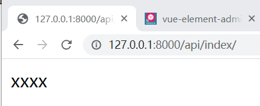

  

- app概念

  ```python
  cd 项目
  python manage.py startapp 名字
  ```

  ```
  mysite
  ├── manage.py              [项目的管理工具]  
  ├── web
      ├── __init__.py
      ├── views.py           [视图函数]
      ├── models.py          [ORM，基于models可以对数据库进行简便的操作]
      ...
  └── mysite
      ├── __init__.py
      ├── settings.py        【配置文件，只有一部分。程序启动时，先读取django内部配置，再读settings.py】
      ├── urls.py			   【主路由，在里面编写  /xxx/xxx/xxx ---> index 】
      ├── asgi.py            【异步】
      └── wsgi.py            【同步，主】
  ```

  ```
  mysite
  ├── manage.py
  ├── mysite
  │   ├── __init__.py
  │   ├── asgi.py
  │   ├── settings.py
  │   ├── urls.py
  │   └── wsgi.py
  └── web
      ├── __init__.py
      ├── admin.py
      ├── apps.py
      ├── migrations
      │   └── __init__.py
      ├── models.py
      ├── tests.py
      └── views.py
  ```


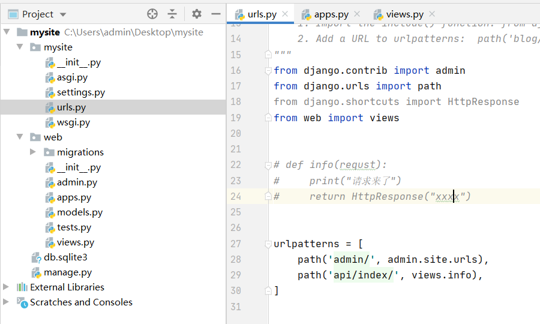


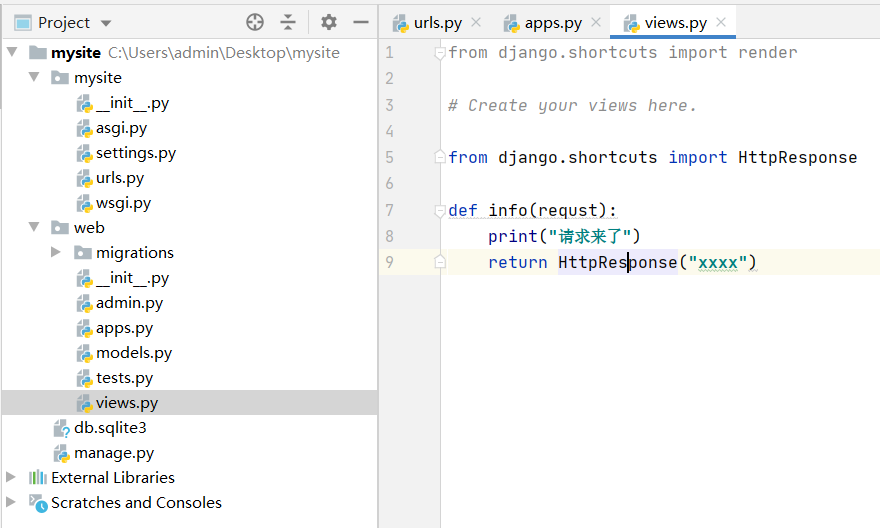


### 3.3 Pycharm

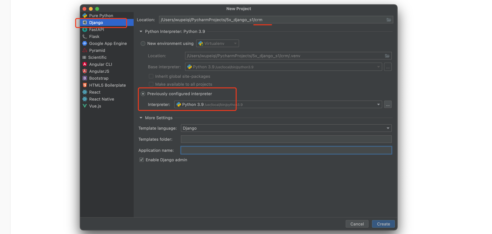

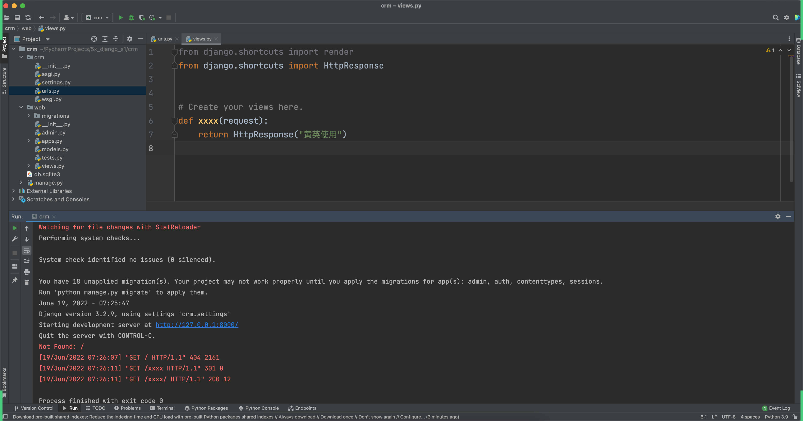


```
django-admin startproject 项目名称

cd 项目目录
python manage.py startapp
python manage.py runserver
```


## 4.虚拟环境

下面的是系统环境：

```python
C:\Python39
	- python.exe
	- Scripts
		- pip.exe
	- Lib
		- re.py
		- random.py
		- site-pakages
```


虚拟出来的环境：

```
D:\envs\crm
	- python.exe
	- Scripts
		- activate.exe   用于激活环境
		- pip.exe
	- Lib
		- re.py
		- random.py
		- site-pakages
			- requests
			- django
			- flask
			- tornado
```

让上面的虚拟环境和下面的项目进行绑定：
```
D:\coding\crm
	crm
		manage.py
		crm
			settings.py
```


再虚拟出来一个虚拟环境：

```
D:\envs\city
	- python.exe
	- Scripts
		- activate.exe
		- pip.exe
	- Lib
		- re.py
		- random.py
		- site-pakages
			request
			...
			....
```

```
D:\coding\city
	crm
		manage.py
		crm
			settings.py
```


注意：以后再创建项目时，不要一直用系统解释器，为每个项目：虚拟环境 + 项目文件。


### 4.1 创建虚拟环境 - 命令行

- venv，Python官方用于创建虚拟环境的工具。

  ```
  cd xxx/xxx/crm
  python3.9 -m venv ddd
  python3.7 -m venv xxxx
  python3.7 -m venv /xxx/xxx/xxx/xx/ppp
  ```

- virtualenv 【推荐】

  ```
  pip install virtualenv
  ```

  ```
  cd /xxx/xx/
  virtualenv ddd --python=python3.9
  ```

  ```python
  virtualenv /xxx/xx/ddd --python=python3.7
  ```


操作：

- 在 `F:\envs\` 创建虚拟环境。

  ```
  cd F:\envs
  virtualenv crm --python=python3.9
  ```

  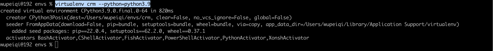

- 激活虚拟环境

  - win

    ```
    cd F:\envs\crm\Scripts
    activate
    ```

  - mac

    ```
    source /虚拟环境目录/bin/activate
    ```

    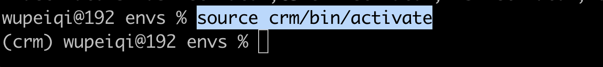

- 安装包

  ```
  pip install 包名
  ```

- 创建django项目   `D:\project\crm`

  ```
  cd D:\project
  django-admin startproject crm
  ```

  ```
  D:\project\crm
  ├── manage.py              [项目的管理工具]  
  └── crm
      ├── __init__.py
      ├── settings.py        【配置文件，只有一部分。程序启动时，先读取django内部配置，再读settings.py】
      ├── urls.py			   【主路由，在里面编写  /xxx/xxx/xxx ---> index 】
      ├── asgi.py            【异步】
      └── wsgi.py            【同步，主】
  ```

  ```
  python manage.py startapp xxxx
  python manage.py runserver 
  ```

- 退出虚拟环境

  ```
  deactivate
  ```

  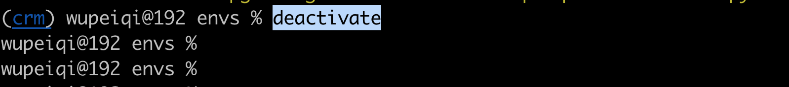

  


### 4.2 Pycharm


#### 4.2.1 项目+虚拟环境


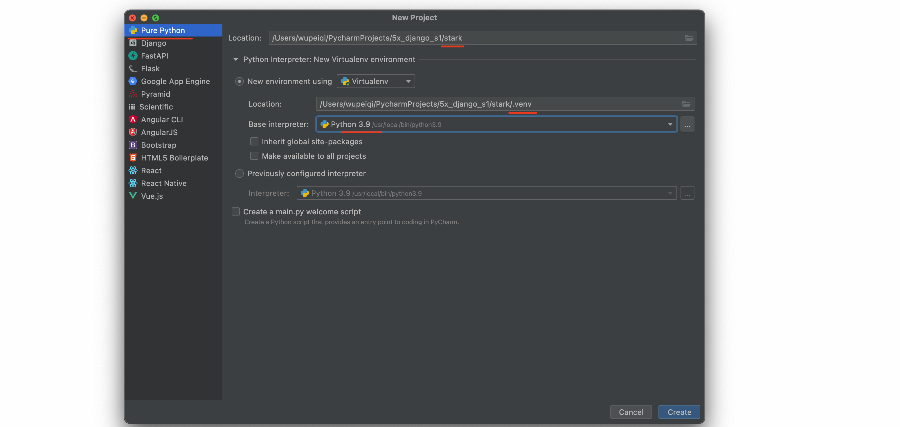


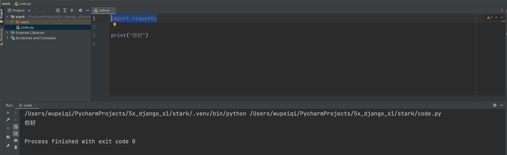


你需要做的：

- 创建项目+虚拟环境

- code.py，写代码运行

- 在虚拟环境中安装 requests   

  ```
  pip install requests
  ```

  

#### 4.2.2 django+虚拟环境【最新】

```
pip install django
```

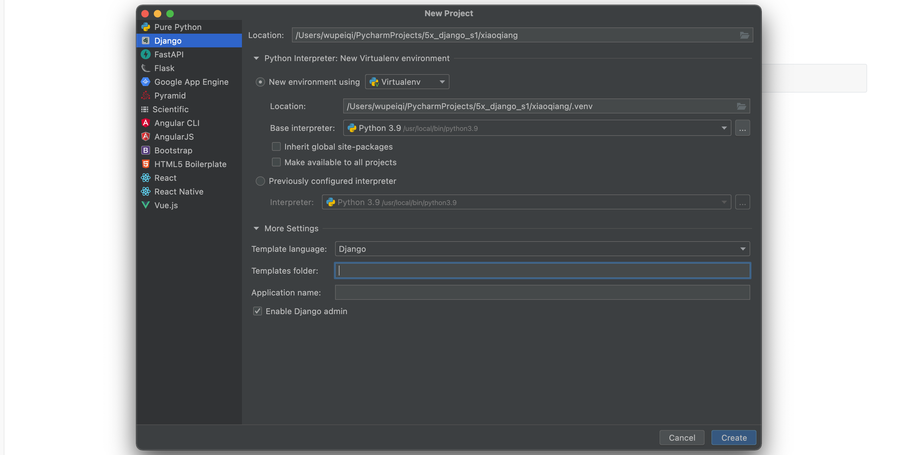


注意：创建django最新版可以。


#### 4.2.3 django+虚拟环境【指定版本】

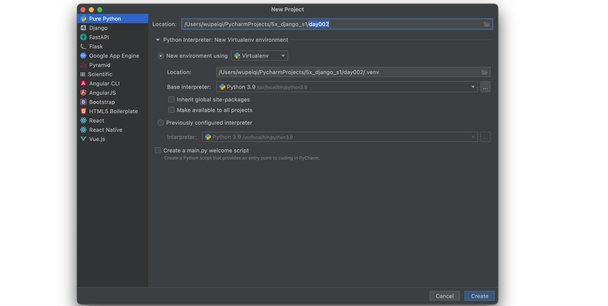


```
pip install django==3.2
```


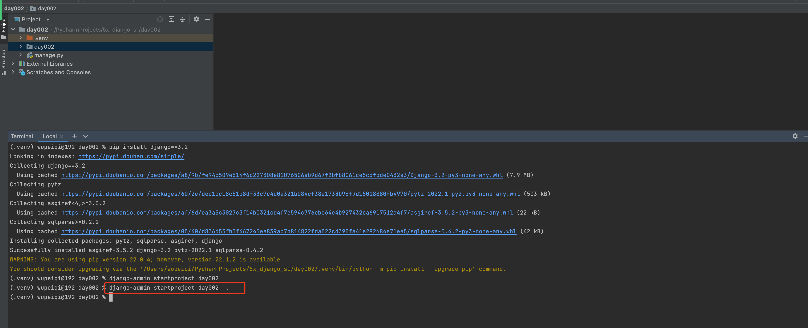


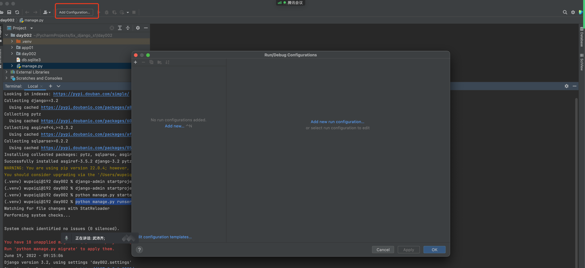

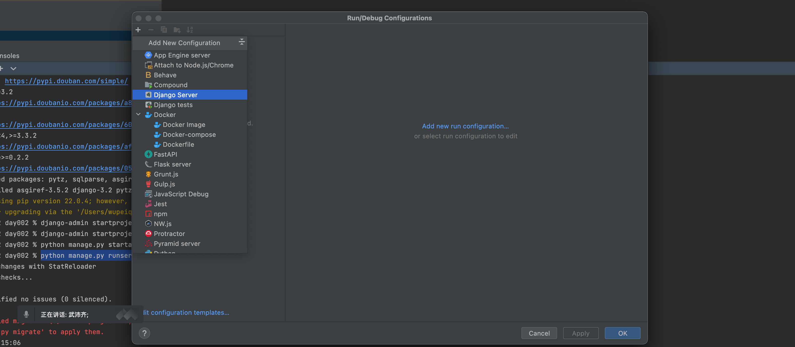

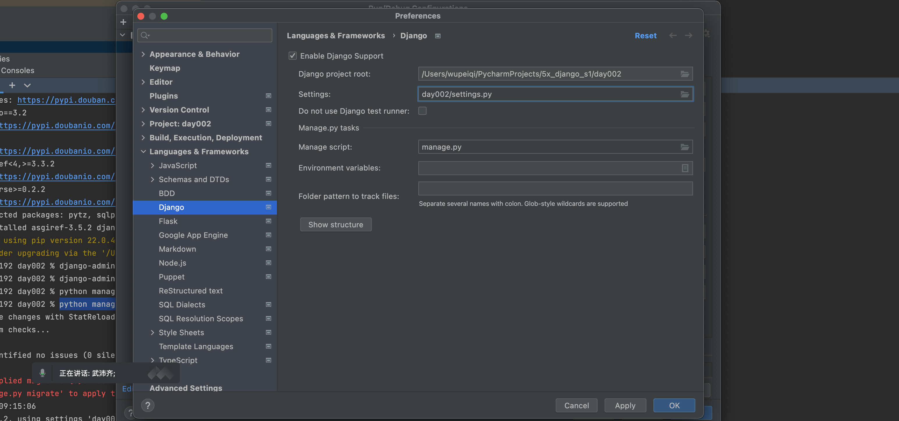


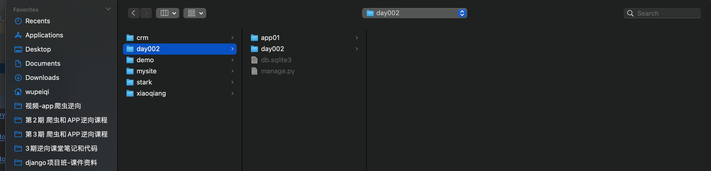


## 小结

1. 快速使用django + 目录结构（系统解释器）

2. 虚拟环境

   - 命令行

     ```
     virtualenv 环境名 --python=python3.9
     ```

     ```
     环境目录/Scripts/activate
     ```

     ```
     pip install django
     pip install requests
     ...
     ```

     创建django项目

     ```
     django-admin ...
     ...
     ```

   - pycharm项目+虚拟环境

3. python+django+3.2版本

   - 先创建纯净的项目 + 虚拟环境（代码+环境放在，.venv）

     ```
     D:\code\crm
     	- .venv
     ```

   - 再次虚拟环境中创建django

     ```
     pip install django==3.2
     ```

   - 创建项目

     ```
     cd 项目根目录
     django-admin startproject crm .
     ```

     ```
     D:\code\crm
     	- .venv
     	- manage.py
     	- crm
     		...
     		..
     ```

   - 命令行

     ```
     python manage.py startapp app01
     python manage.py startapp app02
     
     python manage.py runserver
     ```

   - 为了更方便运行，pycharm配置。


## 5.关于创建app

- 项目只需要一个app，目录机构的建议。

  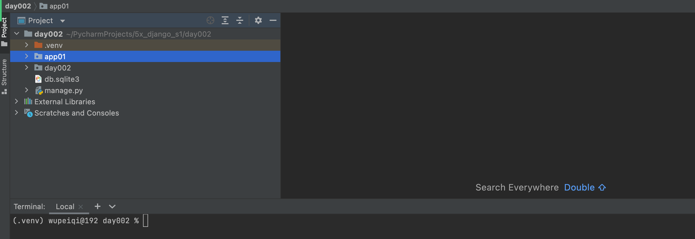

- 项目只需要一个app，目录结构的建议。

  ```python
  day002
  	.venv
      day002
      	...
          ...
      manage.py
      apps
      	web
          backend
          api
  ```

  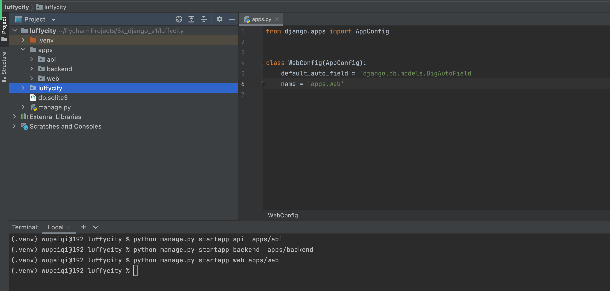

  

  

## 6.关于纯净版

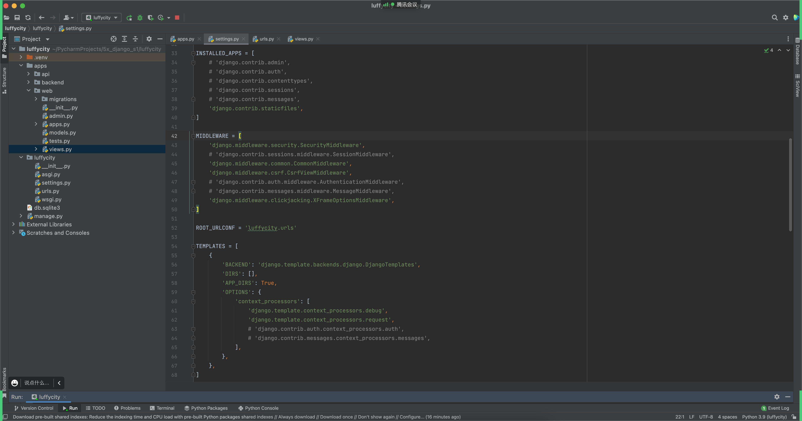


## 总结

知道如何基于pycharm+虚拟环境+业务场景 -> 创建django项目。

问题：给别人的代码+`requirements.txt`


## 任务

1. 笔记，翻遍翻阅。

2. 懂，web框架的本质即可，不要手写。

3. 动手操作

   - 系统解释器，django项目+编写URL和视图+运行+访问 （命令）
   - 虚拟环境 + Python项目
   - 虚拟环境 + django只有一个app的项目
   - 虚拟环境 + django只有多个app的项目

4. 模拟场景

   - 给别人项目

     ```
     pip freeze > requirements.txt
     压缩文件，排除虚拟环境。
     ```

   - 要一个项目

     ```
     虚拟环境 + 安装依赖 + 运行项目
     ```

5. 其他

   - 自己设计自己的需求和功能（页面有什么功能）
   - 预习django3视频


特殊说明：

```
- 项目 & 虚拟环境，都不要有中文路径。
- pycharm不要汉化
- 用专业版 -> 激活（2020/2021/2022）
```


