# django进阶-知识点

今日概要：

- 模板
- 中间件
- ORM操作（pymysql + SQL语句）
- session和cookie
- 缓存（很多种方式）


## 内容回顾

- 请求周期

  - 路由系统

    - 最基本路由关系
    - 动态路由（含正则）
    - 路由分发不同的app中 + include + 本质 + name + namespace

  - 视图

    - 类和函数（FBV和CBV）

    - 参数 request

      - 请求数据
      - 自定义数据

    - 响应

      ```
      HttpResponse/JsonResponse/render/redirect
      return HttpResponse("...")
      
      响应头
      obj = HttpResponse("...")
      obj['xxxxx'] = "值"
      return obj
      ```

- 其他知识

  - 虚拟环境

  - 纯净版项目，内置app功能去掉。

  - 多app，嵌套到apps目录。

  - pycharm创建django项目 + 虚拟环境

    - 最新的django项目
    - 低版本（环境+项目+django文件模板）

  - settings配置

    ```
    django默认settings [先加载] 500
    项目目录settings    [后加载] 20
    ```

  - 静态资源

    - 静态文件，项目必备【项目根目录，每个app目录下static - app注册顺序】
    - 媒体文件，用户上传


## 1.模板


### 1.1 寻找html模板

```python
TEMPLATES = [
    {
        'BACKEND': 'django.template.backends.django.DjangoTemplates',
        'DIRS': [os.path.join(BASE_DIR, 'templates')],
        'APP_DIRS': True,
        'OPTIONS': {
            'context_processors': [
                'django.template.context_processors.debug',
                'django.template.context_processors.request',
                # 'django.contrib.auth.context_processors.auth',
                # 'django.contrib.messages.context_processors.messages',
            ],
        },
    },
]
```

优先去项目根目录 ，然后去每个已注册的app的templates目录找。


如何选择：

- 简单的项目，模板都放在根目录。
- 复杂的项目，模板放在各自的app中，公共部分放在templates目录。


扩展：修改内置app的模板也是同样的套路。


### 1.2 模板处理的本质

渲染完成后，生成了字符串，再返回给浏览器。所以index.html也可以叫index.txt。之所以写成html，是因为在html文件中有提示。渲染是指可以在html文件中添加一些django的标识符。所以是在服务端渲染完后返回给浏览器。

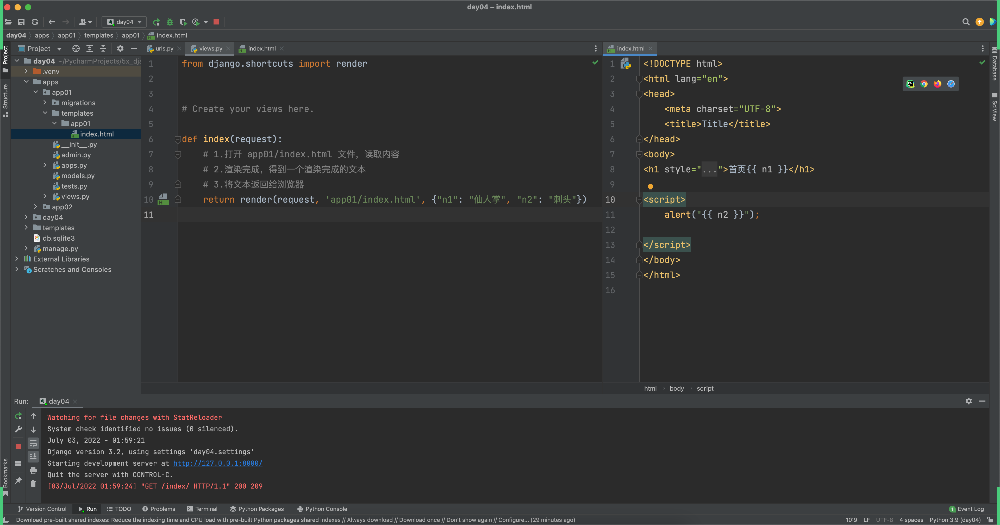

在app01下面创建static，下面创建app01，在app01下面创建v1.js。  v1.js中并不会完成替换，数据放在html文件和放在js文件是完全不一样的。

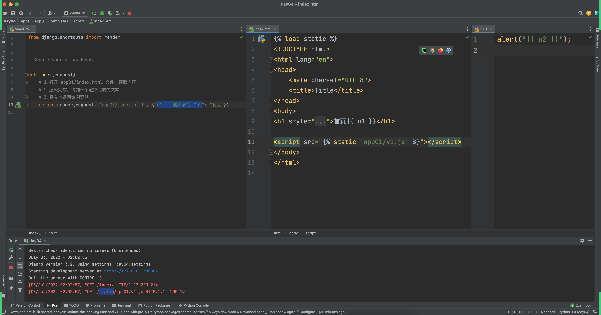


### 1.3 常用语法

```python
class Person(object):
    def __init__(self, name, age):
        self.name = name
        self.age = age

    def get_data(self):
        return "哈哈哈哈哈"


def fetch_data():
    return "我是一个函数"


def gen_data():
    yield 123
    yield 456
    yield 789


def index(request):
    context = {
        "n1": "仙人掌",
        "n2": [11, 22, 33, 44],
        "n3": {
            "name": "武沛齐",
            "age": 19,
        },
        'n4': [
            {"id": 1, "name": "新晨1", "age": 18},
            {"id": 2, "name": "新晨2", "age": 18},
            {"id": 3, "name": "新晨3", "age": 18},
            {"id": 4, "name": "新晨4", "age": 18},
        ],
        "n5": Person("江春", 19),
        "n6": fetch_data,
        "n7": gen_data,
        'n8': "zhangkai",
        "n9": datetime.datetime.now(),
        "n10": datetime.datetime.now().strftime("%Y-%m-%d"),
        "n11": [
            {"id": 1, "name": "xinchen1", "age": 18},
            {"id": 2, "name": "xinchen2", "age": 18},
            {"id": 3, "name": "xinchen3", "age": 18},
            {"id": 4, "name": "xinchen4", "age": 18},
        ],
        "n12": 18
    }
    return render(request, 'app01/index.html', context)
```


```html

<!DOCTYPE html>
<html lang="en">
<head>
    <meta charset="UTF-8">
    <title>Title</title>
</head>
<body>
<h1 style="color:red;">首页{{ n1 }}</h1>
<p>{{ n2.0 }}</p>
<p>{{ n2.1 }}</p>
<ul>
    
        <li>{{ e }}</li>
    
</ul>
<hr/>

<p>{{ n3.name }}</p>
<p>{{ n3.age }}</p>
<ul>
    
        <li>{{ k }} = {{ v }}</li>
    
</ul>

<hr/>

<table border="1">
    
        <tr>
            <td>{{ info.id }}</td>
            <td>{{ info.name }}</td>
            <td>{{ info.age }}</td>
        </tr>
    
</table>

<hr/>
<p>{{ n5.name }}</p>
<p>{{ n5.age }}</p>
<p>{{ n5.get_data }}</p>
<hr/>
<p>{{ n6 }}</p>
<hr/>
<p>{{ n7 }}</p>
<ul>
    
        <li>{{ item }}</li>
    
</ul>
<hr/>

</body>
</html>

```


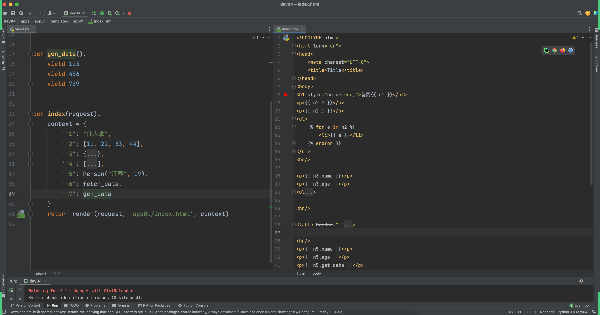


### 1.4 内置函数

在django模板语法中提供了内置函数让我们来。


### 1.5 自定义模板功能

- 自定义filter（只有一个参数）
- 自定义simple_tag（参数可以有多个）
- 自定义inclusion_tag

在app01下面创建templatetags，这个名字是固定的，在其下创建jp.py文件，如下：

from django import template

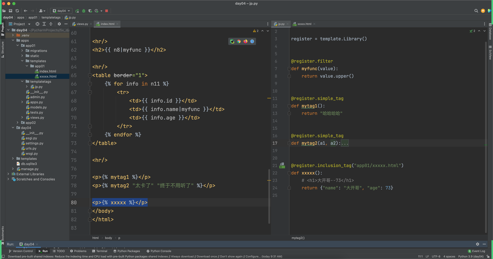

filter有时候往往更方便。

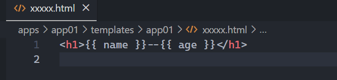


三种方式：

-  filter

  ```
  - 数据处理，参数：1~2个
  - 数据处理，if条件
  ```

-  simple_tag

  ```
  参数无限制 & 返回文本
  ```

-  inclusion_tag

  ```
  参数无限制 & HTML片段
  ```


需求来了：根据用户权限不同显示不同的菜单。


### 1.6 继承和母版

layout.html中放在根目录下面的template下面。home是放在apps/app01/templates/app01/home.html。

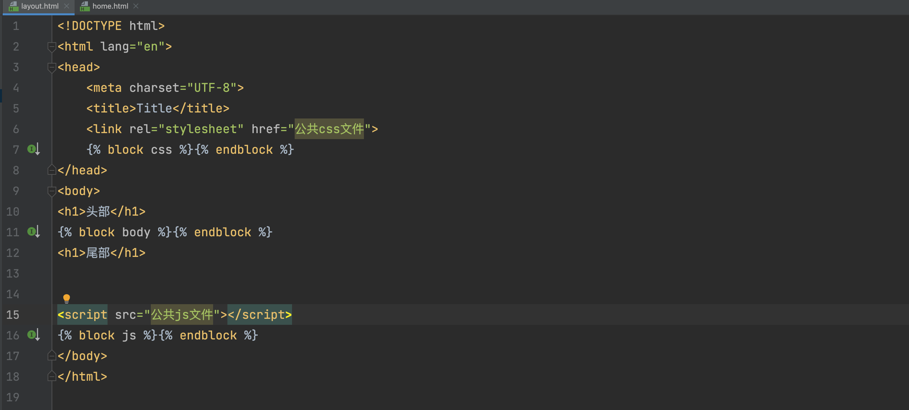

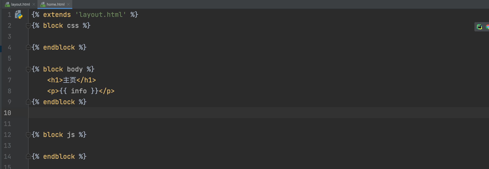

一般情况下，要写这三块。


### 1.7 模板的导入

header.html如下：


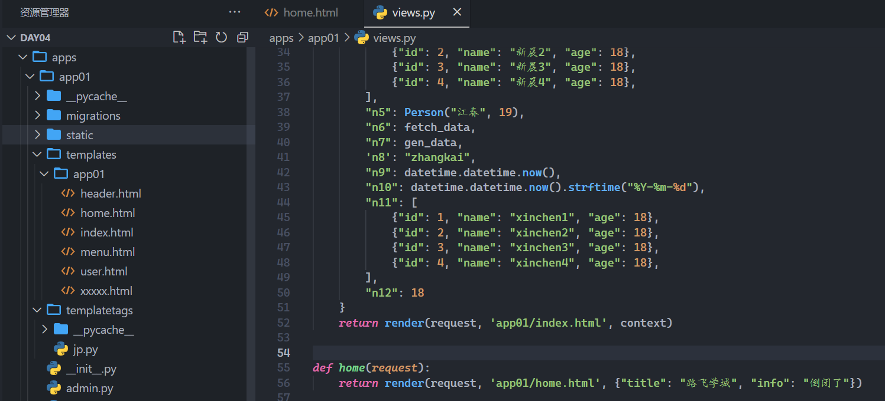

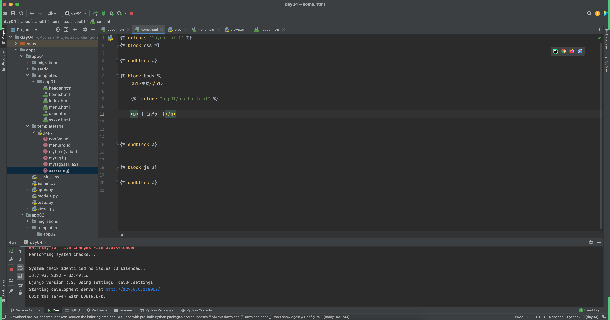


## 2.django中间件

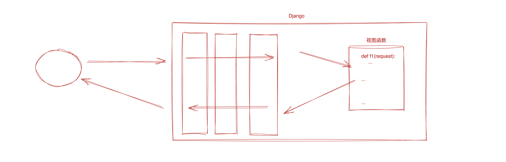

- 类（视图是以函数显示，中间件通过以类来显示）
- 定义方法
- 注册

### 2.1 原始方式（一般不用）

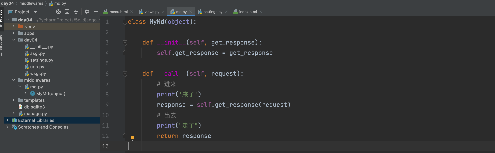

注册中间件，如下：

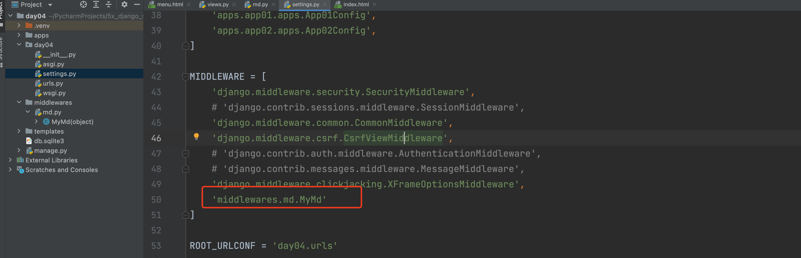


### 2.2 MiddlewareMixin（建议）

在源码的基本上使用中间件，如下：

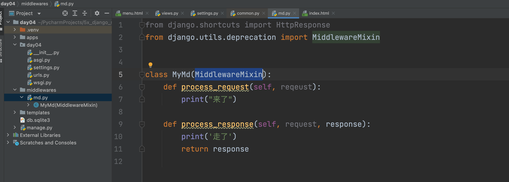

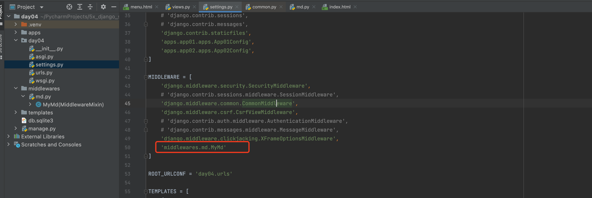

注意：在django1版本中没有MiddlewarsMixin的。


单独拿出来，看一下源码：

- 面向对象

  ```python
  class MyMd(object):
      def __init__(self....):
          pass
      
      def __call__(self,....):
          pass
          
  django内部默认执行call方法，传入参数。django内部就会执行call方法，不要纠结这个，除非你去研究源码。
  ```

- 反射

  ```python
  class MyMd(object):
      def __init__(self....):
          pass
      
      def __call__(self,....):
          if hasattr(self,'process_request'):
              response = self.process_request(request)
  		...
       
  django内部默认执行call方法，传入参数。
  ```

  ```python
  class MiddlewareMixin:
      def __init__(self, get_response=None):
          self.get_response = get_response
          
      def __call__(self, request):
          response = None
          if hasattr(self, 'process_request'):
              response = self.process_request(request)
          response = response or self.get_response(request)
          if hasattr(self, 'process_response'):
              response = self.process_response(request, response)
          return response
      
      
  class MyMd(MiddlewareMixin):
      
      def process_request(self,request):
          ...
      
      def process_response(self,request, response):
          ...
      
  django内部默认执行call方法，传入参数。
  ```


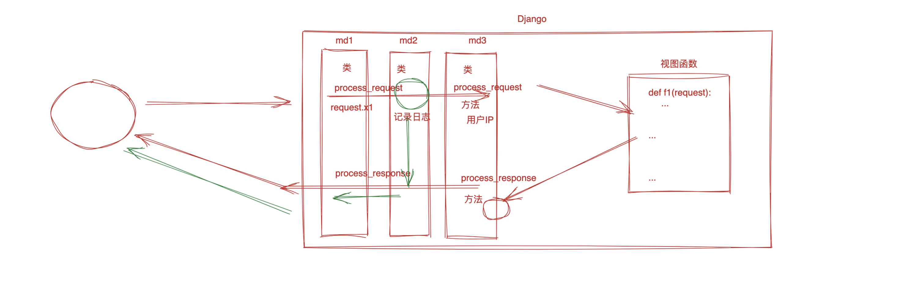

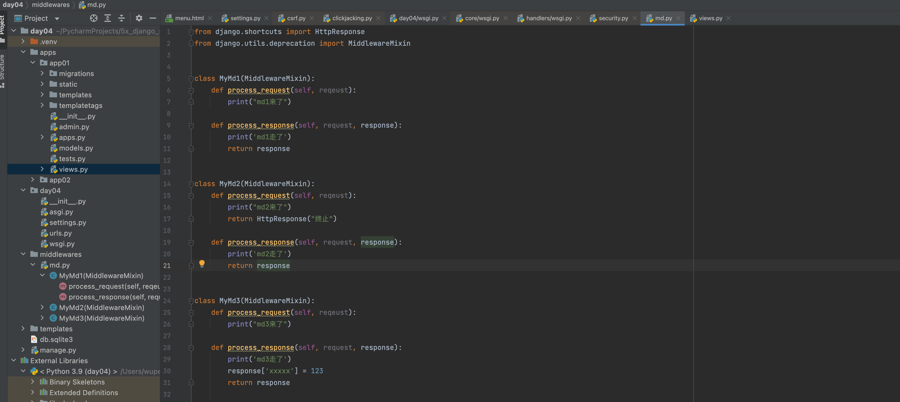


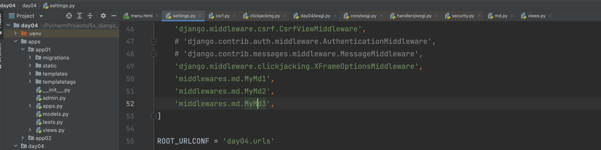


**疑问**：prcess_request的执行时，是否已执行了路由匹配？

request.resolver_match（只有路由匹配成功才有） 答：没有，这个值是None.


**注意**：prcess_request和process_reponse都是我们在__call中构造出来的，但是process_view是在django中源码中写死了。

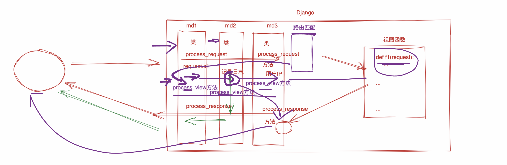


### 2.3 其他

还有两个，基本上用不到：

- process_template_response
- process_exception

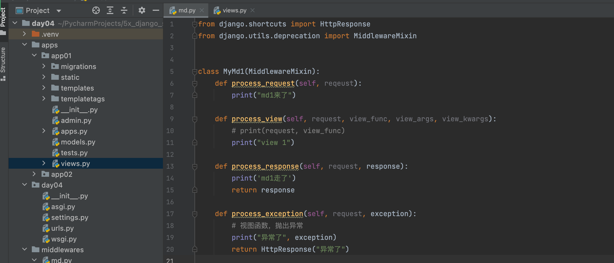

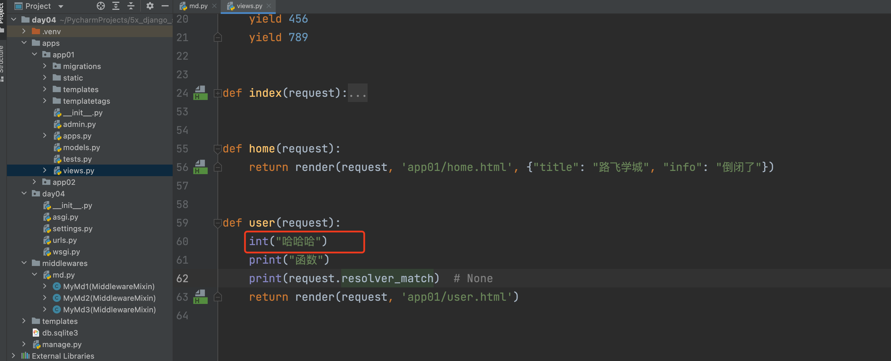


### 小结

- 定义中间类
- 类方法
  - process_request (最常用)
  - process_view（最常用）
  - process_reponse（最常用）
  - process_exception，视图函数出现异常，自定义异常页面。
  - process_template_response，视图函数返回`TemplateResponse`对象  or  对象中含有.render方法。

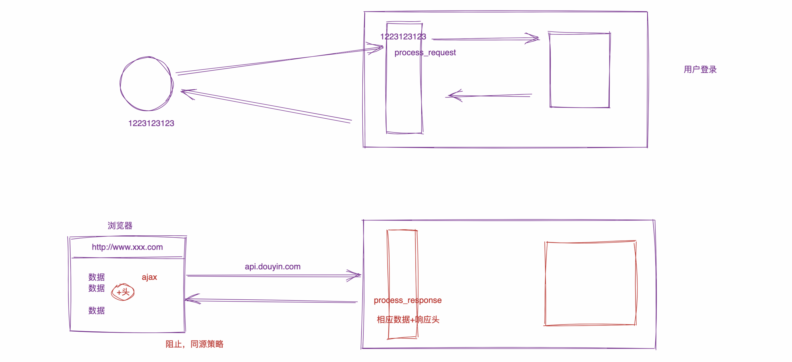


同源策略：数据回来了，只是浏览器给限制了，无法得到。


## 3.ORM操作

orm，关系对象映射，本质翻译的。

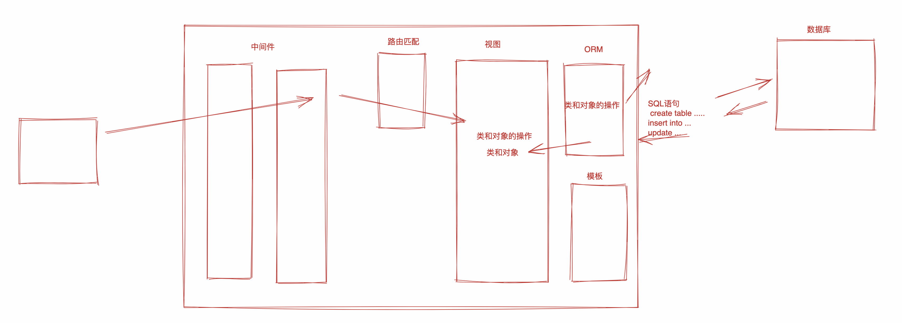


### 3.1 表结构

实现：创建表、修改表、删除表。

在app01中的models.py中按照规则编写类    ===> 表结构。

- 编写类

  ```python
  from django.db import models
  
  # 会自动生成id列   表名是app01_userinfo
  # 有三个字段：id   name   age  
  class UserInfo(models.Model):
      name = models.CharField(max_length=16)
      age = models.IntegerField()
  ```

- 注册app

  ```python
  INSTALLED_APPS = [
      # 'django.contrib.admin',
      # 'django.contrib.auth',
      # 'django.contrib.contenttypes',
      # 'django.contrib.sessions',
      # 'django.contrib.messages',
      'django.contrib.staticfiles',
      'apps.app01.apps.App01Config',
      'apps.app02.apps.App02Config',
  ]
  ```

- 命令，django根据models中类生成一个 `对数据库操作的配置文件` => `migrations`

  ```
  python manage.py makemigrations
  ```

  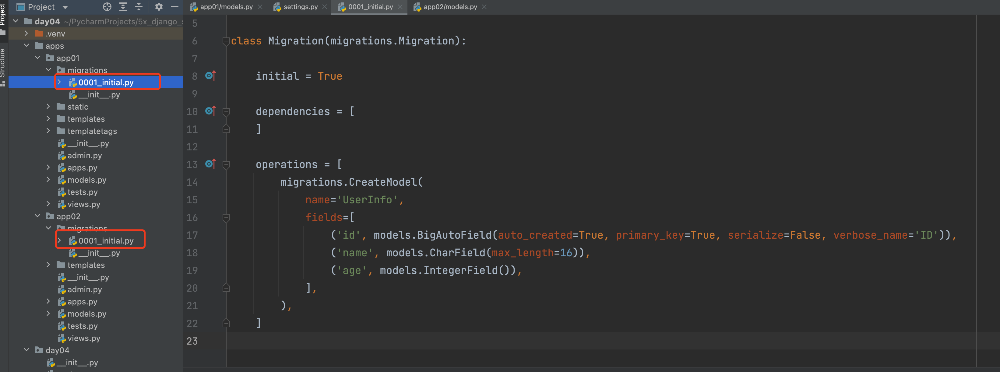

- 命令，读取已经注册么给app中的migrations目录将配置文件  -> 转换成：生成表，修改表 SQL -> 连接数据库去运行。

  ```python
  python manage.py migrate
  ```

  - 那个数据库？
  - 数据库账户和密码?

  ```python
  DATABASES = {
      'default': {
          'ENGINE': 'django.db.backends.sqlite3',  # 引擎 sqlite3是一个文件数据库
          'NAME': os.path.join(BASE_DIR, 'db.sqlite3'),
      }
  }
  ```

  点一下小扳手，下载对应的驱动。默认就有三张表，不用管他。
  
  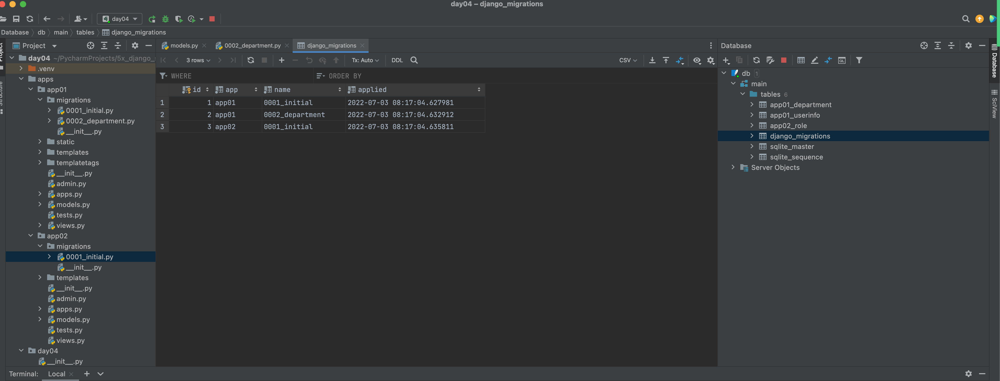


**常见问题**：请不要再手动去修改数据的表结构 + 时刻保证 ORM和数据表是对应。


#### 3.1.1 常见字段和参数

- 字段

  ```
  CharField
  
  SmallIntegerField
  IntegerField
  BigIntegerField
  
  DateField
  DateTimeField
  
  BooleanField  -> 其实数据库不支持真假，根据SmallIntegerField创造出来出来。 0  1
  
  DecimalField  -> 精确的小数
  ```

- 参数

  ```python
  # verbose_name类似备注
  name = models.CharField(verbose_name="姓名", max_length=16)
  name = models.CharField(verbose_name="姓名", max_length=16, default="哈哈哈")
  
  # 经常查询，速度快（MySQL，https://www.bilibili.com/video/BV15R4y1b7y9）
  name = models.CharField(verbose_name="姓名", max_length=16, default="哈哈哈", null=True, blank=True, db_index=True)
  email = models.CharField(verbose_name="姓名", max_length=16, default="哈哈哈", null=True, blank=True, unique=True)
  
  # 在数据库存储时只能是：sh、bj （上海、北京一般用于页面显示中文）
  code = models.CharField(verbose_name="姓名", max_length=16, choices=(("sh", "上海"), ("bj", "北京")),default="sh")
  ```
```
  
  ```python
  # 不用 max_length=16
  count = models.IntegerField(verbose_name="数量", default=1, null=True, blank=True, unique=True)
  code = models.IntegerField(verbose_name="性别",choices=((1, "男"), (2, "女")),default=1)
```

  ```python
  register_date = models.DateField(verbose_name="注册时间", auto_now=True)
  ```

  ```python
  amount = models.DecimalField(verbose_name="余额", max_digits=10, decimal_places=2)
  ```


示例：

```python
from django.db import models


class UserInfo(models.Model):
    name = models.CharField(verbose_name="姓名", max_length=16, db_index=True)
    age = models.PositiveIntegerField(verbose_name="年龄")  # 正整型
    email = models.CharField(verbose_name="邮箱", max_length=128, unique=True)
    amount = models.DecimalField(verbose_name="余额", max_digits=10, decimal_places=2, default=0)
    register_date = models.DateField(verbose_name="注册时间", auto_now=True)


class Goods(models.Model):
    title = models.CharField(verbose_name="标题", max_length=32)
    # detail = models.CharField(verbose_name="详细信息", max_length=255)
    detail = models.TextField(verbose_name="详细信息")
    price = models.PositiveIntegerField(verbose_name="价格")
    count = models.PositiveBigIntegerField(verbose_name="库存", default=0)
```


#### 3.1.2 表关系

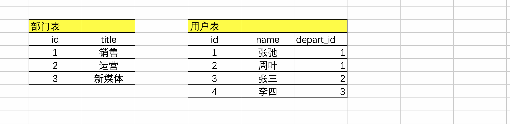

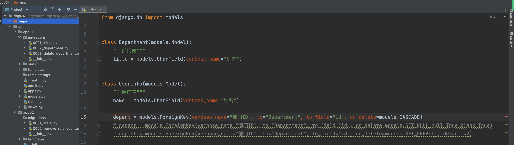


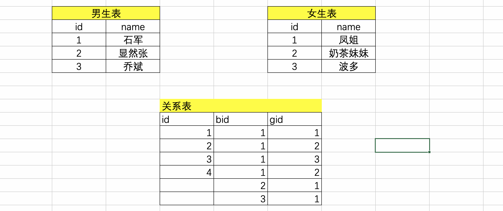

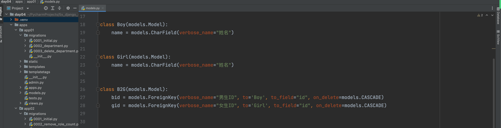


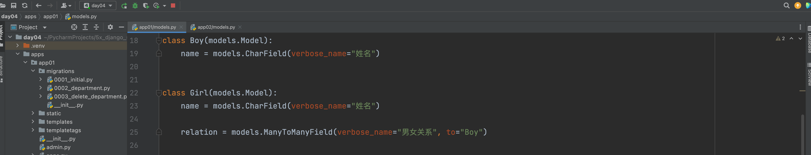

注意：ManyToManyField生成的表字段只能id/bid/gid


#### 小结

设计自己项目的业务时，理清楚表与表之间的关系。

强调：设计项目表结构：表名和字段都不要拼音。


### 3.2 数据

实现：增删改查。


## 任务

- 知识点
- 自己的项目设计表结构，自己设计。
  - 项目功能描述
  - 表结构
    - 设计图（提交）
    - ORM类（主要）


提交形式：zip包 -> markdown编写。

---

```
下节预告：
	orm数据操作、cookie和session、缓存、刷票平台（表结构设计）、用户管理、用户+权限菜单
```


