# 知识点+项目

今日概要：

* ORM相关
* session和cookie
* 缓存
* 项目：
  + 功能需求
  + 表结构
  + 功能实现

## 1.orm

### 1.1 基本操作

orm，关系对象映射。

```
类      --> SQL -->     表
对象    --> SQL -->     数据
```

特点：开发效率高、执行效率低（ 程序写的垃圾SQL ）。

编写ORM操作的步骤：

* settings.py，连接数据库

  

```python
  DATABASES = {
      'default': {
          'ENGINE': 'django.db.backends.sqlite3',
          'NAME': BASE_DIR / 'db.sqlite3',
      }
  }
  ```

* settings.py，注册app

  

```
  INSTALLED_APP = [
  	...
  	"app01.apps.App01Config"
  ]
  ```

* 编写models. 类

  

```python
  class UserInfo(models.Model):
      ....
      .....
  ```

* 执行命令

  

```
  python manage.py makemigrations    # 找到所有已注册的app中的models.py中的类读取 -> migrations配置
  python manage.py migrate           # 读取已注册的app下的migrations配置 -> SQL语句  -> 同步数据库
  ```

  

### 1.2 连接数据库

```python
DATABASES = {
    'default': {
        'ENGINE': 'django.db.backends.sqlite3',
        'NAME': BASE_DIR / 'db.sqlite3',
    }
}
```

```python
DATABASES = {
    'default': {
        'ENGINE': 'django.db.backends.mysql',
        'NAME': 'xxxxxxxx',  # 数据库名字
        'USER': 'root',
        'PASSWORD': 'root123',
        'HOST': '127.0.0.1',  # ip
        'PORT': 3306,
    }
}
```

项目连接MySQL：

* 安装MySQL & 启动MySQL服务

* 手动创建数据库

* django的settings.py配置

  

```python
  DATABASES = {
      'default': {
          'ENGINE': 'django.db.backends.mysql',
          'NAME': 'xxxxxxxx',  # 数据库名字
          'USER': 'root',
          'PASSWORD': 'root123',
          'HOST': '127.0.0.1',  # ip
          'PORT': 3306,
      }
  }
  ```

* 安装第三方组件

  + pymysql

    

```
    pip install pymysql
    ```

    

```
    项目根目录/项目名目录/__init__.py
    	import pymysql
    	pymysql.install_as_MySQLdb()
    ```

  + mysqlclient

    

```
    pip install mysqlclient
    ```

    

```
    电脑上先提前安装MySQL。
    ```

    

其他数据库：

```python
DATABASES = {
    'default': {
        'ENGINE': 'django.db.backends.postgresql',
        'NAME': 'mydatabase',
        'USER': 'mydatabaseuser',
        'PASSWORD': 'mypassword',
        'HOST': '127.0.0.1',
        'PORT': 5432,
    }
}

# 需要 pip install psycopg2
```

```python
DATABASES = {
	'default': {
        'ENGINE': 'django.db.backends.oracle',
        'NAME': "xxxx",  # 库名
        "USER": "xxxxx",  # 用户名
        "PASSWORD": "xxxxx",  # 密码
        "HOST": "127.0.0.1",  # ip
        "PORT": 1521,  # 端口
    }
}
# 需要 pip install cx-Oracle
```

### 1.3 连接池

django默认内置没有数据库连接池 。

```
pymysql   -> 操作数据库
DBUtils   -> 连接池
```

https://pypi.org/project/django-db-connection-pool/

```
pip install django-db-connection-pool
```

```python
DATABASES = {
    "default": {
        'ENGINE': 'dj_db_conn_pool.backends.mysql',
        'NAME': 'day04',  # 数据库名字
        'USER': 'root',
        'PASSWORD': 'root123',
        'HOST': '127.0.0.1',  # ip
        'PORT': 3306,
        'POOL_OPTIONS': {
            'POOL_SIZE': 10,  # 最小
            'MAX_OVERFLOW': 10,  # 在最小的基础上，还可以增加10个，即：最大20个。
            'RECYCLE': 24 * 60 * 60,  # 连接可以被重复用多久，超过会重新创建，-1表示永久。
            'TIMEOUT':30, # 池中没有连接最多等待的时间。
        }
    }
}
```

注意：组件 `django-db-connection-pool` 不是特别厉害。拿了另外一个支持SQLAchemy数据库连接池的组件。

### 1.4 多数据库

django支持项目连接多个数据库。

```python
DATABASES = {
    "default": {
        'ENGINE': 'dj_db_conn_pool.backends.mysql',
        'NAME': 'day05db',  # 数据库名字
        'USER': 'root',
        'PASSWORD': 'root123',
        'HOST': '127.0.0.1',  # ip
        'PORT': 3306,
        'POOL_OPTIONS': {
            'POOL_SIZE': 10,  # 最小
            'MAX_OVERFLOW': 10,  # 在最小的基础上，还可以增加10个，即：最大20个。
            'RECYCLE': 24 * 60 * 60,  # 连接可以被重复用多久，超过会重新创建，-1表示永久。
            'TIMEOUT': 30,  # 池中没有连接最多等待的时间。
        }
    },
    "bak": {
        'ENGINE': 'dj_db_conn_pool.backends.mysql',
        'NAME': 'day05bak',  # 数据库名字
        'USER': 'root',
        'PASSWORD': 'root123',
        'HOST': '127.0.0.1',  # ip
        'PORT': 3306,
        'POOL_OPTIONS': {
            'POOL_SIZE': 10,  # 最小
            'MAX_OVERFLOW': 10,  # 在最小的基础上，还可以增加10个，即：最大20个。
            'RECYCLE': 24 * 60 * 60,  # 连接可以被重复用多久，超过会重新创建，-1表示永久。
            'TIMEOUT': 30,  # 池中没有连接最多等待的时间。
        }
    },
}
```

#### 1.4.1 读写分离

```
192.168.1.2       default master   [写]
                  组件
192.168.2.12      bak slave    [读]
```

* 生成数据库表

  

```
  python manage.py makemigrations    # 找到所有已注册的app中的models.py中的类读取 -> migrations配置
  
  python manage.py migrate
  python manage.py migrate --database=default
  python manage.py migrate --database=bak
  ```

* 后续再进行开发时

  

```python
  models.UserInfo.objects.using("default").create(title="admin")
  
  models.UserInfo.objects.using("bak").all()
  ```

* 编写router类，简化【后续再进行开发时】

  

```python
  class DemoRouter(object):
      
      def db_for_read(...):
          return "bak"
      
      def db_for_write(...):
          return "default"
  ```

  

```
  router = ["DemoRouter"]
  ```

  

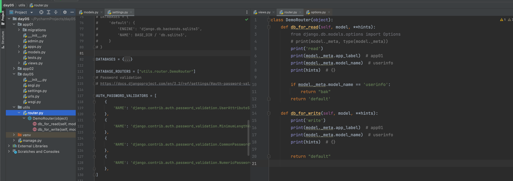

  

#### 1.4.2 分库（多个app ->多数据库）

100张表，50表-A数据库【app02】；50表-B数据库【app02】。

* app01/models

  

```python
  from django.db import models
  
  
  class UserInfo(models.Model):
      title = models.CharField(verbose_name="标题", max_length=32)
  
  ```

* app02/models

  

```python
  from django.db import models
  
  
  class Role(models.Model):
      title = models.CharField(verbose_name="标题", max_length=32)
  ```

* 命令

  

```python
  python manage.py makemigrations
  ```

  

```
  python manage.py migrate app01 --database=default
  ```

  

```
  python manage.py migrate app02 --database=bak
  ```

  

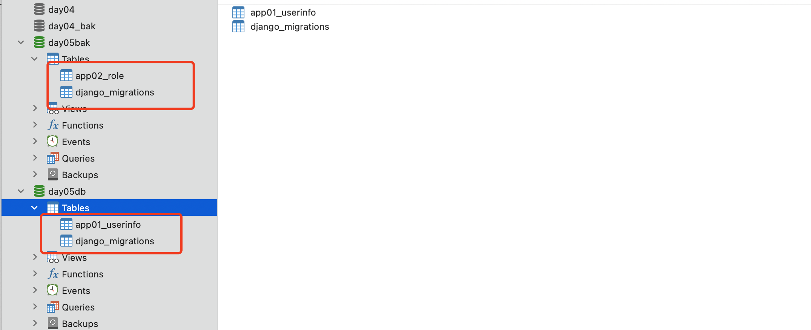

* 读写操作

  

```python
  from django.shortcuts import render, HttpResponse
  
  from app01 import models as m1
  from app02 import models as m2
  
  
  def index(request):
      # app01中的操作 -> default
      v1 = m1.UserInfo.objects.all()
      print(v1)
  
      # app02中的操作 -> bak
      v2 = m2.Role.objects.using('bak').all()
      print(v2)
      return HttpResponse("返回")
  ```

* router

  

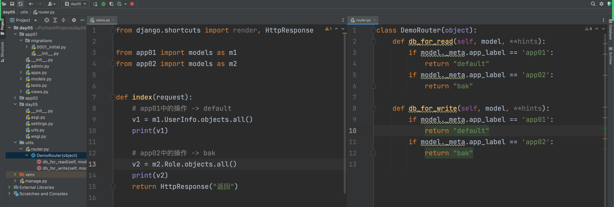

  

  

  

#### 1.4.3 分库（单app）

100张表，50表-A数据库；50表-B数据库。

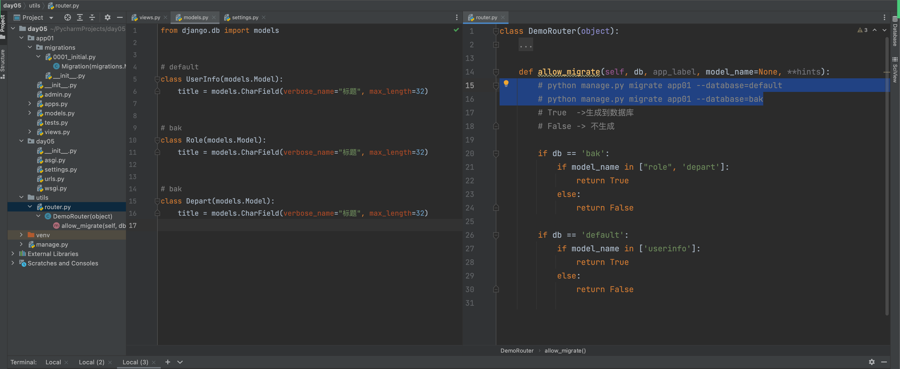

```python
from django.shortcuts import render, HttpResponse

from app01 import models as m1

def index(request):
    # app01中的操作 -> default
    v1 = m1.UserInfo.objects.all()
    print(v1)

    # app01中的操作 -> bak
    v2 = m1.Role.objects.using('bak').all()
    print(v2)

    return HttpResponse("返回")
```

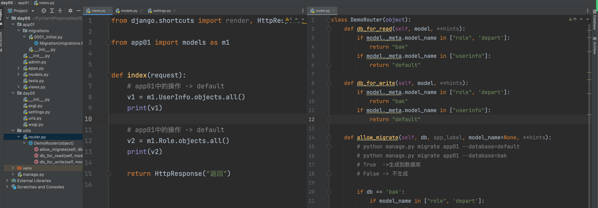

#### 1.4.4 注意事项

* 分库，表拆分到不用数据库。

  

```
  一定不要跨数据库做关联  -> django不支持
  
  怎么办？
  尽可能的将有关联的表放在一个库中。
  ```

  

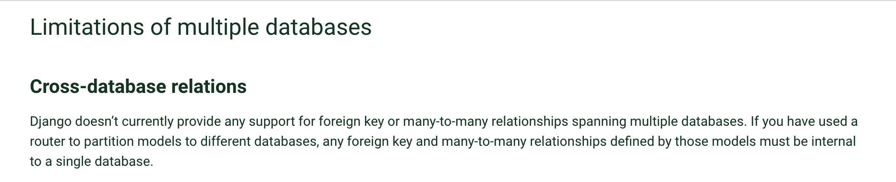

* 为什么表拆分到不同的库？

  

### 1.5 表关系

* 单表

  

```python
  class Role(models.Model):
      title = models.CharField(verbose_name="标题", max_length=32)
  ```

* 一对多

  

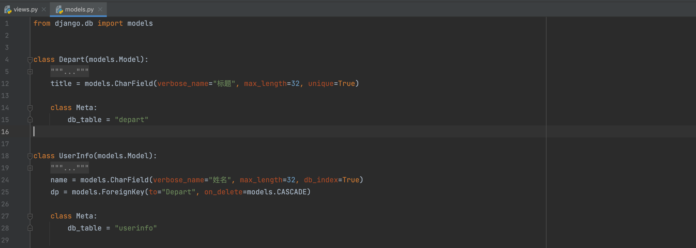

* 多对多
  

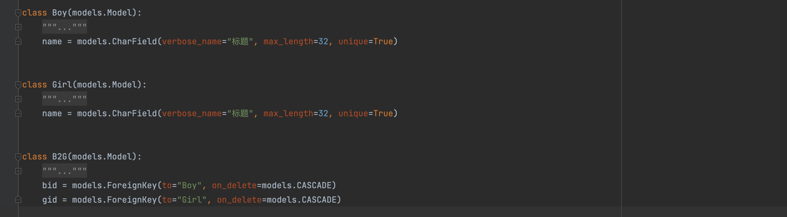

  如果关系表中只有3列。

  

```python
  class Boy(models.Model):
      """
      1   杰森斯坦森
      2   汤普森
      """
      name = models.CharField(verbose_name="标题", max_length=32, unique=True)
      b = models.ManyToManyField(to="Girl")
  
  class Girl(models.Model):
      """
      1   root
      2   小强
      """
      name = models.CharField(verbose_name="标题", max_length=32, unique=True)
  ```

  

```python
  class Boy(models.Model):
      """
      1   杰森斯坦森
      2   汤普森
      """
      name = models.CharField(verbose_name="标题", max_length=32, unique=True)
      
  class Girl(models.Model):
      """
      1   root
      2   小强
      """
      name = models.CharField(verbose_name="标题", max_length=32, unique=True)
      b = models.ManyToManyField(to="Boy")
  ```

  

```python
  class Boy(models.Model):
      name = models.CharField(verbose_name="标题", max_length=32, unique=True)
  
  
  class Girl(models.Model):
      name = models.CharField(verbose_name="标题", max_length=32, unique=True)
  
  
  class B2G(models.Model):
      bid = models.ForeignKey(to="Boy", on_delete=models.CASCADE)
      gid = models.ForeignKey(to="Girl", on_delete=models.CASCADE)
      address = models.CharField(verbose_name="地点", max_length=32)
  ```

  

* 一对一

  

```
  表，100列     ->  50A表      50B表
  
  博客园为例：
  	- 注册，用户名、密码，无法创建博客
  	- 开通博客  地址/
  ```

  

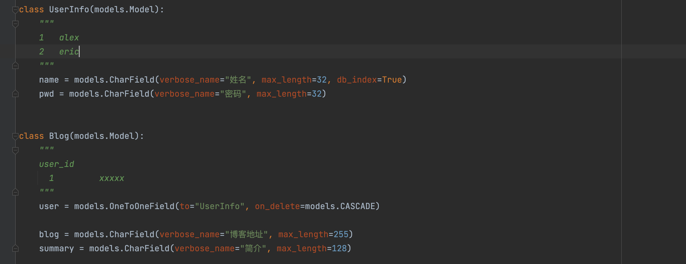

  

### 1.6 数据操作

* 单表

  

```python
  class Role(models.Model):
      title = models.CharField(verbose_name="标题", max_length=32)
  ```

  

```python
  # obj1 = models.Role.objects.create(title="管理员", od=1)
  # obj2 = models.Role.objects.create(**{"title": "管理员", "od": 1})
  
  # 内存 -> save
  # obj = models.Role(title="客户", od=1)
  # obj.od = 100
  # obj.save()
  
  # obj = models.Role(**{"title": "管理员", "od": 1})
  # obj.od = 100
  # obj.save()
  ```

  

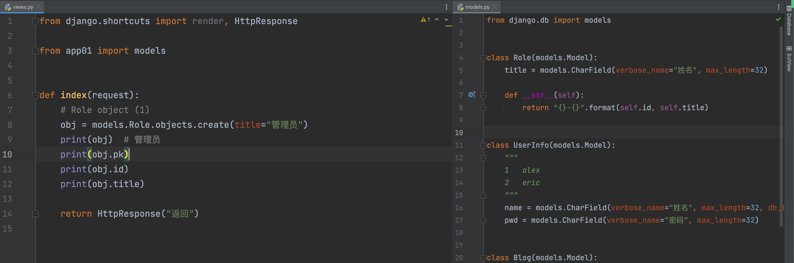

  

```python
  # models.Role.objects.all().delete()
  models.Role.objects.filter(title="管理员").delete()
  ```

  

```python
  models.Role.objects.all().update(od=99)
  models.Role.objects.filter(id=7).update(od=99, title="管理员")
  models.Role.objects.filter(id=7).update(**{"od": 99, "title": "管理员"})
  ```

  

```python
  # QuerySet = [obj, obj]
  v1 = models.Role.objects.all()
  for obj in v1:
      print(obj, obj.id, obj.title, obj.od)
  
  # QuerySet = []
  # v2 = models.Role.objects.filter(od=99, id=99)
  v2 = models.Role.objects.filter(**{"od": 99, "id": 99})
  for obj in v2:
      print(obj, obj.id, obj.title, obj.od)
      
  
  v3 = models.Role.objects.filter(id=99)
  print(v3.query)
  
  v3 = models.Role.objects.filter(id__gt=2)
  print(v3.query)
  
  v3 = models.Role.objects.filter(id__gte=2)
  print(v3.query)
  
  v3 = models.Role.objects.filter(id__lt=2)
  print(v3.query)
  
  v3 = models.Role.objects.filter(id__in=[11, 22, 33])
  print(v3.query)
  
  v3 = models.Role.objects.filter(title__contains="户")
  print(v3.query)
  
  v3 = models.Role.objects.filter(title__startswith="户")
  print(v3.query)
  
  v3 = models.Role.objects.filter(title__isnull=True)
  print(v3.query)
  ```

  

```python
  v3 = models.Role.objects.filter(id=99)
  print(v3.query)
  # 不等于
  v3 = models.Role.objects.exclude(id=99).filter(od=88)
  print(v3.query)
  ```

  

```python
  # queryset=[obj,obj]
  v3 = models.Role.objects.filter(id=99)
  
  # queryset=[{'id': 6, 'title': '客户'}, {'id': 7, 'title': '客户'}]
  v4 = models.Role.objects.filter(id__gt=0).values("id", 'title')
  
  # QuerySet = [(6, '客户'), (7, '客户')]
  v5 = models.Role.objects.filter(id__gt=0).values_list("id", 'title')
  print(v5[0])
  ```

  

```python
  v6 = models.Role.objects.filter(id__gt=0).first()
  # print(v6)  # 对象
  
  v7 = models.Role.objects.filter(id__gt=10).exists()
  print(v7)  # True/False
  ```

  

```python
  # asc
  v8 = models.Role.objects.filter(id__gt=0).order_by("id")
  
  # id desc  od asc
  v9 = models.Role.objects.filter(id__gt=0).order_by("-id", 'od')
  ```

* 一对多

  

```python
  class Depart(models.Model):
      """ 部门 """
      title = models.CharField(verbose_name="标题", max_length=32)
  
  
  class Admin(models.Model):
      name = models.CharField(verbose_name="姓名", max_length=32)
      pwd = models.CharField(verbose_name="密码", max_length=32)
  
      depart = models.ForeignKey(verbose_name="部门", to="Depart", on_delete=models.CASCADE)
  ```

  

```python
  models.Admin.objects.create(name='武沛齐1', pwd='123123123', depart_id=2)
  # models.Admin.objects.create(**{..})
  
  obj = models.Depart.objects.filter(id=2).first()
  models.Admin.objects.create(name='武沛齐2', pwd='123123123', depart=obj)
  models.Admin.objects.create(name='武沛齐2', pwd='123123123', depart_id=obj.id)
  ```

  

```python
  # filter()   # 当前表的字段 + depart__字段    -> 连表和条件
  
  # 找到部门id=3的所有的员工，删除
  # models.Admin.objects.filter(depart_id=3).delete()
  
  # 删除销售部的所有员工
  # obj = models.Depart.objects.filter(title="销售部").first()
  # models.Admin.objects.filter(depart_id=obj.id).delete()
  
  # models.Admin.objects.filter(depart__title="销售部", name='admin').delete()
  ```

  

```python
  # 1. select * from admin    					queryset=[obj,obj,]
  v1 = models.Admin.objects.filter(id__gt=0)
  for obj in v1:
      print(obj.name, obj.pwd, obj.id, obj.depart_id)
  
  # 2. select * from admin inner join depart      queryset=[obj,obj,]
  v2 = models.Admin.objects.filter(id__gt=0).select_related("depart")
  for obj in v2:
      print(obj.name, obj.pwd, obj.id, obj.depart_id, obj.depart.title)
  
  # 3. select id,name.. from admin inner join depart      queryset=[{},{}]
  v3 = models.Admin.objects.filter(id__gt=0).values("id", 'name', 'pwd', "depart__title")
  print(v3)
  
  # 4. select id,name.. from admin inner join depart      queryset=[(),()]
  v4 = models.Admin.objects.filter(id__gt=0).values_list("id", 'name', 'pwd', "depart__title")
  print(v4)
  ```

  

```python
  # 查询
  # models.Admin.objects.filter(id=2).update(name='xxx', pwd='xxxx')
  # models.Admin.objects.filter(name="admin").update(depart_id=2)
  
  # models.Admin.objects.filter(id=2).update(depart__title="技术部")  -> 只能更新自己表字段
  ```

  

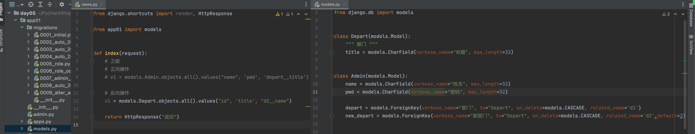

* 多对多

  


  

```
  from django.db import models
  
  
  class Boy(models.Model):
      name = models.CharField(verbose_name="姓名", max_length=32, db_index=True)
  
  
  class Girl(models.Model):
      name = models.CharField(verbose_name="姓名", max_length=32, db_index=True)
  
  
  class B2G(models.Model):
      bid = models.ForeignKey(to="Boy", on_delete=models.CASCADE)
      gid = models.ForeignKey(to="Girl", on_delete=models.CASCADE)
      address = models.CharField(verbose_name="地点", max_length=32)
  ```

  

```
  def index(request):
      # models.Boy.objects.create(name="宝强")
      # models.Boy.objects.create(name="羽凡")
      # models.Boy.objects.create(name="乃亮")
      #
      # models.Girl.objects.bulk_create(
      #     objs=[models.Girl(name="小路"), models.Girl(name="百合"), models.Girl(name="马蓉")],
      #     batch_size=3
      # )
  
      # 创建关系
      # models.B2G.objects.create(bid_id=1, gid_id=3, address="北京")
      # models.B2G.objects.create(bid_id=1, gid_id=2, address="北京")
      # models.B2G.objects.create(bid_id=2, gid_id=2, address="北京")
      # models.B2G.objects.create(bid_id=2, gid_id=1, address="北京")
  
      # b_obj = models.Boy.objects.filter(name='宝强').first()
      # g_object = models.Girl.objects.filter(name="小路").first()
      # models.B2G.objects.create(bid=b_obj, gid=g_object, address="北京")
  
      # 1.宝强都与谁约会。
      # queyset=[obj,obj,obj]
      # q = models.B2G.objects.filter(bid__name='宝强').select_related("gid")
      # for item in q:
      #     print(item.id, item.address, item.bid.name, item.gid.name)
  
      # q = models.B2G.objects.filter(bid__name='宝强').values("id", 'bid__name', 'gid__name')
      # for item in q:
      #     print(item['id'], item['bid__name'], item['gid__name'])
  
      # 2.百合 都与谁约会。
      # q = models.B2G.objects.filter(gid__name='百合').values("id", 'bid__name', 'gid__name')
      # for item in q:
      #     print(item['id'], item['bid__name'], item['gid__name'])
  
      # 3.删除
      # models.B2G.objects.filter(id=1).delete()
      # models.Boy.objects.filter(id=1).delete()
  
      return HttpResponse("返回")
  ```

* 一对一
  

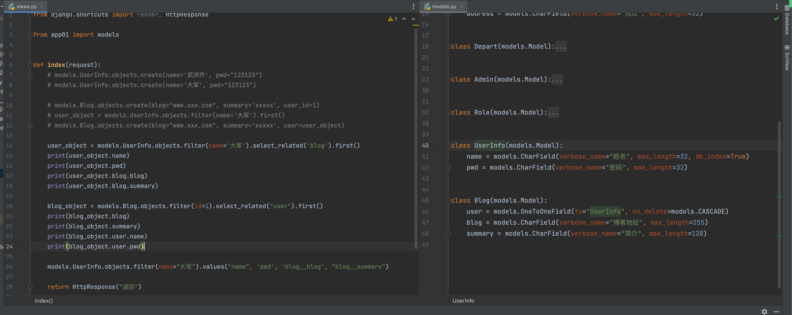

## 2.cookie和session

### 2.1 cookie

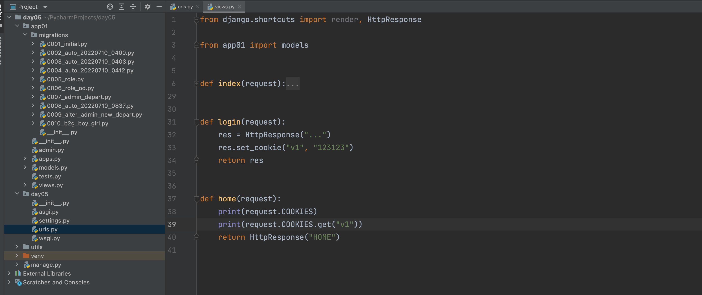

```
127.0.0.1       v1.admin.com
127.0.0.1       v2.admin.com
```

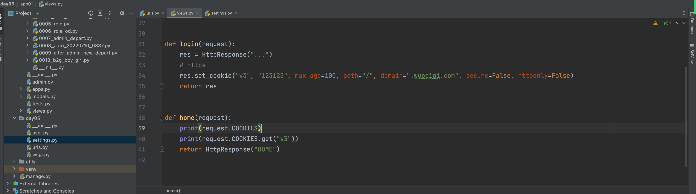

### 2.2 配置session

* 文件版

  

```python
  MIDDLEWARE = [
      'django.middleware.security.SecurityMiddleware',
      'django.contrib.sessions.middleware.SessionMiddleware',
      'django.middleware.common.CommonMiddleware',
      'django.middleware.csrf.CsrfViewMiddleware',
      # 'django.contrib.auth.middleware.AuthenticationMiddleware',
      # 'django.contrib.messages.middleware.MessageMiddleware',
      'django.middleware.clickjacking.XFrameOptionsMiddleware',
  ]
  
  
  # session
  SESSION_ENGINE = 'django.contrib.sessions.backends.file'
  SESSION_FILE_PATH = 'xxxx' 
  
  SESSION_COOKIE_NAME = "sid"  # Session的cookie保存在浏览器上时的key，即：sessionid＝随机字符串
  SESSION_COOKIE_PATH = "/"  # Session的cookie保存的路径
  SESSION_COOKIE_DOMAIN = None  # Session的cookie保存的域名
  SESSION_COOKIE_SECURE = False  # 是否Https传输cookie
  SESSION_COOKIE_HTTPONLY = True  # 是否Session的cookie只支持http传输
  SESSION_COOKIE_AGE = 1209600  # Session的cookie失效日期（2周）
  
  SESSION_EXPIRE_AT_BROWSER_CLOSE = False  # 是否关闭浏览器使得Session过期
  SESSION_SAVE_EVERY_REQUEST = True  # 是否每次请求都保存Session，默认修改之后才保存
  ```

* 数据库

  

```python
  INSTALLED_APPS = [
      # 'django.contrib.admin',
      # 'django.contrib.auth',
      # 'django.contrib.contenttypes',
      'django.contrib.sessions',
      # 'django.contrib.messages',
      'django.contrib.staticfiles',
      "app01.apps.App01Config",
  ]
  
  MIDDLEWARE = [
      'django.middleware.security.SecurityMiddleware',
      'django.contrib.sessions.middleware.SessionMiddleware',
      'django.middleware.common.CommonMiddleware',
      'django.middleware.csrf.CsrfViewMiddleware',
      # 'django.contrib.auth.middleware.AuthenticationMiddleware',
      # 'django.contrib.messages.middleware.MessageMiddleware',
      'django.middleware.clickjacking.XFrameOptionsMiddleware',
  ]
  
  
  # session
  SESSION_ENGINE = 'django.contrib.sessions.backends.db'
  
  SESSION_COOKIE_NAME = "sid"  # Session的cookie保存在浏览器上时的key，即：sessionid＝随机字符串
  SESSION_COOKIE_PATH = "/"  # Session的cookie保存的路径
  SESSION_COOKIE_DOMAIN = None  # Session的cookie保存的域名
  SESSION_COOKIE_SECURE = False  # 是否Https传输cookie
  SESSION_COOKIE_HTTPONLY = True  # 是否Session的cookie只支持http传输
  SESSION_COOKIE_AGE = 1209600  # Session的cookie失效日期（2周）
  
  SESSION_EXPIRE_AT_BROWSER_CLOSE = False  # 是否关闭浏览器使得Session过期
  SESSION_SAVE_EVERY_REQUEST = True  # 是否每次请求都保存Session，默认修改之后才保存
  ```

* 缓存

  

```python
  INSTALLED_APPS = [
      # 'django.contrib.admin',
      # 'django.contrib.auth',
      # 'django.contrib.contenttypes',
      # 'django.contrib.sessions',
      # 'django.contrib.messages',
      'django.contrib.staticfiles',
      "app01.apps.App01Config",
  ]
  
  MIDDLEWARE = [
      'django.middleware.security.SecurityMiddleware',
      'django.contrib.sessions.middleware.SessionMiddleware',
      'django.middleware.common.CommonMiddleware',
      'django.middleware.csrf.CsrfViewMiddleware',
      # 'django.contrib.auth.middleware.AuthenticationMiddleware',
      # 'django.contrib.messages.middleware.MessageMiddleware',
      'django.middleware.clickjacking.XFrameOptionsMiddleware',
  ]
  
  
  # session
  SESSION_ENGINE = 'django.contrib.sessions.backends.cache'
  SESSION_CACHE_ALIAS = 'default' 
  
  SESSION_COOKIE_NAME = "sid"  # Session的cookie保存在浏览器上时的key，即：sessionid＝随机字符串
  SESSION_COOKIE_PATH = "/"  # Session的cookie保存的路径
  SESSION_COOKIE_DOMAIN = None  # Session的cookie保存的域名
  SESSION_COOKIE_SECURE = False  # 是否Https传输cookie
  SESSION_COOKIE_HTTPONLY = True  # 是否Session的cookie只支持http传输
  SESSION_COOKIE_AGE = 1209600  # Session的cookie失效日期（2周）
  
  SESSION_EXPIRE_AT_BROWSER_CLOSE = False  # 是否关闭浏览器使得Session过期
  SESSION_SAVE_EVERY_REQUEST = True  # 是否每次请求都保存Session，默认修改之后才保存
  ```

  

## 3. 缓存

* 服务器 + redis安装启动

* django

  + 安装连接redis包

    

```
    pip install django-redis
    ```

  + settings.py

    

```python
    CACHES = {
        "default": {
            "BACKEND": "django_redis.cache.RedisCache",
            "LOCATION": "redis://127.0.0.1:6379",
            "OPTIONS": {
                "CLIENT_CLASS": "django_redis.client.DefaultClient",
                "CONNECTION_POOL_KWARGS": {"max_connections": 100}
                # "PASSWORD": "密码",
            }
        }
    }
    ```

  + 手动操作redis

    

```python
    from django_redis import get_redis_connection
    
    conn = get_redis_connection("default")
    conn.set("xx","123123")
    conn.get("xx")
    ```

    

## 4. 项目《订单平台》


### 4.1 核心功能

* 认证模块，用户名密码 或 手机短信登录。

* 角色管理，不同角色具有不同权限 和 展示不同菜单。

  

```
  管理员，充值
    客户，下单
  ```

* 客户管理，除了基本的增删改查以外，支持对客户可以分级，不同级别后续下单折扣不同。

* 交易中心

  + 管理员可以给客户余额充值/扣费
  + 客户可以下单/撤单
  + 生成交易记录
  + 对订单进行多维度搜索，例如：客户姓名、订单号。

* agent，去执行订单并更新订单状态。

## 任务

* 梳理搞明白

* redis安装启动   https://pythonav.com/wiki/detail/10/82/

  + py连接
  + django

* 第三方平台发送短信（企业资质）

  

```
  企业认证
  公众号
  	https://pythonav.com/wiki/detail/10/81/
  ```
