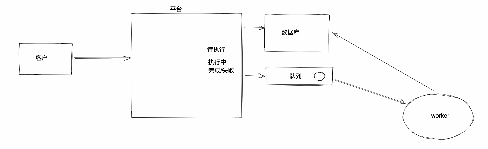
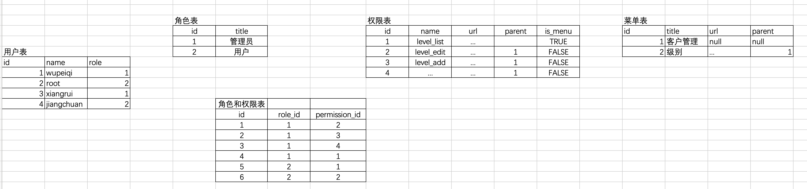
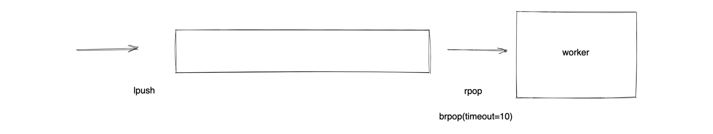
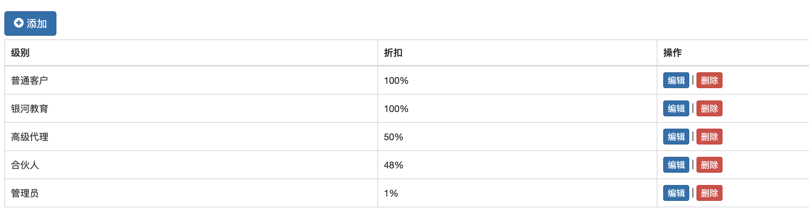
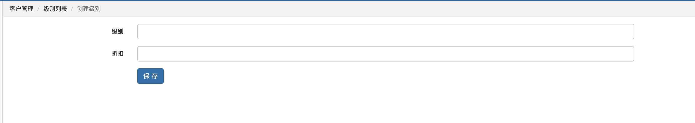

# 订单交易平台



核心的功能模块：

- 认证模块，用户名密码 或 手机短信登录（60s有效）。

- 角色管理，不同角色具有不同权限 和 展示不同菜单。

  ```
  管理员，充值
    客户，下单
  ```

- 客户管理，除了基本的增删改查以外，支持对客户可以分级，不同级别后续下单折扣不同。

- 交易中心

  - 管理员可以给客户余额充值/扣费
  - 客户可以下单/撤单
  - 生成交易记录
  - 对订单进行多维度搜索，例如：客户姓名、订单号。

- worker，去执行订单并更新订单状态。


## 1.单点知识

### 1.1 发送短信

腾讯云短信服务，来进行发送短信。

- 注册账号

- 开通服务 + 缴费 （实名、企业认证，**公众号**）

- API服务、SDK服务

  - API，接口

    ```python
    import requests
    
    # 处理签名和加密
    res = requests.get("......",params={"key":"xxx",'token':'...'})
    ```

  - SDK，服务

    ```python
    pip install tencentcloud-sdk-python
    ```

    ```python
    import xxxx
    
    xxxxx.send(...)
    ```

    

```python
# -*- coding: utf-8 -*-
from tencentcloud.common import credential
from tencentcloud.sms.v20210111 import sms_client, models

cred = credential.Credential("AKIDa0B7nhOq3zf5G8l9TMzNVO0MRHrAE3Yn", "4rPincBUYMuCEzUjsdIiuqWv3vYu0qPh")
client = sms_client.SmsClient(cred, "ap-guangzhou")

req = models.SendSmsRequest()

req.SmsSdkAppId = "1400455481"
req.SignName = "Python之路"
req.TemplateId = "548762"
req.TemplateParamSet = ["449739"]
req.PhoneNumberSet = ["+8615131255000"]

resp = client.SendSms(req)
print(resp)
```


### 1.2 权限和菜单管理

#### 1.2.1 菜单

不同角色的用户登录，看到不同的菜单。

- 页面写死 HTML模板

  ```html
  <html>
      
      	<a href="/xxx/x">用户管理</a>
      	<a href="/xxx/x">级别管理</a>
      	<a href="/xxx/x">级别管理</a>
      	...
      
      	<a href="/xxx/x">xxx管理</a>
      	<a href="/xxx/x">级别管理</a>
      
  </html>
  ```

- 将菜单放在配置文件中 （**选择**）

  ```python
  # settings.py
  
  ADMIN = [
      {"title":"用户管理", "url":"...." },
      {"title":"用户管理", "url":"...." },
      {"title":"用户管理", "url":"...." },
      {"title":"用户管理", "url":"...." },
  ]
  
  USER = [
      {"title":"用户管理", "url":"...." },
      {"title":"用户管理", "url":"...." },
      {"title":"用户管理", "url":"...." },
      {"title":"用户管理", "url":"...." },
  ]
  ```

  ```html
  <html>
      
      	
  		    <a href="{{item.url}}">{{item.title}}</a>
  	    
      
      	
  		    <a href="{{item.url}}">{{item.title}}</a>
  	    
      
  </html>
  ```

- 将 菜单+角色 写入数据库

  | id   | title    | url  |
  | ---- | -------- | ---- |
  | 1    | 用户管理 | ...  |
  | 2    | 级别管理 | ...  |
  | 3    | 订单管理 | ...  |

  | id   | 角色   |
  | ---- | ------ |
  | 1    | 管理员 |
  | 2    | 用户   |

  | id   | role_id | menu_id |
  | ---- | ------- | ------- |
  | 1    | 1       | 1       |
  | 2    | 1       | 2       |
  | 3    | 2       | 2       |

  ```python
  # 在页面展示数据库
  # 1.查询特定角色关联的所有的菜单
  
  # 2.在页面上进行展示
  ```

  


如果选择使用配置文件的方式：

- 菜单，需要显示几个级别的菜单。

  ```
  ADMIN = [
      {"title":"用户管理", "url":"...." },
      {"title":"用户管理", "url":"...." },
      {"title":"用户管理", "url":"...." },
      {"title":"用户管理", "url":"...." },
  ]
  ```

  ```python
  ADMIN = [
      {
          "title":"用户管理", 
          "children":[
              {"title":"级别列表","url":"....", "name":"level_list",}
              {"title":"级别列表","url":"...."}
              {"title":"级别列表","url":"...."}
          ]
      },
      {
          "title":"订单管理", 
          "children":[
              {"title":"订单列表","url":"...."}
              {"title":"订单列表","url":"...."}
              {"title":"订单列表","url":"...."}
          ]
      },
  ]
  ```

- 菜单选中和展开问题

  ```python
  1.获取当前用户请求的 URL   pricepolicy/list/ 或 url对应的name
  
  2. pricepolicy/list/ 配置 ADMIN中的URL   ->默认选中
  ```

- 路径导航的问题

  ```
  1.获取当前用户请求的 URL   pricepolicy/list/ 或 url对应的name
  
  2.获取上级，展示导航信息
  
  3.设置菜单与下级关系
  ```


扩展：菜单多级关系

| id   | title    | url  | parent_id |
| ---- | -------- | ---- | --------- |
| 1    | 客户管理 | null | null      |
| 2    | 级别列表 | ...  | 1         |
| 3    | 客户列表 | ...  | 1         |
| 4    | 订单管理 | null | null      |
| 5    | 价格     | ...  | 4         |
| 6    | 交易     | ...  | 4         |
| 7    | 其他     | ...  | 6         |

注意：类似与平台的评论。

| id   | content    | root_id | parent_id | depth |
| ---- | ---------- | ------- | --------- | ----- |
| 1    | 优秀       | null    | null      | 0     |
| 2    | 不咋样     | null    | null      | 0     |
| 3    | 确实       | 1       | 1         | 1     |
| 4    | 哈哈       | 1       | 1         | 1     |
| 5    | 你说的都对 | 1       | 3         | 2     |

```
- 优秀
	确实
		你说的都对
	哈哈
- 不咋样
```


#### 1.2.2 权限

权限的判断时，要考虑：正常的点击、非法输入。

```python
v1 = [11,22,33,44]
if 33 in v1:
    pass
```

```python
v1 = {11,22,33,44}
if 33 in v1:
    pass
```

```python
v1 = {
    11:123123,
    22:123123
    33:123123
    44:123123
}

if 33 in v1:
    pass
```


- 文件settings.py的方式（编写）

  ```python
  admin_permisions = {
      "level_list":{...},
      "level_edit":{..., 'parent':'level_list'},
      "level_add":{... 'parent':'level_list'},
      "level_delete":{..'parent':'level_list'.},
      
      "user_list":{...},
      "user_edit":{...},
      "user_add":{...},
      "user_delete":{...},
  }
  
  user_permisions = {
      ...
  }
  ```

  ```
  admin访问某个URL + 路由信息（name、namespace），获取当前的URL  /level/edit/4/ -> 是否存在URL
  ```

  ```
  在中间件中根据URL中的name进行权限的校验。
  ```

- 数据库的方式
  


### 1.3 队列


- rabbitMQ，Linux命令+服务构建+python代码。
- kafka，Linux命令+服务构建+python代码。
- redis的列表




基于redis实现上述的过程和代码示例：

- 安装redis

- 启动redis

  ```
  win：  https://pythonav.com/wiki/detail/10/82/
  ```

  ```
  mac：
  	1.去官方下载redis文件
  	2.解压编译
  	3.修改配置文件
  	4.启动
  ```

- Python操作redis

  ```
  pip install redis
  ```

  ```python
  import redis
  
  conn = redis.Redis(host='127.0.0.1', port=6379, password='qwe123', encoding='utf-8')
  
  # 短信验证码
  conn.set('15131255089', 9999, ex=10)
  value = conn.get('15131255089')
  print(value)
  ```

  ```python
  import redis
  
  conn = redis.Redis(host='127.0.0.1', port=6379, password='qwe123', encoding='utf-8')
  
  # 放值
  # conn.lpush('my_queue', "root")
  # conn.lpush('my_queue', "good")
  
  # 取值
  v1 = conn.brpop("my_queue", timeout=5)
  print(v1)
  ```

  


### 1.4 worker和线程池

```python
# 1.去redis中获取任务

# 2.再将此订单在数据库中的状态修改为 执行中

# 3.获取任务详细： 视频，10000

# 4.线程池或协程
from concurrent.futures import ThreadPoolExecutor


def task(video_url):
    # 根据视频地址实现刷播放
    # ..
    pass


pool = ThreadPoolExecutor(50)
for i in range(10000):
    pool.submit(task, "视频地址")

pool.shutdown()  # 卡主，等待所有的任务执行完毕。

# 5.更新订单状态，已完成
```


## 2.项目


### 2.1 用户认证相关

- 用户名和密码登录
- 短信登录

登录成功后，保存用户的信息session【文件、数据库、缓存中】


#### 2.1.1 用户名和密码

- 页面展示
- 提交数据
- 根据数据去数据库校验
  - 通过，登录成功 session。
  - 失败，页面展示错误信息。


## 任务A（必选）

- 编写一个URL

  ```
  /level/list/         ->   level_list 函数    ->     查看级别列表（orm查询+模板渲染）
  
  添加按钮   /level/add/
  ```

  

- 编写一个URL   `/level/add/`   + Form校验

  ```
  /level/add/         ->   函数               -> 输入框
  
  form.cleand_data
  
  models.Level.objects.create(...)
  
  转换回 /level/list/
  ```

  

  

## 任务B（可选）

- 发短信

  ```
  1. ajax发送请求+手机号
  2. 调用短信SDK发送短信 91921
  3. 保存到redis中
  	from django_redis import get_redis_connection
  
      conn = get_redis_connection("default")
      conn.set("18888888","91921")
  ```

  


- 登录

  ```python
  1. ajax请求 + 手机号 + 短信验证码
  2. 校验，登录成功+跳转 /level/list/
  3. 显示错误信息
  ```

  


