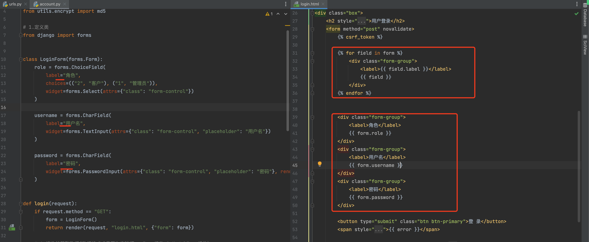
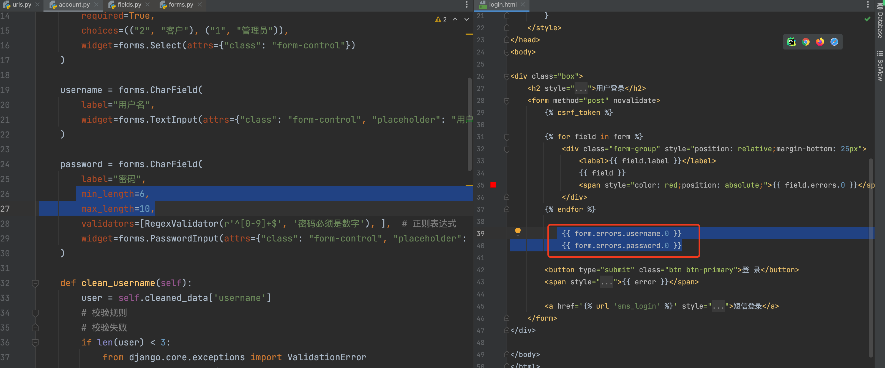
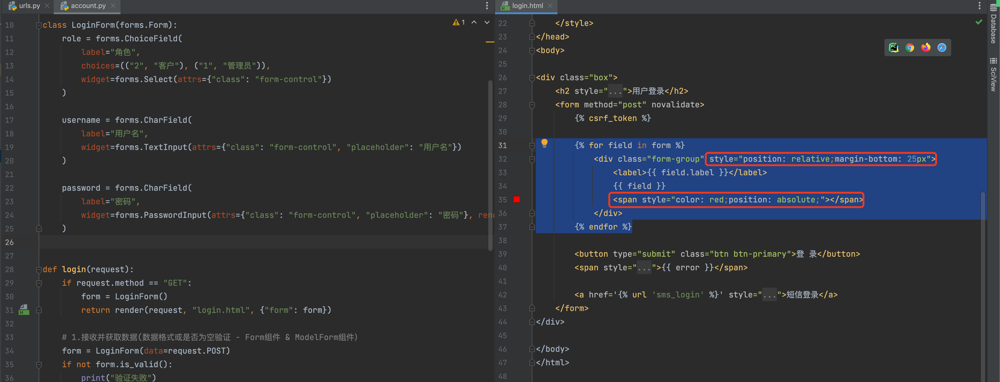
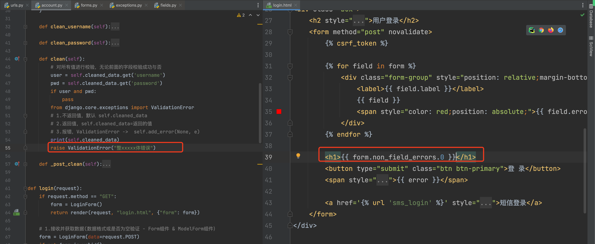
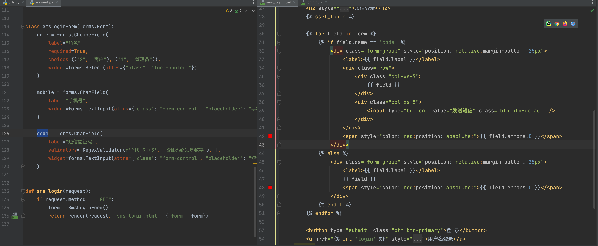
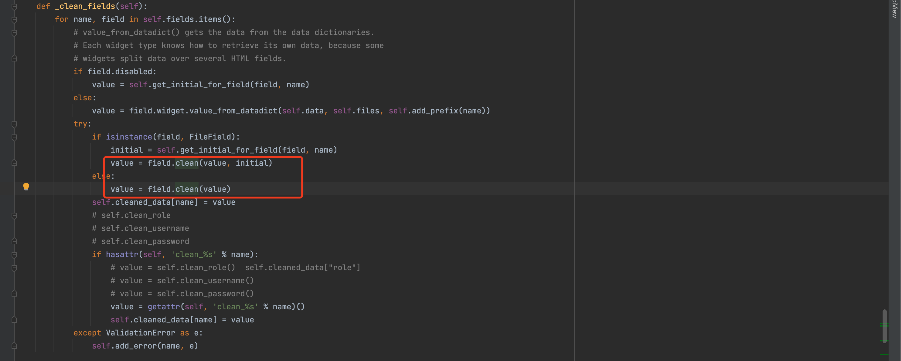
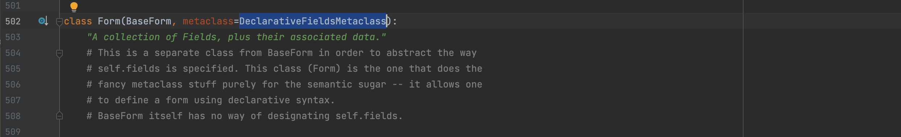

# 订单交易平台


核心的功能模块：

- 认证模块，用户名密码 或 手机短信登录（60s有效）。

- 角色管理，不同角色具有不同权限 和 展示不同菜单。

  ```
  管理员，充值
    客户，下单
  ```

- 客户管理，除了基本的增删改查以外，支持对客户可以分级，不同级别后续下单折扣不同。

- 交易中心

  - 管理员可以给客户余额充值/扣费
  - 客户可以下单/撤单
  - 生成交易记录
  - 对订单进行多维度搜索，例如：客户姓名、订单号。

- worker，去执行订单并更新订单状态。


## 1.知识点

### 1.1 ajax请求

- form表单

  ```html
  <form method='get' action='xxx' >
      <input />
      <input type='submit' />
  </form>
  ```

- ajax

  ```
  本质，利用浏览器上XMLhttpRequest
  ```

  ```html
  <html>
      <head>
          
      </head>
      <body>
          <script>
          	 xhr = new XMLHttpRequest();
               xhr.onreadystatechange = function(){
                   if(xhr.readyState == 4){
                      // 已经接收到全部响应数据，执行以下操作
                      var data = xhr.responseText;
                      console.log(data);
                  }
               };
               xhr.open('POST', "/test/", true );
               xhr.setRequestHeader('Content-Type', 'application/x-www-form-urlencoded;');
               xhr.send('n1=1;n2=2;');
          </script>
      </body>
  </html>
  ```

  ```html
  利用jQuery类库，内部封装，使用简单了。
  ```

  ```html
  <html>
  	...
      <body>
          
          <script src='jquery.js'></script>
          <script>
          	$.ajax({
                  url:"....",
                  type:"post",
                  data:{n1:123,n2:456},
                  success:function(res){
                      console.log(res);
                  }
              })
          </script>
      </body>
  </html>
  ```


大致的应用场景：

- 提交数据，页面可以刷新 -> form表单
- 提交数据，不想刷新，ajax形式提交。


### 1.2 csrf token

- form表单形式提交

  ```html
  <form ...>
        <input type='hidden' value='xxxxxxxx' />
      <input ... />
      <input type='submit' />
  </form>
  ```

- ajax方式

  ```html
  <form>
      
      <input ... />
      <input type='submit' />
  </form>
  ```

  ```
  浏览器打开网址时，django在cookie中也给我们返回了一段值。
  ```

  ```html
  $.ajax({
  	url:"...",
  	type:"get"
  	data:{user:"admin",pwd:"xxxx"}，
  	header:{
  		"X-HTTP...":"cookie中写的那段值"
  	},
  	success:function(arg){
  		
  	}
  })
  ```

  


### 1.3 form组件

```python
class LoginForm(forms.Form):
    role = forms.ChoiceField(
        required=True,
        choices=(("2", "客户"), ("1", "管理员")),
        widget=forms.Select(attrs={"class": "form-control"})
    )
    username = forms.CharField(
        initial="admin",
        required=True,
        正则表达式
        widget=forms.TextInput(attrs={"class": "form-control", "placeholder": "用户名"})
    )
    
    # 自定义方法(钩子)
    def clean_username(self):
        raise 异常
		return 123
    
form = LoginForm(initial={"username":"xxx","password":"xx"})
```

- 生成HTML标签 + 携带数据

  ```
  - 保留原来提交的数据，不再担心form表单提交时页面刷新。
  - 显示默认值，做编辑页面显示默认值。
  ```

- 数据校验，对用户提交的数据格式校验

  ```python
  form = LoginForm(data=request.POST)
  if form.is_valid():
      print(form.cleaned_data)
  else:
      print(form.errors)
  ```

  

#### 1.3.1 form表单提交

- 生成HTML标签 + 携带数据
- 数据校验，对用户提交的数据格式校验


#### 1.3.2 ajax提交

- 数据校验，对用户提交的数据格式校验


## 2.项目业务

### 2.1 登录






```
position属性
	- fixed，固定
	- relative + absolute
	
<div relative >
	<div absolute></div>
</div>
```




form的校验流程：

- 每个字段的内部：required + validators + `min_length=6,max_length=10`

- 字段的钩子方法

  ```python
  def clean_username(self):
      user = self.cleaned_data['username']
      # 校验规则
      # 校验失败
      if len(user) < 3:
          from django.core.exceptions import ValidationError
          raise ValidationError("用户名格式错误")
  	return user
  
  print(form.cleaned_data)
  ```

- clean

  ```python
  def clean(self):
      # 对所有值进行校验
      from django.core.exceptions import ValidationError
      # 1.不返回值，默认 self.cleaned_data
      # 2.返回值，self.cleaned_data=返回的值
      # 3.报错，ValidationError ->  self.add_error(None, e)
  ```

-  _post_clean

  ```python
  def _post_clean(self):
      pass
  ```

  

- Form目的：生成标签 + 校验

- 生成标签

  - 循环 + 单独某个字段
  - label页面显示文本信息
  - 自定义错误信息位置，position

- 校验

  - 定义

    - 每个字段校验

      - 字段上定义校验规则 正则、空、长度
      - clean_方法名

      ```
      校验成功：
      	self.cleaned_data["字段"] = 值
      校验失败
      	self.errors["字段"] = 错误
      ```

    - 所有字段校验

      - clean

        ```python
        try:
            cleaned_data = self.clean()
        except ValidationError as e:
            self.add_error(None, e)
        else:
            if cleaned_data is not None:
                self.cleaned_data = cleaned_data
                
        self.errors["__all__"] = 错误
        ```

      - _post_clean

  - 校验源码

    - form.is_valid
    - form.errors
    - form.full_clean()

  - 业务校验

    ```python
    form = 对象
    
    if not form.is_valid():
        print(form.errors)
        form.errors.username.0
        form.errors.__call__.0   ->  模板语言中 form.errors.__ 不支持
        form.non_field_errors()  <==> form.errors.__call__
        在页面上去适合的位置显示错误信息
    else:
        print(form.cleaned_data)
        ...
    ```

    

  - 扩展

    ```
    如果想要让某个错误信息，展示在特定的字段旁，就可以使用：
    form.add_error("password", "用户名或密码错误")
    ```

    

    


### 2.2 短信登录

#### 2.2.1 展示数据




#### 2.2.2 发送短信

```
<script src=""></script>

$.ajax({
	url:"/xxx/",
	type:"GET",
	data:{mobile:"1888888"},
	success:function(res){
		...
	}
})
```


```javascript
function getCookie(name) {
    let cookieValue = null;
    if (document.cookie && document.cookie !== '') {
        const cookies = document.cookie.split(';');
        for (let i = 0; i < cookies.length; i++) {
            const cookie = cookies[i].trim();
            // Does this cookie string begin with the name we want?
            if (cookie.substring(0, name.length + 1) === (name + '=')) {
                cookieValue = decodeURIComponent(cookie.substring(name.length + 1));
                break;
            }
        }
    }
    return cookieValue;
}
```


向后端发送请求：

- form

  ```
  - GET/POST
  ```

  ```html
  <form method='GET'>
      
  </form>
  ```

  ```html
  <form method='POST'>
      
      ...
  </form>
  ```

- ajax

  ```javascript
  $.ajax({
      url: "/xxx/xx",
      type: "GET",
      data: {mobile: "1888888"},
      success: function (res) {
          console.log(res);
      }
  })
  ```

  ```javascript
  $.ajax({
      url: "/xxx/xx",
      type: "POST",
      data: {mobile: "1888888"},
      headers:{
          "X-CSRFTOKEN":"...."
      },
      success: function (res) {
          console.log(res);
      }
  })
  ```

  ```javascript
  $.ajax({
      url: "/xxx/xx",
      type: "PUT",
      data: {mobile: "1888888"},
      headers:{
          "X-CSRFTOKEN":"...."
      },
      success: function (res) {
          console.log(res);
      }
  })
  ```

  ```javascript
  $.ajax({
      url: "/xxx/xx",
      type: "DELETE",
      data: {mobile: "1888888"},
      headers:{
          "X-CSRFTOKEN":"...."
      },
      success: function (res) {
          console.log(res);
      }
  })
  ```

  


#### 2.2.3 登录

- Ajax提交，展示效果好。
- Form提交。

```html
<form id='f1'>
    <input ...
           
</form>
```

```javascript
$.ajax({
    url:"/sms/login/",
    type:"POST",
    data:{
        mobile:'xxx',
        code:'xxx'
    }
    
})
```

```javascript
$.ajax({
    url:"/sms/login/",
    type:"POST",
    data:$("#f1").serialize()
})

# 好处，不需要加csrf header
```


## 总结

- 发送Ajax

  ```
  $.ajax({
  	url:"...",
  	type:"GET",
  	data:{},
  	dataType:"JSON",
  	success:function(res){
  	}
  })
  ```

- csrf认证

  - 请求体中

    ```
    - 传统的form
    - jQuery    $("#smsForm").serialize()  + Ajax
    ```

  - 请求头中

    ```
    $.ajaxSetup({
    	beforeSend...
    })
    
    $.ajax({
    	url:"...",
    	type:"GET",
    	data:{},
    	dataType:"JSON",
    	headers:{
    		...
    	},
    	success:function(res){
    	}
    })
    ```

- Django的自定义请求头

  ```
  - 自动化添加 HTTP_ 前缀
  - 自动化添加 HTTP_ 前缀，前端的-，转换成后端的_
  ```

- Form组件 & 源码执行流程 & 钩子执行顺序

  - 未使用钩子
  - 使用钩子流程 & 结合源码

- jQuery + location.href + 错误信息展示

- 保留代码，便于后续开发。


## 项目

- 认证组件

- 下一步

  ```
  - 权限校验（settings.py）
  - 动态菜单（settings.py）
  ```


人话：登录成功后，后台管理页面中左侧展示当前用户的菜单，访问我无权访问地址时，提示无权访问。


## 任务

- 当前源码先搞明白 -> 文章

- 继续深入

  

- 继续深入：元类

  ```
  https://www.bilibili.com/video/BV1uA411V7dW?spm_id_from=333.999.0.0
  ```

  


