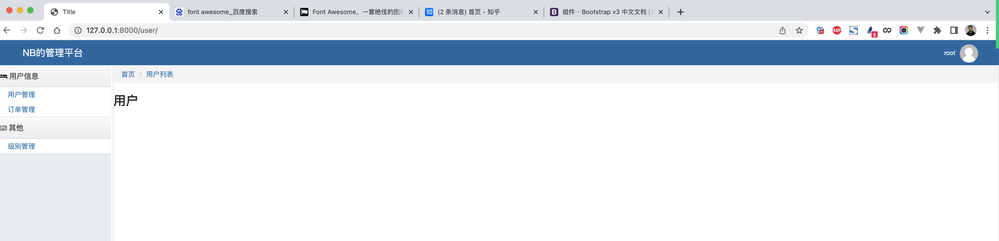

# 订单交易平台


核心的功能模块：

- 认证模块，用户名密码 或 手机短信登录（60s有效）。

- 角色管理，不同角色具有不同权限 和 展示不同菜单。

  ```
  管理员，充值
    客户，下单
  ```

- 客户管理，除了基本的增删改查以外，支持对客户可以分级，不同级别后续下单折扣不同。

- 交易中心

  - 管理员可以给客户余额充值/扣费
  - 客户可以下单/撤单
  - 生成交易记录
  - 对订单进行多维度搜索，例如：客户姓名、订单号。

- worker，去执行订单并更新订单状态。


## 1.菜单和权限


### 1.1 中间件

```
process_request，基于他实现用户是否已登录，继续；未登录则返回登录界面。
	- return None，继续向后访问
	- return 对象，直接返回。
	
process_view，权限校验
	- return None，继续向后访问
	- return 对象，直接返回。
	- 在他的request对象中有 resolver_match  ，包含当前请求的视图路由信息  .name->sms_login
		admin = ['sms_login',"xxx"]
	
process_response
```


### 1.2 面向对象

```python
class HttpRequest(object):
    def __init__(self,name,age):
        self.name = name
        self.age = age 
	...
    
    
request = HttpRequest('小杨',19)
request.name
request.age
request.city = "北京"
```

```
request.name
request.age
request.city
```


```
mapping = {"1": "ADMIN", "2": "CUSTOMER"}
request.session['user_info'] = {'role': mapping[role], 'name': user_object.username, 'id': user_object.id}
```


### 1.3 是否已登录


### 1.4 动态菜单

不同角色用户看到不同的菜单。


#### 1.5.1 美化

> HTML+CSS+JavaScrip


#### 1.5.2 默认选中

- v1

  ```
  获取当前请求的URL   /xxx/xx/
  循环生成菜单的地方
  	如果菜单中的URL = 获取当前请求的URL
  ```

  

- v2


#### 1.5.3 顶部导航


### 1.5 权限校验

- 一个权限，就是一个URL

- 用户具有的权限=URL

  ```
  /user/list/            ->   n1
  /user/<int:id>/edit/   ->   n2
  ```

- 权限信息 settings

  ```
  NB_PERMISSION = {
  	"ADMIN": {
  		"n1":"....",
  		"n2":"....",
  	},
  	"CUSTOMER":{
  		"n1":"....",
  	}
  }
  ```

  ```
  用户访问程序时，程序可以读取当前你访问的URL的 name
  ```

  


此处还存在两个问题：

- 访问子页面时，关联菜单需要被选中。
- 路径导航





### 小结

- 知识点

  - HTML母版

  - inclusion_tag

  - 中间件

    ```
    process_request
    process_view
    ```

  - 在全局变量中定义自己的专属配置（名称必须大写）

    ```
    from django.conf import settings
    ```

    ```
    菜单 & 权限 -> 结构设计 -> 处理和判断。
    ```

  - 面向对象的

    ```
    class UserInfo(object):
        def __init__(self, role, name, id):
            self.id = id
            self.name = name
            self.role = role
            self.menu_name = None
            self.text_list = []
    ```

  - 当前匹配成功URL的name属性。

    ```
    如果项目大，拆分多app，用到路由分发，使用namespace
    ```

- 业务功能

  - 登录成功，用户信息写Session

  - 中间件

    - 读取Session进行校验
    - 判断权限 & 路径导航 & 动态默认选中问题

    ```
    request.nb_user = 对象(.....)
    ```

  - 模板语法 + 自定义inclusion_tag + 读取request.nb_user

    ```
    页面菜单等展示
    ```

  

## 2.级别管理

```python
from django.db import models


class ActiveBaseModel(models.Model):
    active = models.SmallIntegerField(verbose_name="状态", default=1, choices=((1, "激活"), (0, "删除"),))

    class Meta:
        abstract = True
        
class Level(ActiveBaseModel):
    """ 级别表 """
    title = models.CharField(verbose_name="标题", max_length=32)
    percent = models.IntegerField(verbose_name="折扣")
```


- ModelForm，表的增删改查方便。
- Form，请求校验 -> 复杂SQL操作。


----

思考：无论在使用Form和ModelForm时，想要让页面好看，就需要将每个字段的插件中给他设置form-control样式。

```python
class LevelForm(forms.Form):
    title = forms.CharField(
        label="标题",
        required=True,
        # widget=forms.TextInput(attrs={"class": "form-control", 'placeholder': "请输入标题"}),
    )
    percent = forms.CharField(
        label="折扣",
        required=True,
        help_text="填入0-100整数表示百分比，例如：90，表示90%"
    )

    def __init__(self,*args,**kwargs):
        super().__init__(*args,**kwargs)
        
        # {'title':对象,"percent":对象}
        for name,field in self.fields.items():
            field.widget.attrs['class'] = "form-control"
            field.widget.attrs['placeholder'] = "请输入{}".format(field.label)
```

```python
class LevelModelForm(forms.ModelForm):
    class Meta:
        model = models.Level
        fields = ['title', 'percent']
        
    def __init__(self,*args,**kwargs):
        super().__init__(*args,**kwargs)
        
        # {'title':对象,"percent":对象}
        for name,field in self.fields.items():
            field.widget.attrs['class'] = "form-control"
            field.widget.attrs['placeholder'] = "请输入{}".format(field.label)
```


### 2.1 面向对象小知识

```python
class Base:
    def f1(self):
        print("Base")


class Foo(Base):
	pass

class Bar(Foo):
    def f1(self):
        print("Bar")
        super().f1()


obj = Bar()  # [Bar,Foo,Base]
obj.f1()
```

```
super是找父类中的成员吗？不准确。
```

```
super,就是根据类的继承关系（mro），逐步晚上找。
```

```python
class Base:
    def f1(self):
        print("Base")

class Foo:
    def f1(self):
        print("Foo")
        super().f1()
        
class Bar(Foo,Base):
    def f1(self):
        print("Bar")
        super().f1()
        
obj = Bar()  # [Bar,Foo,Base]
obj.f1()
```


```python
class Base:
    def f1(self):
        print("Base")

class Foo:
    def f1(self):
        print("Foo")
        super().f1()
        
class Bar(Foo,Base):
    def f1(self):
        print("Bar")
        super().f1()
        
obj = Foo()
obj.f1()
```


### 2.2 BootStrap样式优化

```python
from django.shortcuts import render, redirect
from web import models
from django import forms
from django.urls import reverse


class BootStrapForm:
    def __init__(self, *args, **kwargs):
        super().__init__(*args, **kwargs)

        # {'title':对象,"percent":对象}
        for name, field in self.fields.items():
            field.widget.attrs['class'] = "form-control"
            field.widget.attrs['placeholder'] = "请输入{}".format(field.label)


class LevelForm(BootStrapForm, forms.Form):
    title = forms.CharField(
        label="标题",
        required=True,
    )
    percent = forms.CharField(
        label="折扣",
        required=True,
        help_text="填入0-100整数表示百分比，例如：90，表示90%"
    )


class LevelModelForm(BootStrapForm, forms.ModelForm):
    class Meta:
        model = models.Level
        fields = ['title', 'percent']
```


### 2.3 编辑

- form或modelForm显示默认值

  ```python
  form = LevelForm(initial={'title': "xxx"})
  ```

- modelForm显示默认值

  ```python
  level_object = models.Level.objects.filter(id=pk).first()
  form = LevelModelForm(instance=level_object)
  ```

  

### 2.4 删除


### 2.5 知识点的梳理和扩展

- ModelForm
- super关键字 + 类继承


#### 1. Form和ModelForm提供的功能？

- Form

  ```
  编写字段
  生成HTML标签 + 插件 + 和参数的配置
  表单的验证
  ```

- ModelForm

  ```
  不编写字段，直接引用Model字段【优秀】
  生成HTML标签 + 插件 + 和 参数的配置
  表单的验证
  保存（新增、更新）
  ```

  - 不编写字段，直接引用Model字段

    ```python
    class LevelModelForm(forms.ModelForm):
        class Meta:
            model = models.Level
            fields = ['title', 'percent']
            fields = "__all__"
    		exclude = ['active']
    ```

    ```python
    class LevelModelForm(BootStrapForm, forms.ModelForm):
        xxx = forms.CharField(label='xxx')
    
        class Meta:
            model = models.Level
            # fields = "__all__"
            # exclude = ['active']
            fields = ['title', 'xxx', 'percent', ]
    ```

    ```python
    class LevelModelForm(BootStrapForm, forms.ModelForm):
        title = forms.ChoiceField(label='xxx', choices=((1, "xxx"), (2, "xxxxxx")))
    
        class Meta:
            model = models.Level
            # fields = "__all__"
            # exclude = ['active']
            fields = ['title', 'percent', ]
    ```

  - 生成HTML标签 + 插件 + 和 参数的配置

    ```python
    class LevelModelForm(BootStrapForm, forms.ModelForm):
        class Meta:
            model = models.Level
            fields = ['title', 'percent', ]
            widgets = {
                'name': forms.PasswordInput(render_value=True)
            }
    ```

  - 表单验证

    ```python
    class LevelModelForm(BootStrapForm, forms.ModelForm):
        class Meta:
            model = models.Level
            fields = ['title', 'percent', ]
    
        def clean_percent(self):
            value = self.cleaned_data['percent']
            return value
    ```

    ```python
    class LevelModelForm(BootStrapForm, forms.ModelForm):
        title = forms.CharField(validators=[])
        class Meta:
            model = models.Level
            fields = ['title', 'percent', ]
    
        def clean_percent(self):
            value = self.cleaned_data['percent']
            return value
    ```

  - 保存（新增、更新）

    ```python
    form = LevelModelForm(data=request.POST)
    form.save()
    ```

    ```python
    form = LevelModelForm(data=request.POST,install=对象)
    form.save()
    ```

    ```python
    form = LevelModelForm(data=request.POST) # 或有 ,install=对象
    
    form.instance.percent = 10
    form.save()
    ```

    ```python
    class LevelModelForm(BootStrapForm, forms.ModelForm):
        confirm_percent = forms.CharField(label="确认")
    
        class Meta:
            model = models.Level
            fields = ['title', 'percent']
            
    
    def level_add(request):
        if request.method == "GET":
            form = LevelModelForm()
            return render(request, 'form.html', {"form": form})
    
        form = LevelModelForm(data=request.POST)
        if not form.is_valid():
            return render(request, 'form.html', {"form": form})
    
        # {'title': '1', 'percent': 2, 'confirm_percent': '3'}
        print(form.cleaned_data)
        # form.instance.percent = 10
        form.save()
    
        return redirect(reverse('level_list'))
    ```


#### 2.super关键字

```
根据类的MRO（类的继承关系）顺序，从下到上去找。

扩展：Python中的类的继承关系是通过 c3算法 计算出来。
```


## 任务

- 菜单和权限实现
- 菜单和权限应用 & ModelForm
  - 级别的管理 - ModelForm 【优先】
  - 客户的管理 - ModelForm 【优先】
    - 重复输入密码 + 校验两次密码一致
    - 级别，选择  -> 默认生成下拉框
  - 客户的管理 - ModelForm 【优先】
    - 重复输入密码 + 校验两次密码一致
    - 级别，选择  -> 默认生成下拉框 -> radio
    - 

**注意**：后续订单相关的话，就会 涉及MySQL锁 + 事务。


