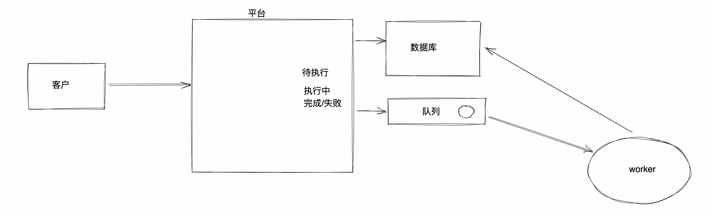

# 订单交易平台




核心的功能模块：

- 认证模块，用户名密码 或 手机短信登录（60s有效）。

- 角色管理，不同角色具有不同权限 和 展示不同菜单。

  ```
  管理员，充值
    客户，下单
  ```

- 客户管理，除了基本的增删改查以外，支持对客户可以分级，不同级别后续下单折扣不同。

- 交易中心

  - 管理员可以给客户余额充值/扣费
  - 客户可以下单/撤单
  - 生成交易记录
  - 对订单进行多维度搜索，例如：客户姓名、订单号。

- worker，去执行订单并更新订单状态。


## 1.权限-按钮

没权限，就不要让他看见。


在模板中自定义方法：

- filter

  ```
  "xxxx"|upper
  ```

- sample_tag

  ```
  
  ```

  ```
  def xxx():
  	return ""
  ```

- inlusion_tag

  ```python
  def xxx():
  	return {'v1':xx,'v2':xx}
  ```

  ```
  <h1>{{v1}}</h1>
  ```

  


权限的粒度控制在按钮，根据是否具有权限来决定是否展示 响应按钮。

```html

```

```python
@register.simple_tag
def demo(request, name, *args, **kwargs):
    print(request, name, args, kwargs)
    # 1.读取用户角色，获取权限字典
    
    # 2.判断是否有权限
    
    # 3.无权限，返回空
    
    # 4.有权限，根据name生成URL
    return "...."
```


## 2.跳转链接

在生成URL时，需要读取当前URL中的参数并构造URL。例如：

- 当前URL

  ```
  http://127.0.0.1:8000/customer/list/?keyword=xinchen&page=8
  ```

- 构造编辑页面URL

  ```
  http://127.0.0.1:8000/customer/edit/1/?_filter=keyword%3Dxinchen%26page%3D8
  ```

  ```python
  param = request.GET.urlencode() # keyword=xinchen&page=8
  
  new_query_dict = QueryDict(mutable=True)
  new_query_dict['_filter'] = param
  
  new_query_dict.urlencode()  _filter=
  ```

- 跳转回来时

  ```
  http://127.0.0.1:8000/customer/list/?keyword=xinchen&page=8
  ```

  ```python
  def policy_edit(request, pk):
      ...
      base_url = reverse(name, args=args, kwargs=kwargs)
      param_url = request.GET.get('_filter')
      url = "{}?{}".format(base_url,param_url)
      return redirect(url)
  ```


## 3.充值

- 携带用户ID展示次用户的交易记录列表

- 充值 & 扣款（对话框）

  - 客户余额增加或减少
  - 创建交易记录

- 事务（MySQL+innodb）

  ```
  多个数据库操作，要成功都成功，要失败都失败。
  ```

  ```python
  from django.db import transaction
  
  with transaction.atomic():
  	# 数据库操作A
      # 数据库操作B
  ```

- 数据库锁（结合事务）

  ```python
  from django.db import transaction
  
  with transaction.atomic():
      customer_object = models.Customer.objects.filter(id=1).select_for_update().first()
  	# 数据库操作A
      # 数据库操作B
  ```


## 知识点梳理

- simple_tag/filter

- QueryDict + `_filter`

- ModelForm字段

  ```python
  class ChargeModelForm(BootStrapForm, forms.ModelForm):
      # 静态变量
      charge_type = forms.TypedChoiceField(
          label="类型",
          choices=[(1, "充值"), (2, "扣款")],  # 只适合固定的数据，不适合去数据表中数据
          coerce=int
      )
  
      class Meta:
          model = models.TransactionRecord
          fields = ['charge_type', 'amount']
  
      def __init__(self, *args, **kwargs):
          super().__init__(*args, **kwargs)
  
          # self.fields['charge_type'].choices = [(1, "充值"), (2, "扣款")]  # 只适合固定的数据，不适合去数据表中数据
          # self.fields['creator'].choices = models.Administrator.objects.filter(id__gt=1).values_list("id", 'username')
  
  ```

  ```
  amount = form.cleaned_data['amount']
  charge_type = form.cleaned_data['charge_type']
  ```

- 事务，原子性操作。 -> Django -> MySQL

  ```python
  from django.db import transaction
  
  with transaction.atomic():
  	# 数据库操作A
      # 数据库操作B
  ```

- 锁，排它锁。           -> Django -> MySQL

  ```python
  from django.db import transaction
  
  with transaction.atomic():
      customer_object = models.Customer.objects.filter(id=1).select_for_update().first()
  	# 数据库操作A
      # 数据库操作B
  ```

  


### 3.1 事务

innodb引擎中支持事务，myisam不支持。

```sql
CREATE TABLE `users` (
  `id` int(11) NOT NULL AUTO_INCREMENT PRIMARY KEY,
  `name` varchar(32) DEFAULT NULL,
  `amount` int(11) DEFAULT NULL
) ENGINE=InnoDB DEFAULT CHARSET=utf8;
```


例如：李杰 给 admin 转账 100，那就会涉及2个步骤。

- 李杰账户 减100
- 武沛齐账户 加 100

这两个步骤必须同时完成才算完成，并且如果第一个完成、第二步失败，还是回滚到初始状态。

事务，就是来解决这种情况的。  大白话：要成功都成功；要失败都失败。

事务的具有四大特性（ACID）：

- 原子性（Atomicity）

  ```
  原子性是指事务包含的所有操作不可分割，要么全部成功，要么全部失败回滚。
  ```

- 一致性（Consistency）

  ```
  执行的前后数据的完整性保持一致。
  ```

- 隔离性（Isolation）

  ```
  一个事务执行的过程中,不应该受到其他事务的干扰。
  ```

- 持久性（Durability）

  ```
  事务一旦结束,数据就持久到数据库
  ```


#### 3.1.1 MySQL客户端

```sql
mysql> select * from users;
+----+---------+---------+
| id | name    | amount  |
+----+---------+---------+
|  1 | admin |    5    |
|  2 |  root   |    6    |
+----+---------+---------+
3 rows in set (0.00 sec)

mysql> begin;  -- 开启事务 start transaction;
Query OK, 0 rows affected (0.00 sec)

mysql> update users set amount=amount-2 where id=1;   -- 执行操作
Query OK, 1 row affected (0.00 sec)
Rows matched: 1  Changed: 1  Warnings: 0

mysql> update users set amount=amount+2 where id=2;   -- 执行操作
Query OK, 1 row affected (0.00 sec)
Rows matched: 1  Changed: 1  Warnings: 0

mysql> commit;  -- 提交事务  rollback;
Query OK, 0 rows affected (0.00 sec)

mysql> select * from users;
+----+---------+---------+
| id | name    | amount  |
+----+---------+---------+
|  1 | admin |    3    |
|  2 |  ale x  |    8    |
+----+---------+---------+
3 rows in set (0.00 sec)
```


```sql
mysql> select * from users;
+----+---------+---------+
| id | name    | amount  |
+----+---------+---------+
|  1 | admin |    3    |
|  2 |  ale x  |    8    |
+----+---------+---------+
3 rows in set (0.00 sec)

mysql> begin; -- 开启事务
Query OK, 0 rows affected (0.00 sec)

mysql> update users set amount=amount-2 where id=1; -- 执行操作（此时数据库中的值已修改）
Query OK, 1 row affected (0.00 sec)
Rows matched: 1  Changed: 1  Warnings: 0

mysql> rollback; -- 事务回滚（回到原来的状态）
Query OK, 0 rows affected (0.00 sec)

mysql> select * from users;
+----+---------+---------+
| id | name    | amount  |
+----+---------+---------+
|  1 | admin |    3    |
|  2 |  ale x  |    8    |
+----+---------+---------+
3 rows in set (0.00 sec)
```


#### 3.1.2 Python代码

```sql
import pymysql

conn = pymysql.connect(host='127.0.0.1', port=3306, user='root', passwd='root123', charset="utf8", db='userdb')
cursor = conn.cursor()

# 开启事务
conn.begin()

try:
    cursor.execute("update users set amount=1 where id=1")
    int('asdf')
    cursor.execute("update tran set amount=2 where id=2")
except Exception as e:
    # 回滚
    print("回滚")
    conn.rollback()
else:
    # 提交
    print("提交")
    conn.commit()

cursor.close()
conn.close()
```


### 3.2 锁

在用MySQL时，不知你是否会疑问：同时有很多做更新、插入、删除动作，MySQL如何保证数据不出错呢？


MySQL中自带了锁的功能，可以帮助我们实现开发过程中遇到的同时处理数据的情况。对于数据库中的锁，从锁的范围来讲有：

- 表级锁，即A操作表时，其他人对整个表都不能操作，等待A操作完之后，才能继续。
- 行级锁，即A操作表时，其他人对指定的行数据不能操作，其他行可以操作，等待A操作完之后，才能继续。

```
MYISAM支持表锁，不支持行锁；
InnoDB引擎支持行锁和表锁。

即：在MYISAM下如果要加锁，无论怎么加都会是表锁。
   在InnoDB引擎支持下如果是基于索引查询的数据则是行级锁，否则就是表锁。
```

所以，一般情况下我们会选择使用innodb引擎，并且在 搜索 时也会使用索引（命中索引）。

接下来的操作就基于innodb引擎来操作：

```sql
CREATE TABLE `L1` (
  `id` int(11) NOT NULL AUTO_INCREMENT,
  `name` varchar(255) DEFAULT NULL,
  `count` int(11) DEFAULT NULL,
  PRIMARY KEY (`id`)
) ENGINE=InnoDB  DEFAULT CHARSET=utf8;
```


在innodb引擎中，update、insert、delete的行为内部都会先申请锁（排它锁），申请到之后才执行相关操作，最后再释放锁。

```
所以，当多个人同时像数据库执行：insert、update、delete等操作时，内部加锁后会排队逐一执行。
```

而select则默认不会申请锁。

```
select * from xxx;
```

如果，你想要让select去申请锁，则需要配合 事务 + 特殊语法来实现。


`for update`，排它锁，加锁之后，其他不可以读写。

```sql
begin; 
	select * from L1 where name="admin" for update;    -- name列不是索引（表锁）
commit;
```

```sql
begin; -- 或者 start transaction;
	select * from L1 where id=1 for update;			  -- id列是索引（行锁）
commit;
```


基于Python代码示例：

```python
import pymysql
import threading


def task():
    conn = pymysql.connect(host='127.0.0.1', port=3306, user='root', passwd='root123', charset="utf8", db='userdb')
    cursor = conn.cursor(pymysql.cursors.DictCursor)
    # cursor = conn.cursor()
	
    # 开启事务
    conn.begin()

    cursor.execute("select id,age from tran where id=2 for update")
    # fetchall      ( {"id":1,"age":10},{"id":2,"age":10}, )   ((1,10),(2,10))
    # {"id":1,"age":10}   (1,10)
    result = cursor.fetchone()
    current_age = result['age']
    
    if current_age > 0:
        cursor.execute("update tran set age=age-1 where id=2")
    else:
        print("已售罄")

    conn.commit()

    cursor.close()
    conn.close()


def run():
    for i in range(5):
        t = threading.Thread(target=task)
        t.start()


if __name__ == '__main__':
    run()

```


## 4.客户下单【客户】

- 我的订单列表
- 下单
  - 输入：视频地址、数量（提示价格策略）
  - 数据库操作（事务 + 锁）
    - 创建订单记录
    - 创建交易记录
    - 扣款
  - 写入redis队列（等待执行）
- 撤销订单（待执行）
  - 数据库操作
    - 更新订单状态
    - 生成交易记录
    - 归还扣款


### 关于撤单（任务）

- url提交

  - 跳转连接

  - 错误提示

    ```
    def xxx(request):
    	return render(request,"xxx.html",{"xx":"xxx"})
    ```

    ```python
    # message组件 -> session  -> ViewData TempView  TempData
    def xxx(request):
    	return redirect('/my/order/list/')
    ```

- ajax提交（推荐）

  - ajax悄悄发送后台
  - 页面刷新
  - 错误信息
  - 加载框


业务流程：锁 + 事务

- 订单状态变化
- 金额归还用户余额
- 交易记录

注意：状态的判断。


## 5.我的交易记录

查看用户交易记录 + 搜索


## 6.Worker

执行worker去执行订单的执行。

- redis队列获取订单号

- 数据库获取订单信息和状态（撤单，则不执行）

- 执行订单

  ```
  更新状态-执行中
  线程池执行订单
  执行完成更新状态
  ```

  


## 任务和下节准备

1. 实现的业务功能
2. 撤单
   - ajax，必须
   - 跳转，可选
3. 准备
   - 云服务器，系统，centos7
   - Linux命令
   - 域名 + 备案（HTTPS部署）


