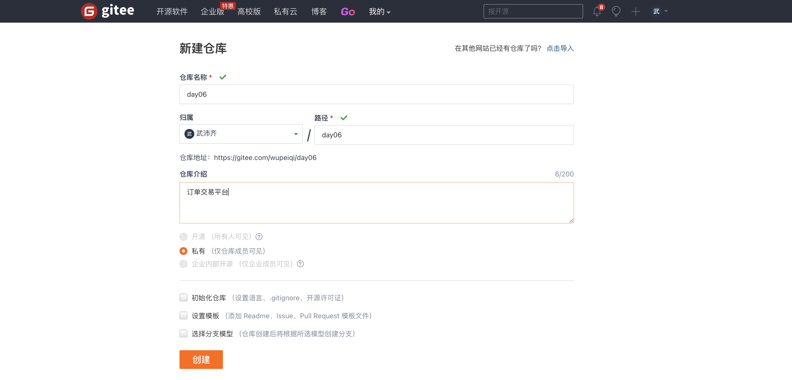

# 交易平台和项目部署


核心的功能模块：

- 认证模块，用户名密码 或 手机短信登录（60s有效）。

- 角色管理，不同角色具有不同权限 和 展示不同菜单。

  ```
  管理员，充值
    客户，下单
  ```

- 客户管理，除了基本的增删改查以外，支持对客户可以分级，不同级别后续下单折扣不同。

- 交易中心

  - 管理员可以给客户余额充值/扣费
  - 客户可以下单/撤单
  - 生成交易记录
  - 对订单进行多维度搜索，例如：客户姓名、订单号。

- worker，去执行订单并更新订单状态。


## 1.message组件

### 1.1 配置

```python
# MESSAGE_STORAGE = 'django.contrib.messages.storage.fallback.FallbackStorage'
# MESSAGE_STORAGE = 'django.contrib.messages.storage.cookie.CookieStorage'
MESSAGE_STORAGE = 'django.contrib.messages.storage.session.SessionStorage'
```

```python
INSTALLED_APPS = [
    # 'django.contrib.admin',
    # 'django.contrib.auth',
    # 'django.contrib.contenttypes',
    # 'django.contrib.sessions',
    'django.contrib.messages',
    'django.contrib.staticfiles',
    "web.apps.WebConfig"
]
```

```python
MIDDLEWARE = [
    'django.middleware.security.SecurityMiddleware',
    'django.contrib.sessions.middleware.SessionMiddleware',
    'django.middleware.common.CommonMiddleware',
    'django.middleware.csrf.CsrfViewMiddleware',
    # 'django.contrib.auth.middleware.AuthenticationMiddleware',
    'django.contrib.messages.middleware.MessageMiddleware',
    'django.middleware.clickjacking.XFrameOptionsMiddleware',
    'utils.md.AuthMiddleware'
]
```

```python
TEMPLATES = [
    {
        'BACKEND': 'django.template.backends.django.DjangoTemplates',
        'DIRS': [],
        'APP_DIRS': True,
        'OPTIONS': {
            'context_processors': [
                'django.template.context_processors.debug',
                'django.template.context_processors.request',
                # 'django.contrib.auth.context_processors.auth',
                'django.contrib.messages.context_processors.messages',
            ],
        },
    },
]
```


### 1.2 设置值

```python
from django.contrib import messages
messages.add_message(reqeust, messages.SUCCESS, "删除成功1")
messages.add_message(reqeust, messages.ERROR, "操作失败")
```


### 1.3 读取值

```python
from django.contrib.messages.api import get_messages
messages = get_messages(request)
for msg in messages:
    print(msg)
```

```html
<ul>
    
	    <li>{{ message.tags }} {{ message }}</li>
    
</ul>
```


### 1.4 源码分析

前戏：message是一个对象（包裹）。

```
v1 = "admin"
v2 = ["admin",123]

class Message(object):
    def __init__(self, level, message, extra_tags=None):
        self.level = int(level)
        self.message = message
        self.extra_tags = extra_tags
		
obj = Message(10,"哈哈哈哈","123")
```

```python
from django.contrib import messages
messages.add_message(reqeust, messages.ERROR, "删除成功1")
messages.add_message(reqeust, messages.SUCCESS, "删除成功2", extra_tags="哈哈哈")
```


- 【设置】中间件process_request加载

- 【设置】在视图函数中往message中写入值（内存）

- 【设置】中间件process_response，将内存中新增的数据写入到数据源

- 【新页面】中间件process_request加载

- 【新页面】在视图函数或模板中读取message中的信息（老的数据源加载的+新增的）

- 【设置】中间件process_response

  ```
  used = True，则只保存新增部分。
  added_new = True，老的数据源加载的+新增的都重新保存到数据源。
  ```


### 1.6 案例：撤单

基于message组件实现撤单的业务。

详细见代码。


注意：ajax方式撤单，不要用message组件，只有跳转操作时才使用。


## 2.我的交易记录

- 我的交易列表
- 关键字搜索
- 组合搜索【新功能】
  - 用
  - 底层实现


- 第一步：获取 group.py文件并放到项目中（utils目录）。
  

- 第二步：在视图函数中配置

  ```python
  from django.shortcuts import render
  from web import models
  from utils.pager import Pagination
  from django.db.models import Q
  
  
  def my_transaction_list(request):
      """ 我的交易记录 """
      
      # 配置-展示
      from utils.group import Option, get_search_group_condition
      search_group = [Option('charge_type'), ]
      search_group_row_list = []
      for option_object in search_group:
          row = option_object.get_queryset_or_tuple(models.TransactionRecord, request)
          search_group_row_list.append(row)
      # 配置-构建搜索条件
      conn = get_search_group_condition(search_group, request)
  
      
      
      keyword = request.GET.get("keyword", "").strip()
      con = Q()
      if keyword:
          con.connector = 'OR'
          con.children.append(('order_oid__contains', keyword))
  
      queryset = models.TransactionRecord.objects.filter(con).filter(**conn).filter(customer_id=request.nb_user.id,
                                                                                  active=1).order_by(
          "-id")
      pager = Pagination(request, queryset)
  
      context = {
          "pager": pager,
          "keyword": keyword,
          "search_group_row_list": search_group_row_list
      }
      return render(request, 'my_transaction_list.html', context)
  
  ```

  

- 第三步：在HTML页面

  ```html
  
      <link rel="stylesheet" href="">
  
  
  
      
          <div class="panel panel-default">
              <div class="panel-heading">
                  <i class="fa fa-filter" aria-hidden="true"></i> 快速筛选
              </div>
              <div class="panel-body">
                  <div class="search-group">
                      
                          <div class="row">
                              
                                  {{ obj|safe }}
                              
                          </div>
                      
                  </div>
              </div>
          </div>
      
      
      ...
  
  ```

  

详细见示例代码。

### 2.1 源码大概流程


```python
class SearchGroupRow(object):
    def __init__(self,queryset_or_tuple, option):
        self.queryset_or_tuple = queryset_or_tuple
        self.option = option

	def __iter__(self):
        yield "全部"
		for item in self.queryset_or_tuple:
            self.option.is_multi:
                ...
            else:
                ...
            yield "<a>{}</a>".format(item)   # 注意，保留原来的URL条件 request.GET ->拷贝>可变
        
# 用于存储相关配置
class Option(object):
    def __init__(self,field,is_multi):
        self.field = field
        self.is_multi = is_multi
	
    def get_queryset_or_tuple(self, model_class, request, *args, **kwargs):
		field_object = model_class._meta.get_field(self.field)
    
    	# 获取关联数据
        if isinstance(field_object, ForeignKey) :
            # FK和M2M,应该去获取其关联表中的数据： QuerySet
            return SearchGroupRow(
                field_object.remote_field.model.objects.all(),
                self
            )
		else:
            # tuple
            return SearchGroupRow(
                field_object.choices
                self
            )
            
       
option_list = [
    Option("charge_type"),
    Option("customer"),
]

search_group_row_list = []
for opt in option_list:
    res = opt.get_queryset_or_tuple(modes.TransactionRecord,request)
    search_group_row_list.append(res)
```

```html
# row=SearchGroupRow对象（数据源+配置）

    <div class="row">
        
        	{{ obj|safe }}
        
    </div>

```


### 2.2 组件的使用方法

```python
search_group = [
        Option('charge_type', 
               is_multi=True, 
               text_func=lambda x: x[1],
               value_func=lambda x:x[0]
              ),  # choice
        Option(
            'customer', 
            db_condition={"id__lte": 10, 'active': 1}, 
            text_func=lambda x: x.username,value_func=lambda x:x.id
        ),  # fk
]
```


### 2.3 实现源码

```python
#!/usr/bin/env python
# -*- coding:utf-8 -*-
from django.db.models import ForeignKey, ManyToManyField


class SearchGroupRow(object):
    def __init__(self, title, queryset_or_tuple, option, query_dict):
        """
        :param title: 组合搜索的列名称
        :param queryset_or_tuple: 组合搜索关联获取到的数据
        :param option: 配置
        :param query_dict: request.GET
        """
        self.title = title
        self.queryset_or_tuple = queryset_or_tuple
        self.option = option
        self.query_dict = query_dict

    def __iter__(self):
        yield '<div class="whole">'
        yield self.title
        yield '</div>'
        yield '<div class="others">'
        total_query_dict = self.query_dict.copy()
        total_query_dict._mutable = True

        origin_value_list = self.query_dict.getlist(self.option.field)
        if not origin_value_list:
            yield "<a class='active' href='?%s'>全部</a>" % total_query_dict.urlencode()
        else:
            total_query_dict.pop(self.option.field)
            yield "<a href='?%s'>全部</a>" % total_query_dict.urlencode()

        for item in self.queryset_or_tuple:
            text = self.option.get_text(item)
            value = str(self.option.get_value(item))
            query_dict = self.query_dict.copy()
            query_dict._mutable = True

            if not self.option.is_multi:
                query_dict[self.option.field] = value
                if value in origin_value_list:
                    query_dict.pop(self.option.field)
                    yield "<a class='active' href='?%s'>%s</a>" % (query_dict.urlencode(), text)
                else:
                    yield "<a href='?%s'>%s</a>" % (query_dict.urlencode(), text)
            else:
                # {'gender':['1','2']}
                multi_value_list = query_dict.getlist(self.option.field)
                if value in multi_value_list:
                    multi_value_list.remove(value)
                    query_dict.setlist(self.option.field, multi_value_list)
                    yield "<a class='active' href='?%s'>%s</a>" % (query_dict.urlencode(), text)
                else:
                    multi_value_list.append(value)
                    query_dict.setlist(self.option.field, multi_value_list)
                    yield "<a href='?%s'>%s</a>" % (query_dict.urlencode(), text)

        yield '</div>'


class Option(object):
    def __init__(self, field, is_condition=True, is_multi=False, db_condition=None, text_func=None, value_func=None):
        """
        :param field: 组合搜索关联的字段
        :param is_multi: 是否支持多选
        :param db_condition: 数据库关联查询时的条件
        :param text_func: 此函数用于显示组合搜索按钮页面文本
        :param value_func: 此函数用于显示组合搜索按钮值
        """
        self.field = field
        self.is_condition = is_condition
        self.is_multi = is_multi
        if not db_condition:
            db_condition = {}
        self.db_condition = db_condition
        self.text_func = text_func
        self.value_func = value_func

        self.is_choice = False

    def get_db_condition(self, request, *args, **kwargs):
        return self.db_condition

    def get_queryset_or_tuple(self, model_class, request, *args, **kwargs):
        """
        根据字段去获取数据库关联的数据
        :return:
        """
        # 根据gender或depart字符串，去自己对应的Model类中找到 字段对象
        field_object = model_class._meta.get_field(self.field)
        title = field_object.verbose_name
        # 获取关联数据
        if isinstance(field_object, ForeignKey) or isinstance(field_object, ManyToManyField):
            # FK和M2M,应该去获取其关联表中的数据： QuerySet
            db_condition = self.get_db_condition(request, *args, **kwargs)
            return SearchGroupRow(title,
                                  field_object.remote_field.model.objects.filter(**db_condition),
                                  self,
                                  request.GET)
        else:
            # 获取choice中的数据：元组
            self.is_choice = True
            return SearchGroupRow(title, field_object.choices, self, request.GET)

    def get_text(self, field_object):
        """
        获取文本函数
        :param field_object:
        :return:
        """
        if self.text_func:
            return self.text_func(field_object)

        if self.is_choice:
            return field_object[1]

        return str(field_object)

    def get_value(self, field_object):
        if self.value_func:
            return self.value_func(field_object)

        if self.is_choice:
            return field_object[0]

        return field_object.pk

    def get_search_condition(self, request):
        if not self.is_condition:
            return None
        if self.is_multi:
            values_list = request.GET.getlist(self.field)  # tags=[1,2]
            if not values_list:
                return None
            return '%s__in' % self.field, values_list
        else:
            value = request.GET.get(self.field)  # tags=[1,2]
            if not value:
                return None
            return self.field, value
```


### 2.4 封装

```python
#!/usr/bin/env python
# -*- coding:utf-8 -*-
from django.db.models import ForeignKey, ManyToManyField


class SearchGroupRow(object):
    def __init__(self, title, queryset_or_tuple, option, query_dict):
        """
        :param title: 组合搜索的列名称
        :param queryset_or_tuple: 组合搜索关联获取到的数据
        :param option: 配置
        :param query_dict: request.GET
        """
        self.title = title
        self.queryset_or_tuple = queryset_or_tuple
        self.option = option
        self.query_dict = query_dict

    def __iter__(self):
        yield '<div class="whole">'
        yield self.title
        yield '</div>'
        yield '<div class="others">'
        total_query_dict = self.query_dict.copy()
        total_query_dict._mutable = True

        origin_value_list = self.query_dict.getlist(self.option.field)
        if not origin_value_list:
            yield "<a class='active' href='?%s'>全部</a>" % total_query_dict.urlencode()
        else:
            total_query_dict.pop(self.option.field)
            yield "<a href='?%s'>全部</a>" % total_query_dict.urlencode()

        for item in self.queryset_or_tuple:
            text = self.option.get_text(item)
            value = str(self.option.get_value(item))
            query_dict = self.query_dict.copy()
            query_dict._mutable = True

            if not self.option.is_multi:
                query_dict[self.option.field] = value
                if value in origin_value_list:
                    query_dict.pop(self.option.field)
                    yield "<a class='active' href='?%s'>%s</a>" % (query_dict.urlencode(), text)
                else:
                    yield "<a href='?%s'>%s</a>" % (query_dict.urlencode(), text)
            else:
                # {'gender':['1','2']}
                multi_value_list = query_dict.getlist(self.option.field)
                if value in multi_value_list:
                    multi_value_list.remove(value)
                    query_dict.setlist(self.option.field, multi_value_list)
                    yield "<a class='active' href='?%s'>%s</a>" % (query_dict.urlencode(), text)
                else:
                    multi_value_list.append(value)
                    query_dict.setlist(self.option.field, multi_value_list)
                    yield "<a href='?%s'>%s</a>" % (query_dict.urlencode(), text)

        yield '</div>'


class Option(object):
    def __init__(self, field, is_condition=True, is_multi=False, db_condition=None, text_func=None, value_func=None):
        """
        :param field: 组合搜索关联的字段
        :param is_multi: 是否支持多选
        :param db_condition: 数据库关联查询时的条件
        :param text_func: 此函数用于显示组合搜索按钮页面文本
        :param value_func: 此函数用于显示组合搜索按钮值
        """
        self.field = field
        self.is_condition = is_condition
        self.is_multi = is_multi
        if not db_condition:
            db_condition = {}
        self.db_condition = db_condition
        self.text_func = text_func
        self.value_func = value_func

        self.is_choice = False

    def get_db_condition(self, request, *args, **kwargs):
        return self.db_condition

    def get_queryset_or_tuple(self, model_class, request, *args, **kwargs):
        """
        根据字段去获取数据库关联的数据
        :return:
        """
        # 根据gender或depart字符串，去自己对应的Model类中找到 字段对象
        field_object = model_class._meta.get_field(self.field)
        title = field_object.verbose_name
        # 获取关联数据
        if isinstance(field_object, ForeignKey) or isinstance(field_object, ManyToManyField):
            # FK和M2M,应该去获取其关联表中的数据： QuerySet
            db_condition = self.get_db_condition(request, *args, **kwargs)
            return SearchGroupRow(title,
                                  field_object.remote_field.model.objects.filter(**db_condition),
                                  self,
                                  request.GET)
        else:
            # 获取choice中的数据：元组
            self.is_choice = True
            return SearchGroupRow(title, field_object.choices, self, request.GET)

    def get_text(self, field_object):
        """
        获取文本函数
        :param field_object:
        :return:
        """
        if self.text_func:
            return self.text_func(field_object)

        if self.is_choice:
            return field_object[1]

        return str(field_object)

    def get_value(self, field_object):
        if self.value_func:
            return self.value_func(field_object)

        if self.is_choice:
            return field_object[0]

        return field_object.pk

    def get_search_condition(self, request):
        if not self.is_condition:
            return None
        if self.is_multi:
            values_list = request.GET.getlist(self.field)  # tags=[1,2]
            if not values_list:
                return None
            return '%s__in' % self.field, values_list
        else:
            value = request.GET.get(self.field)  # tags=[1,2]
            if not value:
                return None
            return self.field, value


class NbSearchGroup(object):
    def __init__(self, request, model_class, *options):
        self.request = request
        self.model_class = model_class
        self.options = options

    def get_row_list(self):
        row_list = []
        for option_object in self.options:
            row = option_object.get_queryset_or_tuple(self.model_class, self.request)
            row_list.append(row)
        return row_list

    @property
    def get_condition(self):
        """
        获取组合搜索的条件
        :param request:
        :return:
        """
        condition = {}
        # ?depart=1&gender=2&page=123&q=999
        for option in self.options:
            key_and_value = option.get_search_condition(self.request)
            if not key_and_value:
                continue
            key, value = key_and_value
            condition[key] = value

        return condition

```


### 2.5 使用

- 在视图函数中

  ```python
  from django.shortcuts import render
  from web import models
  from utils.pager import Pagination
  from django.db.models import Q
  from utils.group import Option, NbSearchGroup
  
  def my_transaction_list(request):
      """ 我的交易记录 """
      # 第一步：配置和传参
      search_group = NbSearchGroup(
          request,
          models.TransactionRecord,
          Option('charge_type'),  # choice
      )
  
      # 第二步：获取条件 .filter(**search_group.get_condition)
      queryset = models.TransactionRecord.objects.filter(**search_group.get_condition)
      pager = Pagination(request, queryset)
  
      context = {
          "pager": pager,
          "keyword": keyword,
          "search_group": search_group  # 第三步：传入前端页面
      }
      return render(request, 'my_transaction_list.html', context)
  ```

  ```html
  # 母版
  <link rel="stylesheet" href="">
  ```

  ```html
  
      
  
  ```

  

### 2.6 案例：客户列表


- 第一类：用，应用项目中（大多数）
- 第二类：思路（django中admin的源码，stark组件）


### 2.7 案例：交易记录


## 总结

- 权限和菜单

  - 动态菜单，不同用户角色【配置文件】

    ```
    - 配置文件，写配置用户级别配置 + 默认配置
    - 构造属于自己的结构：权限、菜单字典。
    - 数据库获取用户角色
    ```

  - 默认选中和展开

    ```
    - inclusion_tag
    ```

  - 权限校验

    ```
    - 中间件
    - request.nb_user 赋值
    ```

  - 控制按钮是否显示

    ```
    - filter，可以模板语言中的if else的条件
    ```

- 基于Form和ModelForm实现增删改查

- 构建的了BootStrapForm类实现BootStrap样式 + 免除BootStrap样式

- 删除/撤单

  - 直接超链接删除，跳转
  - 对话框 + ajax删除（推荐）
  - 直接超链接删除，跳转 + message => 成功和失败的提醒。（推荐）

- 添加和编辑

  - 跳转到添加和编辑页面，成功后跳转回来。
  - 对话框 + ajax 

- 原条件保留

  - 删除
  - 编辑

- 分页

- 关键字搜索

- 组合搜索


## 3.Worker


执行worker去执行订单的执行。


**业务功能：**

- redis队列获取订单号

- 数据库获取订单信息和状态（撤单，则不执行）

- 执行订单

  ```
  更新状态-执行中
  线程池执行订单
  执行完成更新状态
  ```


**相关知识点：**

- 线程池

- 数据库操作+上下文管理

- 可执行文件打包

  ```
  pip install pyinstaller
  ```

  ```
  - windows -> windows包
  - mac     -> windows包
  ```

  ```python
  pyinstaller -D app.py
  pyinstaller -F app.py
  ```

  


### 答疑

- 出现错误的话重新循环任务吗？

  - 错误重试，已经完成。

  - 程序突然关闭

    - 正常运行时，500次，在数据库更新一次，已刷多少。

    - 崩溃

      ```
      - 状态，正在执行
      - 已刷，500
      ```

    - 重新打开时，先去找到所有的正在执行的订单，重新加入队列去执行（所有-已刷）。

  - 订单，跑了多少。

- 这个脚本需要数据库 缓存。指定的电脑肯定要安装上吧

  ```
  不需要数据，连接的远程数据库。
  ```

- 如果要把各执行状态写入到日志文件，应该怎么搞？

- 日志

  - logging模块，内置模块+线程安全。
  - 第三方模块日志模块。
  - sentry日志&探针


## 4.Web项目部署


### 4.1 git


### 4.2 github


### 4.3 上传代码

- 电脑上安装git

  ```
  https://git-scm.com/downloads
  ```

- 注册gitee/github

  ```
  https://gitee.com/admin
  ```

- 创建项目
  

  ```
  https://gitee.com/admin/day06.git
  ```

- 本地git配置-全局

  ```
  git config --global user.name "admin"
  git config --global user.email "admin@live.com"
  ```

- 项目配置

  - 进入项目目录
    

  - 初始化（最开始时，做一次）

    ```
    git init 
    git remote add origin https://gitee.com/admin/day06.git
    ```

  - 提交代码

    ```
    git add .
    git commit -m '第一次提交，项目初始化'
    ```

  - 提交到远程仓库

    ```
    git push origin master
    ```

    

### 4.4 拉代码（不专业）

不专业，使用的腾讯云的web版本，直接通过命令操作。

专业，在自己电脑上利用SSH连接到远程服务器。

```
- mac，自带SSH
	ssh root@82.156.54.134
	
- win，没有SSH（git中集成了ssh）
	ssh root@82.156.54.134
	
- win，没有SSH - xshell
	界面
```

----


- 克隆（第一次）

  ```
  git clone https://gitee.com/admin/day06.git
  ```

- 获取更新

  ```
  cd day06
  git pull origin master
  ```

  


