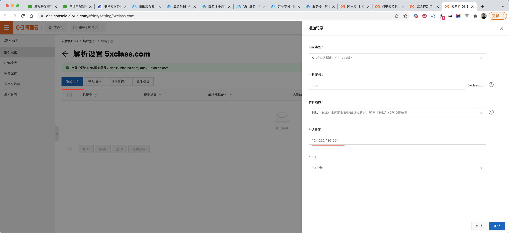
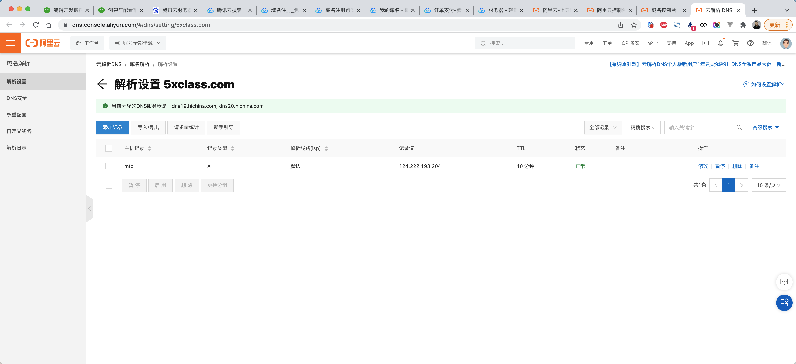

# 项目部署


想要将django项目部署在服务器上，本质上需要三大部分：

* 将代码上传到服务器
* 在服务器上 获取代码、安装服务、配置环境
* 启动服务

## 1. 代码同步

上传代码的方式有很多种，例如：FTP工具、scp命令、rsync服务、svn等，不过目前公司主流的都是使用git+代码托管平台。


* 本地电脑，安装git并使用git命令上传代码。
* 代码仓库，创建仓库。
* 服务器，安装git并使用git命令获取最新代码。

### 1.1 本地上传

在本地电脑上本质上需要执行如下步骤：

* 全局配置

  

```
  git config --global user.name "admin"
  git config --global user.email "admin@live.com"
  ```

* 进入项目目录

  + 初始化

    

```
    git init
    ```

  + 配置远程地址

    

```
    git remote add origin https://gitee.com/admin/xxxxx.git
    ```

  + 本地版本提交

    

```
    git add .
    git commit -m '提交说明...'
    ```

  + 提交到远程仓库

    

```
    git push origin master
    ```

这样虽然能操作，但是会有两个小问题：

* 项目中所有数据都提交了，如果仓库是公开的，有些敏感数据会泄露。
* 每次提交都需要输入密码，太烦了。

#### 1.1.1 gitignore

在项目中创建一个 `.gitignore` 的文件，在里面写上文件名或文件夹，可以git忽略一些文件，不要进行版本控制。

```
https://github.com/github/gitignore/blob/main/Python.gitignore
```


将Python的ignore文件内存拷贝并保存至项目目录下。


这样，就可以控制git忽略某些文件。

学会这个知识点之后，接下来再来讲一个关于配置文件的常见操作，即：local_settings.py


如果本次开发和线上开发一些配置不同，就可以放在这个文件。

* 本地：local_settings.py 编写本地特有配置。
* 线上：local_settings.py 编写线上特有配置。

而在settings.py中编写所有环境都有的配置。

#### 1.1.2 密码或秘钥

本地提交代码时，每次需要输入密码 & 线上服务器拉去代码时，每次也需要输入密码。

* 固定用户名和密码

  

```
  git remote remove origin
  git remote add origin https://用户名:密码@gitee.com/admin/xxxxx.git
  ```

* 使用SSH

  + 使用ssh-keygen命令，生成一对秘钥（公钥和私钥）

    

```
    ssh-keygen -t rsa
    ```

    


  + 读取公钥 `~/.ssh/id_rsa.pub`内容并上传到代码托管仓库

    


    


  + 推拉数据

    

```
    git remote add origin git@gitee.com:admin/xxxxx.git
    git push origin master
    ```

    

```
    git clone git@gitee.com:admin/xxxxx.git
    ```

    


#### 1.1.3 关于版本（赠送）

在本地的git每次执行commit命令时，都会生成一个提交记录，如果执行git push也会将记录提交到代码仓库。


可以通过命令实现在各个版本之间进行切换：

* 查看提交记录

  

```
  git log
  ```

* 查看提交记录

  

```
  git reflog
  ```

* 跳转至指定版本

  

```
  git reset --hard fa1653b6cd5ed1ff12ef1acdf534e91b9b895604
  ```

注意：此命令可以在本地、线上执行，以此来切换到各种版本。

### 1.2 线上同步

登录线上服务器并获取代码，本质上需要以下三个步骤：

* 基于SSH或web页面登录服务器

  

```
  - 云平台网页版：支持登录并进行命令交互（不便捷，不推荐）。
  - SSH工具，连接比较方便（推荐）
  	- win：xshell、SecureCRT
  	- mac：iTerm2
  	
  注意：如果使用SSH工具连接远程服务器的话，需要在云平台的的安全组开启22端口权限。
  ```

* 安装git

* 进入项目克隆或拉取代码

  

```
  基于用户名和密码：
  	git clone https://gitee.com/admin/xxxxx.git
  	
  基于用户名和密码：
  	git clone https://用户名:密码@gitee.com/admin/xxxxx.git
  
  基于秘钥：
  	>>>ssh-keygen -t rsa
  	>>>cat ~/.ssh/id_rsa.pub
  	>>>拷贝公钥到代码仓库
  	>>>git clone git@gitee.com:admin/xxxxx.git
  ```


#### 1.2.1 SSH密码+下载代码

```
>>>ssh root@82.156.54.134
>>>cd /data/
>>>git clone https://gitee.com/admin/xxxxx.git
```

```
>>>cat ~/.ssh/id_rsa.pub
>>>拷贝公钥放到代码仓库
>>>cd /data/
>>>git clone git@gitee.com:admin/xxxxx.git
```


#### 1.2.2 SSH秘钥+下载代码

在我们本地想要通过SSH连接服务器，每次连接都输入密码也觉得比较烦，此时也可以使用秘钥的方式直接连接服务器。

```
>>>ssh-keygen -t rsa    这个命令不需要做了，因为在之前git上传代码时已执行过（已有公钥和私钥）
```

```
>>>ssh-copy-id  -i ~/.ssh/id_rsa.pub root@82.156.54.134
```


那么以后再想要登录远程服务器，就不需要再输入账户和密码了，直接输入：

```
>>>ssh root@82.156.54.134
```

```
>>>cd /data/
>>>git clone https://gitee.com/admin/xxxxx.git
```

```
>>>cat ~/.ssh/id_rsa.pub
>>>拷贝公钥放到代码仓库
>>>cd /data/
>>>git clone git@gitee.com:admin/xxxxx.git
```


## 2. 服务和环境配置

下面的配置和操作均在腾讯云服务器+CentOS 7.5的系统下进行。

### 2.1 MySQL

* 安装服务端

  

```
  yum install mariadb-server -y
  ```

  

```python
  mariadb-server.x86_64 1:5.5.68-1.el7
  ```

* 安装客户端

  

```python
  yum install mariadb -y
  ```

  

```python
  软件包 1:mariadb-5.5.68-1.el7.x86_64 已安装并且是最新版本
  ```

* 服务配置
  + 启动

    

```
    systemctl start mariadb
    ```

  + 设置开机启动

    

```
    systemctl enable mariadb
    ```

* 账号初始化

  + 登录

    

```
    mysql -u root -p
    ```

  + root设置密码

    

```
    UPDATE user SET password=password('qwe123..') WHERE user='root'; 
    flush privileges;
    ```

  + 创建用户

    

```
    insert into mysql.user(user,host,password) values('xxx','%',password('qwe123..'));
    
    # 或更新密码
    UPDATE user SET password=password('qwe123..') WHERE user='xxx'; 
    flush privileges;
    ```

  + 创建数据库

    

```
    CREATE DATABASE 数据库名 DEFAULT CHARSET utf8 COLLATE utf8_general_ci;
    ```

  + 授权

    

```
    grant all privileges on 数据库.* to settle@'%';
    flush privileges;
    ```

    

```
    grant all privileges on 数据库.* to tasker@'127.0.0.1';
    flush privileges;
    ```

    

### 2.2 Redis

* 安装

  

```
  yum install redis -y
  ```

* 配置

  

```
  vim /etc/redis.conf
  
  ?requirepass
  设置密码
  ```

* 启动

  + 启动

    

```
    systemctl start redis
    systemctl restart redis
    ```

  + 开机启动

    

```
    systemctl enable redis
    ```

### 2.3 Python3

* 安装gcc，用于后续安装Python时编译源码。

  

```python
  yum install gcc -y
  ```

* 安装Python3相关依赖

  

```
  yum install zlib zlib-devel -y
  yum install bzip2 bzip2-devel  -y
  yum install ncurses ncurses-devel  -y
  yum install readline readline-devel  -y
  yum install openssl openssl-devel  -y
  yum install xz lzma xz-devel  -y
  yum install sqlite sqlite-devel  -y
  yum install gdbm gdbm-devel  -y
  yum install tk tk-devel  -y
  yum install mysql-devel -y
  yum install python-devel -y
  yum install libffi-devel -y
  ```

* 下载Python源码，https://www.python.org/ftp/python/

  

```
  cd /data/
  wget https://www.python.org/ftp/python/3.9.5/Python-3.9.5.tgz
  ```

  注意：如果没有wget，则先安装 `yum install wget`

* 编译安装

  + 解压

    

```
    tar -xvf Python-3.9.5.tgz
    ```

  + 进入目录并编译安装

    

```
    cd Python-3.9.5
    ./configure
    make all
    make install
    ```

  + 测试

    

```
    python3 --version
    
    /usr/local/bin/python3
    /usr/local/bin/pip3
    /usr/local/bin/pip3.9
    ```

  + 配置豆瓣源（腾讯云服务器，默认腾讯源）

    

```
    pip3.9 config set global.index-url https://pypi.douban.com/simple/
    ```

### 2.4 虚拟环境

* 安装虚拟环境

  

```
  pip3.9 install virtualenv
  ```

* 创建虚拟环境目录并创建虚拟环境

  

```
  mkdir /envs
  virtualenv /envs/nb --python=python3.9
  ```

* 安装项目依赖的pip包

  

```
  source /envs/nb/bin/activate
  cd /data/www/nb/
  pip install -r requirements.txt
  ```

### 2.5 拉取代码和配置

当上述环境准备好之后，接下来需要在线上服务器上做以下步骤：

* 获取最新代码

* 安装第三方包

  

```
  source /envs/nb/bin/activate
  pip install -r requirements.txt
  ```

* local_settings.py设置线上配置

  

```python
  import os
  from pathlib import Path
  
  BASE_DIR = Path(__file__).resolve().parent.parent.parent
  
  DEBUG = False
  
  ALLOWED_HOSTS = ['*']
  
  STATIC_ROOT = os.path.join(BASE_DIR,"allstatic")
  
  DATABASES = {
      'default': {
          'ENGINE': 'django.db.backends.mysql',
  		'NAME': 'day06db',  # 数据库名字
          'USER': 'wangchuan',
          'PASSWORD': 'qwe123..',
          'HOST': '127.0.0.1',  # ip
          'PORT': 3306,
      }
  }
  
  CACHES = {
      "default": {
          "BACKEND": "django_redis.cache.RedisCache",
          "LOCATION": "redis://127.0.0.1:6379",
          "OPTIONS": {
              "CLIENT_CLASS": "django_redis.client.DefaultClient",
              "CONNECTION_POOL_KWARGS": {"max_connections": 100},
              "PASSWORD": "qwe123456",
          }
      }
  }
  ```

* 收集静态文件

  

```
  python manage.py  collectstatic
  ```

### 2.5 uwsgi

激活虚拟环境并安装uwsgi

```
source /envs/nb/bin/activate
pip install uwsgi
```

基于uwsgi运行项目

* 命令参数

  

```
  uwsgi --http :80 --chdir /data/www/xxxxx/ --wsgi-file day06/wsgi.py --master --processes 4 --static-map /static=/data/www/allstatic
  ```

* 文件参数

  + 创建 day06_uwsgi.ini

    

```ini
    [uwsgi]
    http = 0.0.0.0:80
    chdir = /data/www/xxxxx/
    wsgi-file = day06/wsgi.py
    processes = 4
    static-map = /static=/data/www/allstatic
    
    virtualenv = /envs/nb/
    ```

  + 执行命令

    

```
    uwsgi --ini  day06_uwsgi.ini
    ```

### 2.6 nginx

利用nginx做反向代理和处理静态文件。

```
yum install nginx -y
```

修改nginx.conf配置文件：

```
user nginx;
worker_processes auto;
error_log /var/log/nginx/error.log;
pid /run/nginx.pid;

# Load dynamic modules. See /usr/share/doc/nginx/README.dynamic.
include /usr/share/nginx/modules/*.conf;

events {
    worker_connections 1024;
}

http {
    log_format  main  '$remote_addr - $remote_user [$time_local] "$request" '
                      '$status $body_bytes_sent "$http_referer" '
                      '"$http_user_agent" "$http_x_forwarded_for"';

    access_log  /var/log/nginx/access.log  main;

    sendfile            on;
    tcp_nopush          on;
    tcp_nodelay         on;
    keepalive_timeout   65;
    types_hash_max_size 4096;

    include             /etc/nginx/mime.types;
    default_type        application/octet-stream;

    # Load modular configuration files from the /etc/nginx/conf.d directory.
    # See http://nginx.org/en/docs/ngx_core_module.html#include
    # for more information.
    # include /etc/nginx/conf.d/*.conf;

    upstream django {
        server 127.0.0.1:8001;
    }

    server {
        listen       80;
        listen       [::]:80;
        server_name  day06.pythonav.com;

        # Load configuration files for the default server block.
        # include /etc/nginx/default.d/*.conf;

		location /static {
            alias  /data/www/allstatic/;
        }

        location / {
            uwsgi_pass  django;
            include     uwsgi_params;
        }

    }
}
```

修改uwsgi配置（day06_uwsgi）：

```ini
[uwsgi]
socket = 127.0.0.1:9000
chdir = /data/www/xxxxx/
wsgi-file = day06/wsgi.py
processes = 4
virtualenv = /envs/video_killer/
```

接下来就需要启动uwsgi和nginx：

* nginx

  

```
  # 启动
  systemctl start nginx
  
  # 开机启动
  systemctl enable nginx
  ```

* uwsgi

  

```
  uwsgi --ini  day06_uwsgi.ini
  ```

每次启动都比较麻烦，怎么办？

### 2.7 shell脚本

#### 2.7.1 reboot.sh

```bash
#!/usr/bin/env bash

echo -e "\033[34m--------------------wsgi process--------------------\033[0m"

ps -ef|grep uwsgi_day06.ini | grep -v grep

sleep 0.5

echo -e '\n--------------------going to close--------------------'

ps -ef |grep uwsgi_day06.ini | grep -v grep | awk '{print $2}' | xargs kill -9

sleep 0.5

echo -e '\n----------check if the kill action is correct----------'

/envs/day06/bin/uwsgi  --ini uwsgi_day06.ini &  >/dev/null

echo -e '\n\033[42;1m----------------------started...----------------------\033[0m'
sleep 1

ps -ef |grep uwsgi_day06.ini | grep -v grep
```

```
chmod 755 reboot.sh
./reboot.sh
```

#### 2.7.2 stop.sh

```bash
#!/usr/bin/env bash

echo -e "\033[34m--------------------wsgi process--------------------\033[0m"

ps -ef |grep uwsgi_day06.ini | grep -v grep

sleep 0.5

echo -e '\n--------------------going to close--------------------'

ps -ef |grep uwsgi_day06.ini | grep -v grep | awk '{print $2}' | xargs kill -9

sleep 0.5
```

#### 2.7.3 uwsgi

uwsgi_day06.ini

```
[uwsgi]
socket = 127.0.0.1:8001
chdir = /data/www/day06/
wsgi-file = day06/wsgi.py
processes = 1
virtualenv = /envs/day06/
```

### 2.8 域名和解析

#### 2.8.1 购买域名


#### 2.8.2 解析

就是让域名和我们刚才买的服务器绑定，以后通过域名就可以找到那台服务器，不需要再使用IP了。






解析成功后，基于域名就可以访问了。


注意：域名需要备案后才能使用。

### 2.9 https

#### 2.9.1 申请证书


#### 2.9.2 下载证书


#### 2.9.3 证书上传

将证书文件上传至服务器，例如：上传至项目目录的ssl文件夹下。


#### 2.9.4 修改nginx配置

```
user nginx;
worker_processes auto;
error_log /var/log/nginx/error.log;
pid /run/nginx.pid;

events {
    worker_connections  65536;
    use epoll;
}

http {
    log_format  main  '$remote_addr - $remote_user [$time_local] "$request" '
                      '$status $body_bytes_sent "$http_referer" '
                      '"$http_user_agent" "$http_x_forwarded_for"';

    access_log  /var/log/nginx/access.log  main;

    sendfile            on;
    tcp_nopush          on;
    tcp_nodelay         on;
    keepalive_timeout   65;
    gzip on;
    gzip_http_version 1.1;
    gzip_buffers  4 32k;
     gzip_comp_level 9;
    include             mime.types;
    default_type        application/octet-stream;

    upstream django {
        server 127.0.0.1:8001; # for a web port socket (we'll use this first)
    }

    server {
        listen      80;
        server_name day06.pythonav.com;
        rewrite ^(.*) https://$server_name$1 redirect;
    }

    server {
        listen       443 ssl;
        server_name  day06.pythonav.com;

        #证书文件
        ssl_certificate      /data/www/ssl/8372403_day06.pythonav.com.pem;
        #私钥文件
        ssl_certificate_key  /data/www/ssl/8372403_day06.pythonav.com.key;

        ssl_session_cache    shared:SSL:1m;
        ssl_session_timeout  5m;
        ssl_ciphers ECDHE-RSA-AES128-GCM-SHA256:ECDHE:ECDH:AES:HIGH:!NULL:!aNULL:!MD5:!ADH:!RC4;
        ssl_protocols TLSv1 TLSv1.1 TLSv1.2;
        ssl_prefer_server_ciphers  on;

        location / {
            uwsgi_pass  django;
            include     uwsgi_params;
           }
        location /static {
            alias  /data/www/allstatic;
        }
    }

}
```
