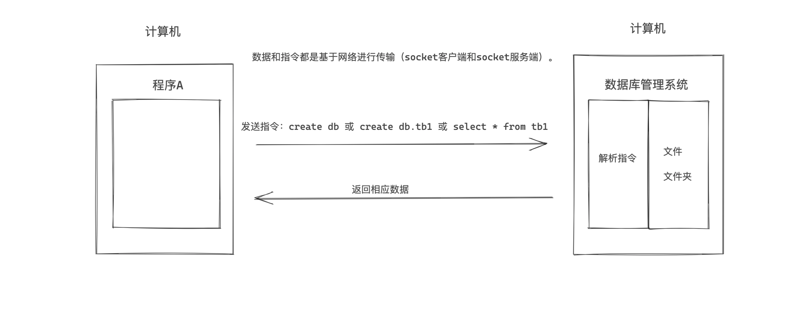
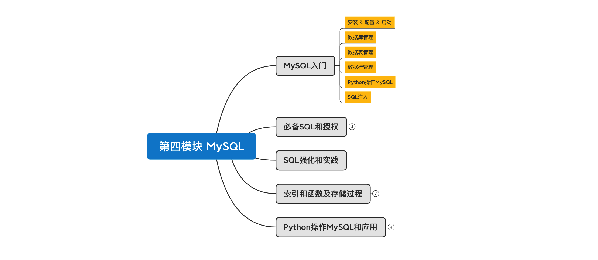
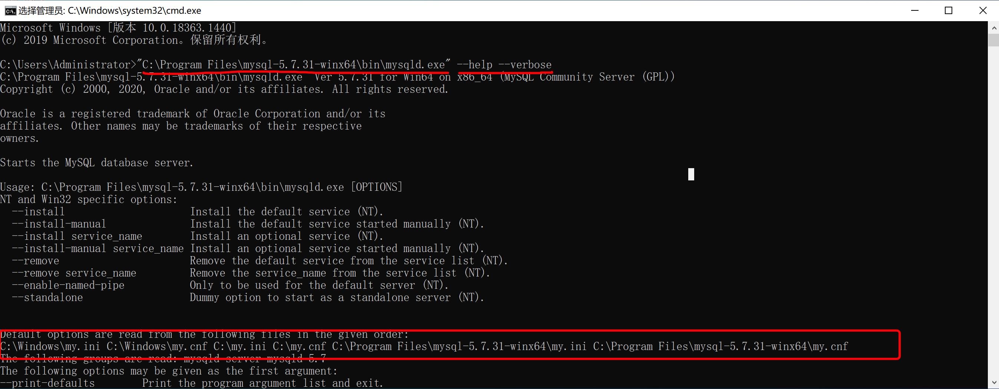
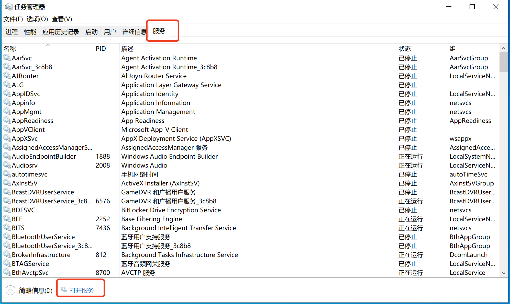
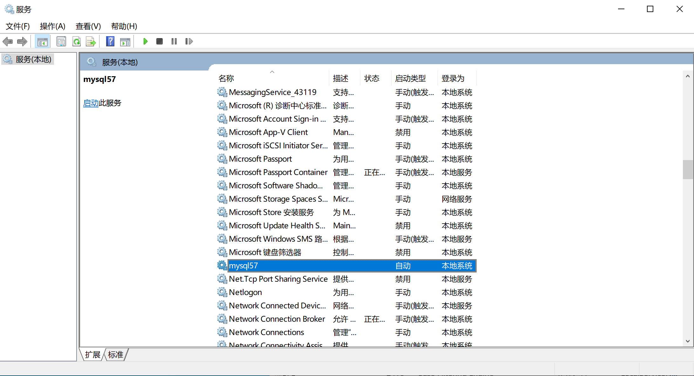
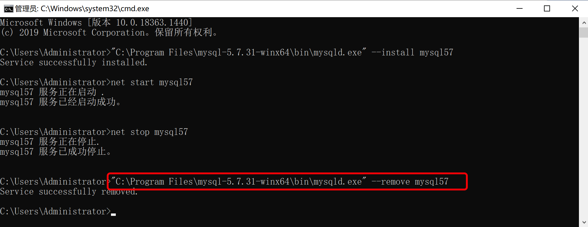
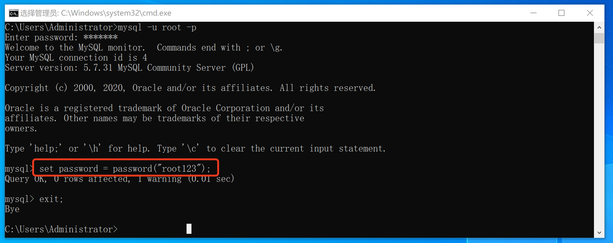

# MySQL数据库

从今天开始，我们将进入系列课程的 第四模块 的学习，这个模块就是给大家讲解MySQL数据库。

以前，在开发程序时，我们会把很多的数据和信息存储到某个文件夹中的文件中，例如：user.txt 、db.xlsx 等。

现在，有那么一个叫：数据库管理系统（DBMS，Database Management System）的软件，可以帮助我们实现对文件夹中的文件进行操作，而我们只要学习DBMS能识别的指令， 就能控制它去帮助我们实现的文件和文件夹的处理。例如：




数据库管理系统（DBMS）专注于帮助开发者解决数据存储的问题，这样开发者就可以把主要精力放在实现业务功能上了。

业内有很多的的数据库管理系统产品，例如：

* **MySQL**，原来是sun公司，后来被甲骨文收购。现在互联网企业几乎都在使用。【免费 + 收费】
* Oracle，甲骨文。收费，一般国企、事业单位居多。【收费】
* Microsoft SQL Server，微软。【收费】
* DB2，IBM。【免费 + 收费】
* SQLite，D. Richard Hipp个人开发。【免费】
* Access， 微软。【收费】
* PostgreSQL，加州大学伯克利分校。【免费】
* 等众多..

由于各大公司都是使用MySQL，所以我们课程主要给大家讲解MySQL数据库。

在项目开发中想要基于MySQL来进行数据存储，大致应该怎么做呢？


本系列的MySQL模块会分为5部分来讲解：

* MySQL入门，安装和快速应用Python实现数据库的操作。
* 必备SQL和授权，学习更多必备的指令让数据库实现更多业务场景。
* SQL强化和实践，强化练习必备”指令“（项目开发写的最多）。
* 索引和函数以及存储过程，掌握常见性能提升手段以及那些应用不是很频繁却又需了解的知识点。
* Python操作MySQL和应用，侧重点在于Python开发，让大家了解Python开发中必备的实战应用，例如：锁、事务、数据库连接池等。


# day25 MySQL入门




课程目标：学习安装和快速应用Python实现数据库的操作。

课程概要：

* 安装 & 配置 & 启动
  + win
  + mac
* 数据库 管理（类比文件夹）
* 表 管理        （类比文件夹下的Excel文件）
* 数据行 管理（类比Excel文件中的数据行）
* Python操作MySQL及相关安全的问题

## 1. 安装 & 配置 & 启动

MySQL现在的版本主要分为：

* 5.x 版本，现在互联网企业中的主流版本，包括：头条、美图、百度、腾讯等互联网公司主流的版本。
* 8.x 版本，新增了一些了窗口函数、持久化配置、隐藏索引等其他功能。

所以，我们课程会以常用大版本中最新的版本为例来讲解，即：5.7.31 （依然有很多企业在用5.6.x，但新项目基本上都是5.7.x了）。

### 1.1 win系统

#### 第1步：下载安装

https://downloads.mysql.com/archives/community/


#### 第2步：解压至任意文件夹

建议解压至软件安装目录，例如：


#### 第3步：创建配置文件

在MySQL的安装目录下创建 `my.ini` 的文件，作为MySQL的配置文件。


其实，MySQL的配置文件可以放在很多的目录，下图是配置文件的优先级：



强烈，建议大家还是把配置文件放在MySQL安装目录下，这样以后电脑上想要安装多个版本的MySQL时，配置文件可以相互独立不影响。

注意：如果你电脑的上述其他目录存在MySQL配置文件，建议删除，否则可能会影响MySQL的启动。

#### 第4步：初始化

```
>>> "C:\Program Files\mysql-5.7.31-winx64\bin\mysqld.exe"  --initialize-insecure
```

初始化命令在执行时，会自动读取配置文件并执行初始化，此过程主要会做两件事：

* 自动创建data目录，以后我们的数据都会存放在这个目录。
* 同时创建建必备一些的数据，例如默认账户 root （无密码），用于登录MySQL并通过指令操作MySQL。


在windowns安装过程中如果有报错 （ msvcr120.dll不存在 ），请下载并安装下面的两个补丁：

* vcredist：https://www.microsoft.com/zh-cn/download/confirmation.aspx?id=40784  （主要）
  

* dirctx：https://www.microsoft.com/zh-CN/download/details.aspx?id=35
  

#### 第5步：启动

启动MySQL常见的有两种方式：

* 临时启动

  

```bash
  >>> "C:\Program Files\mysql-5.7.31-winx64\bin\mysqld.exe"
```

  


  注意：此时程序会挂起，内部就是可以接收客户端发来的MySQL指令，关闭窗口或Ctrl+c 就可以停止运行。

  这种启动方式每次开机或想要开启都需要手动执行一遍命令比较麻烦。

* 制作windows服务，基于windows服务管理。

  

```bash
  >>>"C:\Program Files\mysql-5.7.31-winx64\bin\mysqld.exe" --install mysql57
```

  


  创建好服务之后，可以通过命令 启动和关闭服务，例如：

  

```bash
  >>> net start mysql57
  >>> net stop mysql57
```

  也可以在window的服务管理中点击按钮启动和关闭服务。例如：

  


  



  



  

  以后不再想要使用window服务了，也可以将制作的这个MySQL服务删除。

  

```
  >>>"C:\Program Files\mysql-5.7.31-winx64\bin\mysqld.exe" --remove mysql57
```

  



#### 第6步：测试连接MySQL

安装并启动MySQL之后，就可以连接MySQL来测试是否已正确安装并启动成功。


以后在开发时，肯定是要用Python代码来连接MySQL并且进行数据操作（后面讲）。

在安装MySQL时，其实也自动安装了一个工具（客户端），让我们快速实现连接MySQL并发送指令。


注意：如果把bin目录加入环境变量，每次在运行命令时，就不用再重新输入绝对路径了。


上述过程如果操作完成之后，证明你的安装和启动过程就搞定了。

### 1.2 mac系统

mac系统和win不同，MySQL为他提供了非常方便的一站式安装程序，只要点击、next就可以安装、初始化完成。

#### 第1步：安装和初始化

https://downloads.mysql.com/archives/community/


这个基于dmg文件的安装过程，其实包含了：

* 安装，默认安装在了 `/usr/local/mysql-5.7.31-macos10.14-x86_64/`目录。
* 初始化，在安装目录下创建data目录用于存放数据； 初始化模块数据库以及账户相关等，例如： 账cd


#### 第2步：创建配置文件

建议在MySQL安装目录下创建 `etc/my.cnf` 作为MySQL的配置文件。


MySQL的配置文件按照优先级，会在以下目录中寻找：


为了避免多个版本共存时，配置文件混乱的问题，建议大家还是把配置文件放在当前MySQL的安装目录下。

#### 第3步：启动

在Mac系统中启动MySQL常见的有2种方式：

* 安装目录中自带 `mysql.server` 脚本（建议）

  

```python
  sudo /usr/local/mysql/support-files/mysql.server start
  # 输入电脑密码
  
  sudo mysql.server start
  # 输入电脑密码
```

  

```
  sudo /usr/local/mysql/support-files/mysql.server stop
```

  


  为了避免每次执行命令都需要些路径，可以将路径 `/usr/local/mysql/support-files` 加入到环境变量中。


  操作完成之后，再在终端执行下命令： `source ~/.zprofile` 让设置的环境变量立即生效。

  注意：mac系统的版本如果比较老，会显示空白的 `zprofile` 文件，此就要去打开 `bash_profile` 文件。

  这样设置好之后，以后就可以使用下面的命令去启动和关闭MySQL了。

  

```
sudo mysql.server start
sudo mysql.server stop
```

  

* 系统偏好设置（不推荐）


第一种 `mysql.server` 脚本的形式，内部是使用 `mysqld_safe` 运行，可以守护我们的MySQL进程，如意外挂掉可自动重启。

#### 第4步：测试连接MySQL

安装并启动MySQL之后，就可以连接MySQL来测试是否已正确安装并启动成功。


以后在开发时，肯定是要用Python代码来连接MySQL并且进行数据操作（后面讲）。

在安装MySQL时，其实也自动安装了一个工具（客户端），让我们快速实现连接MySQL并发送指令。


注意： `/usr/local/mysql/bin` 也可以加入到环境变量。

至此，在Mac系统中关于MySQL的安装和配置就完成了。

### 1.3 关于配置文件

上述的过程中，我们在配置文件中只添加了很少的配置。

其实，配置项有很多，而哪些配置项都有默认值，如果我们不配置，MySQL则自动使用默认值。

### 1.4 关于密码

#### 1. 设置和修改root密码

在windows系统中模块默认 root 账户是没有密码的，如果想要为账户设定密码，可以在利用root账户登录成功之后，执行：



#### 2. 忘记root密码

如果你忘记了MySQL账户的密码。

* 修改配置文件，在 [mysqld] 节点下添加 `skip-grant-tables=1`

  

```
  [mysqld]
  ...
  skip-grant-tables=1
  ...
```

* 重启MySQL，再次登录时，不需要密码直接可以进去了

  + windows重启

$mdFormatter$106$mdFormatter$

```
    net stop mysql57
    net start mysql57
```

  + mac重启

$mdFormatter$106$mdFormatter$

```
    sudo mysql.server restart
```

  重启后，无序密码就可以进入。

  

```
  >>> mysql -u root -p
```

* 进入数据库后执行修改密码命令

  

```
  use mysql;
  update user set authentication_string = password('新密码'),password_last_changed=now() where user='root';
```

* 退出并再次修改配置文件，删除 [mysqld] 节点下的 `skip-grant-tables=1`

  

```
  [mysqld]
  ...
  # skip-grant-tables=1
  ...
```

* 再次重启，以后就可以使用新密码登录了。

## 2. 数据库 管理

安装上数据库之后，就需要开始学习指令了，通过指令让MySQL去做出一些文件操作。


如果将数据库管理系统与之前的文件管理做类比的话：

| 数据库管理系统 | 文件管理            |
| -------------- | ------------------- |
| 数据库         | 文件夹              |
| 数据表         | 文件夹下的excel文件 |

接下来，我们先学习 数据库（文件夹）相关操作的指令。


### 2.1 内置客户端操作

当连接上MySQL之后，执行如下指令（一般称为SQL语句），就可以对MySQL的数据进行操作。

* 查看当前所有的数据库：  `show databases;`

* 创建数据库：`create database 数据库名 DEFAULT CHARSET utf8 COLLATE utf8_general_ci;`

  

```
  create database day25db;
  
  create database day25db DEFAULT CHARSET utf8 COLLATE utf8_general_ci;
```

* 删除数据库：`drop database 数据库名`; 

* 进入数据（进入文件）：`use 数据库;`

示例：

```bash
# 1.登录MySQL
wupeiqi@wupeiqideMBP ~ % /usr/local/mysql/bin/mysql -u root -p
Enter password:
Welcome to the MySQL monitor.  Commands end with ; or \g.
Your MySQL connection id is 5
Server version: 5.7.31 MySQL Community Server (GPL)

Copyright (c) 2000, 2020, Oracle and/or its affiliates. All rights reserved.

Oracle is a registered trademark of Oracle Corporation and/or its
affiliates. Other names may be trademarks of their respective
owners.

Type 'help;' or '\h' for help. Type '\c' to clear the current input statement.

# 2.查看当前数据库
mysql> show databases;
+--------------------+
| Database           |
+--------------------+
| information_schema |
| mysql              |
| performance_schema |
| sys                |
+--------------------+
4 rows in set (0.00 sec)

# 3. 创建数据库:  create database 数据库名 default charset 编码 collate 排序规则;
mysql> create database db1 default charset utf8 collate utf8_general_ci;
Query OK, 1 row affected (0.00 sec)

mysql> show databases;
+--------------------+
| Database           |
+--------------------+
| information_schema |
| db1                |
| mysql              |
| performance_schema |
| sys                |
+--------------------+
5 rows in set (0.01 sec)

# 4. 删除数据库
mysql> drop database db1;
Query OK, 0 rows affected (0.00 sec)

# 5. 查看当前数据库
mysql> show databases;
+--------------------+
| Database           |
+--------------------+
| information_schema |
| mysql              |
| performance_schema |
| sys                |
+--------------------+
4 rows in set (0.00 sec)

# 6. 进入数据库
mysql> use mysql;
Reading table information for completion of table and column names
You can turn off this feature to get a quicker startup with -A

Database changed
# 7. 进入mysql数据库（文件夹），查看此数据库下的所有表。
mysql> show tables;
+---------------------------+
| Tables_in_mysql           |
+---------------------------+
| columns_priv              |
| db                        |
| engine_cost               |
| event                     |
| func                      |
| general_log               |
| gtid_executed             |
| help_category             |
| help_keyword              |
| help_relation             |
| help_topic                |
| innodb_index_stats        |
| innodb_table_stats        |
| ndb_binlog_index          |
| plugin                    |
| proc                      |
| procs_priv                |
| proxies_priv              |
| server_cost               |
| servers                   |
| slave_master_info         |
| slave_relay_log_info      |
| slave_worker_info         |
| slow_log                  |
| tables_priv               |
| time_zone                 |
| time_zone_leap_second     |
| time_zone_name            |
| time_zone_transition      |
| time_zone_transition_type |
| user                      |
+---------------------------+
31 rows in set (0.00 sec)

# 8. 退出
mysql>exit;
```

### 2.2 Python代码操作

无论通过何种方式去连接MySQL，本质上发送的 **指令** 都是相同的，只是连接的方式和操作形式不同而已。

当连接上MySQL之后，执行如下指令，就可以对MySQL的数据进行操作。（同上述过程）

* 查看当前所有的数据库 `show databases;`

* 创建数据库： `create database 数据库名 default charset utf8 collate utf8_general_ci;`

* 删除数据库：`drop database 数据库名`; 
* 进入数据（进入文件）：`use 数据库;`

想要使用Python操作MySQL需要安装第三方模块：

```
pip3 install pymysql
```


安装完成后，就可以编写代码：

```python
import pymysql

# 连接MySQL（socket）
conn = pymysql.connect(host='127.0.0.1', port=3306, user='root', passwd='root123', charset="utf8")
cursor = conn.cursor()

# 1. 查看数据库
# 发送指令
cursor.execute("show databases")
# 获取指令的结果
result = cursor.fetchall()
print(result) # (('information_schema',), ('mysql',), ('performance_schema',), ('sys',))

# 2. 创建数据库（新增、删除、修改）
# 发送指令
cursor.execute("create database db3 default charset utf8 collate utf8_general_ci")
conn.commit()

# 3. 查看数据库
# 发送指令
cursor.execute("show databases")
# 获取指令的结果
result = cursor.fetchall()
print(result) # (('information_schema',), ('db3',), ('mysql',), ('performance_schema',), ('sys',))

# 4. 删除数据库
# 发送指令
cursor.execute("drop database db3")
conn.commit()

# 3. 查看数据库
# 发送指令
cursor.execute("show databases")
# 获取指令的结果
result = cursor.fetchall()
print(result) # (('information_schema',), ('mysql',), ('performance_schema',), ('sys',))

# 5. 进入数据库，查看表
# 发送指令
cursor.execute("use mysql")
cursor.execute("show tables")
result = cursor.fetchall()
print(result) # (('columns_priv',), ('db',), ('engine_cost',), ('event',), ('func',), ('general_log',),....

# 关闭连接
cursor.close()
conn.close()
```

## 3. 数据表 管理


如果将数据库管理系统与之前的文件管理做类比的话：

| 数据库管理系统 | 文件管理       |
| -------------- | -------------- |
| 数据库         | 文件夹         |
| 数据表         | 文件夹下的文件 |

接下来，我们先学习 数据表（文件夹中的文件）相关操作的指令。


其实在数据库中创建数据库 和 创建Excel非常类似，需要指定： `表名` 、 `列名称` 、 `类类型（整型、字符串或其他)` 。

### 3.1 内置客户端操作

数据表常见操作的指令：

* 进入数据库 `use 数据库;`，查看当前所有表：`show tables;`

* 创建表结构
  


  

```sql
  create table 表名(
      列名  类型,
      列名  类型,
      列名  类型
  )default charset=utf8;
```

  

```sql
  create table tb1(
  	id int,
      name varchar(16)
  )default charset=utf8;
```

  

```sql
  create table tb2(
  	id int,
      name varchar(16) not null,   -- 不允许为空
      email varchar(32) null,      -- 允许为空（默认）
      age int
  )default charset=utf8;
```

  

```sql
  create table tb3(
  	id int,
      name varchar(16) not null,   -- 不允许为空
      email varchar(32) null,      -- 允许为空（默认）
      age int default 3            -- 插入数据时，如果不给age列设置值，默认值：3
  )default charset=utf8;
```

  

```sql
  create table tb4(
  	id int primary key,			 -- 主键（不允许为空、不能重复）
      name varchar(16) not null,   -- 不允许为空
      email varchar(32) null,      -- 允许为空（默认）
      age int default 3            -- 插入数据时，如果不给age列设置值，默认值：3
  )default charset=utf8;
```

  主键一般用于表示当前这条数据的ID编号（类似于人的身份证），需要我们自己来维护一个不重复的值，比较繁琐。所以，在数据库中一般会将主键和自增结合。

  

```sql
  create table tb5(
  	id int not null auto_increment primary key,	-- 不允许为空 & 主键 & 自增
      name varchar(16) not null,   		-- 不允许为空
      email varchar(32) null,      		-- 允许为空（默认）
      age int default 3            		-- 插入数据时，如果不给age列设置值，默认值：3
  )default charset=utf8;
```

  注意：一个表中只能有一个自增列【自增列，一般都是主键】。

* 删除表 `drop table 表名;`

* 清空表 `delete from 表名;` 或 `truncate table 表名;`（速度快、无法回滚撤销等）

* 修改表

  + 添加列 

$mdFormatter$106$mdFormatter$

```sql
    alter table 表名 add 列名 类型;
    alter table 表名 add 列名 类型 DEFAULT 默认值;
    alter table 表名 add 列名 类型 not null default 默认值;
    alter table 表名 add 列名 类型 not null primary key auto_increment;
```

  + 删除列

$mdFormatter$106$mdFormatter$

```sql
    alter table 表名 drop column 列名;
```

  + 修改列 类型

$mdFormatter$106$mdFormatter$

```sql
    alter table 表名 modify column 列名 类型;
```

  + 修改列 类型 + 名称

$mdFormatter$106$mdFormatter$

```sql
    alter table 表名 change 原列名 新列名 新类型;
```

$mdFormatter$106$mdFormatter$

```sql
    alter table  tb change id nid int not null;
    alter table  tb change id id int not null default 5;
    alter table  tb change id id int not null primary key auto_increment;
    
    alter table  tb change id id int; -- 允许为空，删除默认值，删除自增。
```

  + 修改列 默认值

$mdFormatter$106$mdFormatter$

```sql
    ALTER TABLE 表名 ALTER 列名 SET DEFAULT 1000;
```

  + 删除列 默认值

$mdFormatter$106$mdFormatter$

```sql
    ALTER TABLE 表名 ALTER 列名 DROP DEFAULT;
```

  + 添加主键

$mdFormatter$106$mdFormatter$

```sql
    alter table 表名 add primary key(列名);
```

  + 删除主键

$mdFormatter$106$mdFormatter$

```sql
    alter table 表名 drop primary key;
```

* 常见列类型

  

```sql
  create table 表(
  	id int,
      name varchar(16)
  )default charset=utf8;
```

  + `int[(m)][unsigned][zerofill]`

$mdFormatter$106$mdFormatter$

```
    int				表示有符号，取值范围：-2147483648 ～ 2147483647
    int unsigned	表示无符号，取值范围：0 ～ 4294967295
    int(5)zerofill	仅用于显示，当不满足5位时，按照左边补0，例如：00002；满足时，正常显示。
```

$mdFormatter$106$mdFormatter$

```sql
    mysql> create table L1(id int, uid int unsigned, zid int(5) zerofill) default charset=utf8;
    Query OK, 0 rows affected (0.03 sec)
    
    mysql> insert into L1(id,uid,zid) values(1,2,3);
    Query OK, 1 row affected (0.00 sec)
    
    mysql> insert into L1(id,uid,zid) values(2147483641,4294967294,300000);
    Query OK, 1 row affected (0.00 sec)
    
    mysql> select * from L1;
    +------------+------------+--------+
    | id         | uid        | zid    |
    +------------+------------+--------+
    |          1 |          2 |  00003 |
    | 2147483641 | 4294967294 | 300000 |
    +------------+------------+--------+
    2 rows in set (0.00 sec)
    
    mysql> insert into L1(id,uid,zid) values(214748364100,4294967294,300000);
    ERROR 1264 (22003): Out of range value for column 'id' at row 1
    mysql>
```

  + `tinyint[(m)] [unsigned] [zerofill]`

$mdFormatter$106$mdFormatter$

```
    有符号，取值范围：-128 ～ 127.
    无符号，取值范围：0 ～ 255
```

  + `bigint[(m)][unsigned][zerofill]`

$mdFormatter$106$mdFormatter$

```
    有符号，取值范围：-9223372036854775808 ～ 9223372036854775807
    无符号，取值范围：0  ～  18446744073709551615
```

  + `decimal[(m[,d])] [unsigned] [zerofill]`

$mdFormatter$106$mdFormatter$

```
    准确的小数值，m是数字总个数（负号不算），d是小数点后个数。 m最大值为65，d最大值为30。
    
    例如：
    create table L2(
    	id int not null primary key auto_increment,
    	salary decimal(8,2)
    )default charset=utf8;
```

$mdFormatter$106$mdFormatter$

```sql
    mysql> create table L2(id int not null primary key auto_increment,salary decimal(8,2))default charset=utf8;
    Query OK, 0 rows affected (0.03 sec)
    
    mysql> insert into L2(salary) values(1.28);
    Query OK, 1 row affected (0.01 sec)
    
    mysql> insert into L2(salary) values(5.289);
    Query OK, 1 row affected, 1 warning (0.00 sec)
    
    mysql> insert into L2(salary) values(5.282);
    Query OK, 1 row affected, 1 warning (0.00 sec)
    
    mysql> insert into L2(salary) values(512132.28);
    Query OK, 1 row affected (0.00 sec)
    
    mysql> insert into L2(salary) values(512132.283);
    Query OK, 1 row affected, 1 warning (0.00 sec)
    
    mysql> select * from L2;
    +----+-----------+
    | id | salary    |
    +----+-----------+
    |  1 |      1.28 |
    |  2 |      5.29 |
    |  3 |      5.28 |
    |  4 | 512132.28 |
    |  5 | 512132.28 |
    +----+-----------+
    5 rows in set (0.00 sec)
    
    mysql> insert into L2(salary) values(5121321.283);
    ERROR 1264 (22003): Out of range value for column 'salary' at row 1
    mysql>
```

  + `FLOAT[(M,D)] [UNSIGNED] [ZEROFILL]`

$mdFormatter$106$mdFormatter$

```
    单精度浮点数，非准确小数值，m是数字总个数，d是小数点后个数。
```

  + `DOUBLE[(M,D)] [UNSIGNED] [ZEROFILL]`

$mdFormatter$106$mdFormatter$

```
    双精度浮点数（非准确小数值），m是数字总个数，d是小数点后个数。
```

  + `char(m)`

$mdFormatter$106$mdFormatter$

```
    定长字符串，m代表字符串的长度，最多可容纳255个字符。
    
    定长的体现：即使内容长度小于m，也会占用m长度。例如：char(5)，数据是：yes，底层也会占用5个字符；如果超出m长度限制（默认MySQL是严格模式，所以会报错）。
        如果在配置文件中加入如下配置，
            sql-mode="NO_AUTO_CREATE_USER,NO_ENGINE_SUBSTITUTION"
        保存并重启，此时MySQL则是非严格模式，此时超过长度则自动截断（不报错）。。
    
    注意：默认底层存储是固定的长度（不够则用空格补齐），但是查询数据时，会自动将空白去除。 如果想要保留空白，在sql-mode中加入 PAD_CHAR_TO_FULL_LENGTH 即可。
    查看模式sql-mode，执行命令：show variables  like 'sql_mode';
    
    一般适用于：固定长度的内容。
    
    create table L3(
        id int not null primary key auto_increment,
        name varchar(5),
        depart char(3)
    )default charset=utf8;
    
    insert into L3(name,depart) values("alexsb","sbalex");
```

  + `varchar(m)`

$mdFormatter$106$mdFormatter$

```
    变长字符串，m代表字符串的长度，最多可容纳65535个字节。
    
    变长的体现：内容小于m时，会按照真实数据长度存储；如果超出m长度限制（（默认MySQL是严格模式，所以会报错）。
        如果在配置文件中加入如下配置，
            sql-mode="NO_AUTO_CREATE_USER,NO_ENGINE_SUBSTITUTION"
        保存并重启，此时MySQL则是非严格模式，此时超过长度则自动截断（不报错）。
    
    例如：
    create table L3(
        id int not null primary key auto_increment,
        name varchar(5),
        depart char(3)
    )default charset=utf8;
```

$mdFormatter$106$mdFormatter$

```sql
    mysql> create table L3(id int not null primary key auto_increment,name varchar(5),depart char(3))default charset=utf8;
    Query OK, 0 rows affected (0.03 sec)
    
    -- 插入多行
    mysql> insert into L3(name,depart) values("wu","WU"),("wupei","ALS");
    Query OK, 2 rows affected (0.00 sec)
    Records: 2  Duplicates: 0  Warnings: 0
    
    mysql> select * from L3;
    +----+-------+--------+
    | id | name  | depart |
    +----+-------+--------+
    |  1 | wu    | WU     |
    |  2 | wupei | ALS    |
    +----+-------+--------+
    2 rows in set (0.00 sec)
    
    -- 非严格模式下，不会报错。
    mysql> insert into L3(name,depart) values("wupeiqi","ALS");
    ERROR 1406 (22001): Data too long for column 'name' at row 1
    mysql> insert into L3(name,depart) values("wupei","ALSB");
    ERROR 1406 (22001): Data too long for column 'depart' at row 1
    mysql>
    
    -- 如果 sql-mode 中加入了 PAD_CHAR_TO_FULL_LENGTH ，则查询时char时空白会保留。
    mysql> select name,length(name),depart,length(depart) from L3;
    +-------+--------------+--------+----------------+
    | name  | length(name) | depart | length(depart) |
    +-------+--------------+--------+----------------+
    | wu    |            2 | WU     |              3 |
    | wupei |            5 | ALS    |              3 |
    +-------+--------------+--------+----------------+
    4 rows in set (0.00 sec)
    mysql>
```

  + `text`

$mdFormatter$106$mdFormatter$

```
    text数据类型用于保存变长的大字符串，可以组多到65535 (2**16 − 1)个字符。
    
    一般情况下，长文本会用text类型。例如：文章、新闻等。
```

$mdFormatter$106$mdFormatter$

```sql
    create table L4(
    	id int not null primary key auto_increment,
        title varchar(128),
    	content text
    )default charset=utf8;
```

  + `mediumtext`

$mdFormatter$106$mdFormatter$

```
    A TEXT column with a maximum length of 16,777,215 (2**24 − 1) characters.
```

  + `longtext`

$mdFormatter$106$mdFormatter$

```
    A TEXT column with a maximum length of 4,294,967,295 or 4GB (2**32 − 1)
```

​    

  + `datetime`

$mdFormatter$106$mdFormatter$

```
    YYYY-MM-DD HH:MM:SS（1000-01-01 00:00:00/9999-12-31 23:59:59）
```

  + `timestamp`

$mdFormatter$106$mdFormatter$

```
    YYYY-MM-DD HH:MM:SS（1970-01-01 00:00:00/2037年）
```

$mdFormatter$106$mdFormatter$

```
    对于TIMESTAMP，它把客户端插入的时间从当前时区转化为UTC（世界标准时间）进行存储，查询时，将其又转化为客户端当前时区进行返回。
    
    对于DATETIME，不做任何改变，原样输入和输出。
```

$mdFormatter$106$mdFormatter$

```sql
    mysql> create table L5(
        -> id int not null primary key auto_increment,
        -> dt datetime,
        -> tt timestamp
        -> )default charset=utf8;
    Query OK, 0 rows affected (0.03 sec)
    
    mysql> insert into L5(dt,tt) values("2025-11-11 11:11:44", "2025-11-11 11:11:44");
    
    mysql> select * from L5;
    +----+---------------------+---------------------+
    | id | dt                  | tt                  |
    +----+---------------------+---------------------+
    |  1 | 2025-11-11 11:11:44 | 2025-11-11 11:11:44 |
    +----+---------------------+---------------------+
    1 row in set (0.00 sec)
    
    mysql> show variables like '%time_zone%';
    +------------------+--------+
    | Variable_name    | Value  |
    +------------------+--------+
    | system_time_zone | CST    | 
    | time_zone        | SYSTEM |
    +------------------+--------+
    2 rows in set (0.00 sec)
    -- “CST”指的是MySQL所在主机的系统时间，是中国标准时间的缩写，China Standard Time UT+8:00
    
    mysql> set time_zone='+0:00';
    Query OK, 0 rows affected (0.00 sec)
    
    mysql> show variables like '%time_zone%';
    +------------------+--------+
    | Variable_name    | Value  |
    +------------------+--------+
    | system_time_zone | CST    |
    | time_zone        | +00:00 |
    +------------------+--------+
    2 rows in set (0.01 sec)
    
    mysql> select * from L5;
    +----+---------------------+---------------------+
    | id | dt                  | tt                  |
    +----+---------------------+---------------------+
    |  1 | 2025-11-11 11:11:44 | 2025-11-11 03:11:44 |
    +----+---------------------+---------------------+
    1 row in set (0.00 sec)
```

  + `date`

$mdFormatter$106$mdFormatter$

```
    YYYY-MM-DD（1000-01-01/9999-12-31）
```

  + `time`

$mdFormatter$106$mdFormatter$

```
    HH:MM:SS（'-838:59:59'/'838:59:59'）
```

  MySQL还有很多其他的数据类型，例如：*set、enum、TinyBlob、Blob、MediumBlob、LongBlob 等*，详细见官方文档：https://dev.mysql.com/doc/refman/5.7/en/data-types.html

上述就是关于数据表的一些基本操作。

### 3.2 MySQL代码操作

基于Python去连接MySQL之后，想要进行数据表的管理的话，发送的指令其实都是相同的，例如：

```sql
import pymysql

# 连接MySQL
conn = pymysql.connect(host='127.0.0.1', port=3306, user='root', passwd='root123', charset="utf8")
cursor = conn.cursor()

# 1. 创建数据库
"""
cursor.execute("create database db4 default charset utf8 collate utf8_general_ci")
conn.commit()
"""

# 2. 进入数据库、查看数据表
"""
cursor.execute("use db4")
cursor.execute("show tables")
result = cursor.fetchall()
print(result)
"""

# 3. 进入数据库创建表
cursor.execute("use db4")
sql = """
create table L4(
    id int not null primary key auto_increment,
    title varchar(128),
    content text,
    ctime datetime
)default charset=utf8;
"""
cursor.execute(sql)
conn.commit()

# 4. 查看数据库中的表
"""
cursor.execute("show tables")
result = cursor.fetchall()
print(result)
"""

# 5. 其他 drop table... 略过

# 关闭连接
cursor.close()
conn.close()
```

## 4. 数据行

当数据库和数据表创建完成之后，就需要对数据表中的内容进行：增、删、改、查了。


### 4.1 内置客户端操作

数据行操作的相关SQL语句（指令）如下：

* 新**增**数据

  

```
  insert into 表名 (列名,列名,列名) values(对应列的值,对应列的值,对应列的值);
```

  

```sql
  insert into tb1(name,password) values('武沛齐','123123');
  insert into tb1(name,password) values('武沛齐','123123'),('alex','123');
  
  insert into tb1 values('武沛齐','123123'),('alex','123'); -- 如果表中只有2列
```

* **删**除数据

  

```sql
  delete from 表名;
  delete from 表名 where 条件;
```

  

```sql
  delete from tb1;
  delete from tb1 where name="wupeiqi";
  delete from tb1 where name="wupeiqi" and password="123";
  delete from tb1 where id>9;
```

* 修**改**数据

  

```sql
  update 表名 set 列名=值;
  update 表名 set 列名=值 where 条件;
```

  

```sql
  update tb1 set name="wupeiqi";
  update tb1 set name="wupeiqi" where id=1;
  
  update tb1 set age=age+1;  -- 整型
  update tb1 set age=age+1 where id=2;
  
  update L3 set name=concat(name,"db");
  update L3 set name=concat(name,"123")  where id=2;  -- concat一个函数，可以拼接字符串
```

* **查**询数据

  

```sql
  select * from 表名;
  select 列名,列名,列名 from 表名;
  select 列名,列名 as 别名,列名 from 表名;
  select * from 表名 where 条件;
```

  

```sql
  select * from tb1;
  select id,name,age from tb1;
  select id,name as N,age, from tb1;
  select id,name as N,age, 111 from tb1;
  
  select * from tb1 where id = 1;
  select * from tb1 where id > 1;
  select * from tb1 where id != 1;
  select * from tb1 where name="wupeiqi" and password="123";
```

### 4.2 Python代码操作


```python
import pymysql

# 连接MySQL，自动执行 use userdb; -- 进入数据库
conn = pymysql.connect(host='127.0.0.1', port=3306, user='root', passwd='root123', charset="utf8", db='userdb')
cursor = conn.cursor()

# 1.新增（需commit）
"""
cursor.execute("insert into tb1(name,password) values('武沛齐','123123')")
conn.commit()
"""

# 2.删除（需commit）
"""
cursor.execute("delete from tb1 where id=1")
conn.commit()
"""

# 3.修改（需commit)
"""
cursor.execute("update tb1 set name='xx' where id=1")
conn.commit()
"""

# 4.查询
"""
cursor.execute("select * from tb where id>10")
data = cursor.fetchone() # cursor.fetchall()
print(data)
"""

# 关闭连接
cursor.close()
conn.close()
```

其实在真正做项目开发时，流程如下：

* 第一步：根据项目的功能来设计相应的 数据库 & 表结构（不会经常变动，在项目设计之初就确定好了）。
* 第二步：操作表结构中的数据，已达到实现业务逻辑的目的。

**例如：实现一个 用户管理系统。**

先使用MySQL自带的客户端创建相关 数据库和表结构（相当于先创建好Excel结构）。

```sql
create database usersdb default charset utf8 collate utf8_general_ci;
```

```sql
create table users(
	id int not null primary key auto_increment,
    name varchar(32),
	password varchar(64)
)default charset=utf8;
```

再在程序中执行编写相应的功能实现 注册、登录 等功能。

```python
import pymysql

def register():
    print("用户注册")

    user = input("请输入用户名：") # alex
    password = input("请输入密码：") # sb

    # 连接指定数据
    conn = pymysql.connect(host='127.0.0.1', port=3306, user='root', passwd='root123', charset="utf8", db="usersdb")
    cursor = conn.cursor()

    # 执行SQL语句（有SQL注入风险，稍后讲解）
    # sql = 'insert into users(name,password)values("alex","sb")'
    sql = 'insert into users(name,password) values("{}","{}")'.format(user, password)
    
    cursor.execute(sql)
    conn.commit()

    # 关闭数据库连接
    cursor.close()
    conn.close()

    print("注册成功，用户名：{},密码:{}".format(user, password))

def login():
    print("用户登录")

    user = input("请输入用户名：")
    password = input("请输入密码：")

    # 连接指定数据
    conn = pymysql.connect(host='127.0.0.1', port=3306, user='root', passwd='root123', charset="utf8", db="usersdb")
    cursor = conn.cursor()

    # 执行SQL语句（有SQL注入风险，稍后讲解）
    # sql = select * from users where name='wupeiqi' and password='123'
    sql = "select * from users where name='{}' and password='{}'".format(user, password)
    cursor.execute(sql)
    
    result = cursor.fetchone() # 去向mysql获取结果
    # None
    # (1,wupeiqi,123)
    
    
    # 关闭数据库连接
    cursor.close()
    conn.close()

    if result:
        print("登录成功", result)
    else:
        print("登录失败")

def run():
    choice = input("1.注册；2.登录")
    if choice == '1':
        register()
    elif choice == '2':
        login()
    else:
        print("输入错误")

if __name__ == '__main__':
    run()

```

So，你会发现， 在项目开发时，数据库 & 数据表 的操作其实就做那么一次，最最常写的还是 对数据行 的操作。

## 5. 关于SQL注入

假如，你开发了一个用户认证的系统，应该用户登录成功后才能正确的返回相应的用户结果。 

```python
import pymysql

# 输入用户名和密码
user = input("请输入用户名：") # ' or 1=1 -- 
pwd = input("请输入密码：") # 123

conn = pymysql.connect(host='127.0.0.1', port=3306, user='root', passwd='root123', charset="utf8",db='usersdb')
cursor = conn.cursor()

# 基于字符串格式化来 拼接SQL语句
# sql = "select * from users where name='alex' and password='123'"
# sql = "select * from users where name='' or 1=1 -- ' and password='123'"
sql = "select * from users where name='{}' and password='{}'".format(user, pwd)
cursor.execute(sql)

result = cursor.fetchone()
print(result) # None，不是None

cursor.close()
conn.close()
```

如果用户在输入user时，输入了： ` ' or 1=1 --   ` ，这样即使用户输入的密码不存在，也会可以通过验证。

**为什么呢？**

因为在SQL拼接时，拼接后的结果是：

```
select * from users where name='' or 1=1 -- ' and password='123'
```

注意：在MySQL中 `--` 表示注释。

**那么，在Python开发中 如何来避免SQL注入呢？**

切记，SQL语句不要在使用python的字符串格式化，而是使用pymysql的execute方法。

```python
import pymysql

# 输入用户名和密码
user = input("请输入用户名：")
pwd = input("请输入密码：")

conn = pymysql.connect(host='127.0.0.1', port=3306, user='root', passwd='root123', charset="utf8", db='userdb')

cursor = conn.cursor()

cursor.execute("select * from users where name=%s and password=%s", [user, pwd])
# 或
# cursor.execute("select * from users where name=%(n1)s and password=%(n2)s", {"n1": user, 'n2': pwd})

result = cursor.fetchone()
print(result)

cursor.close()
conn.close()
```

## 总结


除了 【第5步 用户授权】以外，现在使用的是默认root账户（拥有最大权限），上述所有的过程已讲解完毕。

本节内容大家需要掌握：

* 安装和启动MySQL
* SQL语句：
  + 数据库操作
  + 表操作
  + 数据行操作
* 基于Python操作MySQL
* 注意SQL注入的问题

## 作业

1. 根据要求 创建表 结构并编写相应的SQL语句（基于MySQL自带客户端操作）

   | 列名     | 类型          | 备注                                           |
   | -------- | ------------- | ---------------------------------------------- |
   | id       | int           | 不为空 & 自增 & 主键                           |
   | name     | varchar(32)   | 不为空                                         |
   | password | varchar(64)   | 不为空                                         |
   | gender   | char(1)       | 不为空，支持：男、女                           |
   | email    | varchar(64)   | 可以为空                                       |
   | amount   | decimal(10, 2) | 不为空 & 默认值为 0                            |
   | ctime    | datetime      | 新增时的时间<br />提示：可基于datetime模块实现 |

   - 根据上述表的要求创建相应的数据和表结构（注意编码）。

   - 任意插入5条数据。

   - 将 `id>3` 的所有人的性别改为  男。

   - 查询余额 `amount>1000` 的所有用户。

   - 让每个人的余额在自己原的基础上 +1000 。

   - 删除性别为男的所有数据。

   - 通过Python代码实现上述除了第一个以外的操作。

     

```
     插入5条数据时，ctime那一列不要自己写“2021-11-11.。。” 而是使用datatime模块生成当前时间。
```

2. 编写脚本实现将 csv 文件的内容录入到 MySQL 数据库中。
   要求：自己创建一个自增列作为主键（不要用csv文件中的第一列作为主键）。

   

```
   1715046,河北大学取消考试学生紧急离校,老师:回不了家的到老师家过年,https://video.pearvideo.com/mp4/adshort/20210105/cont-1715046-15562045_adpkg-ad_hd.mp4
   1715020,重庆两口子因琐事吵架，男子怒将自家车推进涪江,https://video.pearvideo.com/mp4/adshort/20210105/cont-1715020-15561817_adpkg-ad_hd.mp4
   1715031,成都九峰山因雪景引游客暴增，致垃圾遍地野猴觅食,https://video.pearvideo.com/mp4/adshort/20210105/cont-1715031-15561980_adpkg-ad_hd.mp4
   1715014,女子子宫摘除32年后CT报告称未见异常，医生：贴的模版忘删了,https://video.pearvideo.com/mp4/adshort/20210105/cont-1715014-15561686_adpkg-ad_hd.mp4
   1715025,监控画面曝光！甘肃天水一公交车与救护车相撞后坠桥,https://video.pearvideo.com/mp4/adshort/20210105/cont-1715025-15561875_adpkg-ad_hd.mp4
   1715010,男子称退伍后发现被贷款100万：征信逾期数十次，非自己签名,https://video.pearvideo.com/mp4/adshort/20210105/cont-1715010-15561845_adpkg-ad_hd.mp4
   1715007,东北老交警零下43度执勤落下老寒腿:穿2斤重棉裤,已习以为常,https://video.pearvideo.com/mp4/adshort/20210105/cont-1715007-15561958_adpkg-ad_hd.mp4
   1715011,女教师公寓熟睡被同事弟弟连砍数刀：全身刀疤，不敢告诉父母,https://video.pearvideo.com/mp4/adshort/20210105/cont-1715011-15561664_adpkg-ad_hd.mp4
   1714970,网曝江西一村庄现两千平违建，房主回应：建给村里当文化中心,https://video.pearvideo.com/mp4/adshort/20210105/cont-1714970-15561752_adpkg-ad_hd.mp4
   1715006,河南一新建足球场内惊现坟墓，官方：会尽快迁坟,https://video.pearvideo.com/mp4/adshort/20210105/cont-1715006-15561679_adpkg-ad_hd.mp4
   1715009,老师收到毕业24年学生送的定制台历：他高考失利，我开导过,https://video.pearvideo.com/mp4/adshort/20210105/cont-1715009-15561658_adpkg-ad_hd.mp4
   1715000,尚德机构回应未兑现宝马奖励：名单仍在确认中，会负责到底,https://video.pearvideo.com/mp4/adshort/20210105/cont-1715000-15561545_adpkg-ad_hd.mp4
   1714993,沈阳重点管控区日常产90吨生活垃圾，重点疫点垃圾由专人运走,https://video.pearvideo.com/mp4/adshort/20210105/cont-1714993-15561434_adpkg-ad_hd.mp4
   1714995,消费者称遭移动外呼10088套路换套餐，客服致歉：口径有问题,https://video.pearvideo.com/mp4/adshort/20210105/cont-1714995-1427-174135_adpkg-ad_hd.mp4
   1714979,泪流满面！武警相隔两千公里与妻子隔屏举行婚礼,https://video.pearvideo.com/mp4/adshort/20210105/cont-1714979-15561542_adpkg-ad_hd.mp4
   1714992,村民结婚两男子拄拐上门要钱：给少了不走，反问"咋拿得出手",https://video.pearvideo.com/mp4/adshort/20210105/cont-1714992-15561429_adpkg-ad_hd.mp4
   1714457,36年嫌疑人：儿女被骂“杀人犯的孩子”，不想把骂名带进棺材,https://video.pearvideo.com/mp4/adshort/20210105/cont-1714457-1491-170515_adpkg-ad_hd.mp4
   1714981,男子偷手机被发现挣脱失主逃跑，执勤辅警狂追八百米擒获,https://video.pearvideo.com/mp4/adshort/20210105/cont-1714981-99-172939_adpkg-ad_hd.mp4
   1714977,八旬老太捡拾垃圾成瘾，堆满楼道院子漫进邻居家,https://video.pearvideo.com/mp4/adshort/20210105/cont-1714977-15561306_adpkg-ad_hd.mp4
   1714972,昆明一楼盘消防喷淋离地仅2米1，业主吐槽：直接当喷头用,https://video.pearvideo.com/mp4/adshort/20210105/cont-1714972-15561247_adpkg-ad_hd.mp4
   1714973,居民家浓烟弥漫邻居敲门不应，民警赶来一看是屋主在熏腊肉,https://video.pearvideo.com/mp4/adshort/20210105/cont-1714973-15561249_adpkg-ad_hd.mp4
   1714966,石家庄有超市停业，学校紧急放假，学生：下午考试被临时取消,https://video.pearvideo.com/mp4/adshort/20210105/cont-1714966-15561248_adpkg-ad_hd.mp4
   1714902,杭州地铁7号线施工大揭秘：940天完成近40公里地铁线,https://video.pearvideo.com/mp4/adshort/20210105/cont-1714902-15561394_adpkg-ad_hd.mp4
   1714928,沈阳已设置重点管控区域，大连志愿者挨家挨户配送生活物资,https://video.pearvideo.com/mp4/adshort/20210105/cont-1714928-15561018_adpkg-ad_hd.mp4
   1714950,女孩考第一溺亡双胞胎姐姐不吃不喝，家属诉求：给予心理疏导,https://video.pearvideo.com/mp4/adshort/20210105/cont-1714950-15561100_adpkg-ad_hd.mp4
   1714924,70万1针特效药降价，2岁患儿母亲哽咽：会拼全力救孩子,https://video.pearvideo.com/mp4/adshort/20210105/cont-1714924-58-162201_adpkg-ad_hd.mp4
   1714930,贵州大叔嫁女陪嫁28万现金和一套房：儿子结婚只花了十几万,https://video.pearvideo.com/mp4/adshort/20210105/cont-1714930-15561017_adpkg-ad_hd.mp4
   1714927,张家口云顶滑雪场通报一滑雪者摔倒身亡：警方已介入,https://video.pearvideo.com/mp4/adshort/20210105/cont-1714927-15560963_adpkg-ad_hd.mp4
   1714926,邢台全面进入战时状态，小区进出需要健康码,https://video.pearvideo.com/mp4/adshort/20210105/cont-1714926-15560829_adpkg-ad_hd.mp4
   1714918,石家庄多个小区采取封闭管理：发现阳性检测者，全员核酸检测,https://video.pearvideo.com/mp4/adshort/20210105/cont-1714918-15560835_adpkg-ad_hd.mp4
   1714693,兰大女生当兵2年后重返校园：学会自律，珍惜在校时光,https://video.pearvideo.com/mp4/adshort/20210105/cont-1714693-15560791_adpkg-ad_hd.mp4
   1714920,猴哥尝到投喂甜头赖老太家不走，逗鸡毁菜气到村民报警,https://video.pearvideo.com/mp4/adshort/20210105/cont-1714920-15560793_adpkg-ad_hd.mp4
   1714916,沈阳确诊出车司机搭载的抚顺3名乘客全部找到，核酸均为阴性,https://video.pearvideo.com/mp4/adshort/20210105/cont-1714916-15560758_adpkg-ad_hd.mp4
   1714894,轿车被48米建筑垃圾围堵三个月，车主无法用车叫苦不迭,https://video.pearvideo.com/mp4/adshort/20210105/cont-1714894-15560731_adpkg-ad_hd.mp4
   1714861,考第一被质疑后溺亡女孩同学：她自尊心强，曾说被怀疑作弊,https://video.pearvideo.com/mp4/adshort/20210105/cont-1714861-15560701_adpkg-ad_hd.mp4
   1714886,东北汉子冲进火场救人被熏成黑脸：差几秒，我就倒在里面了,https://video.pearvideo.com/mp4/adshort/20210105/cont-1714886-15560659_adpkg-ad_hd.mp4
   1714908,探访石家庄疫情高风险地区：部分村庄封村，外村人一律不让进,https://video.pearvideo.com/mp4/adshort/20210105/cont-1714908-15560638_adpkg-ad_hd.mp4
   1714906,“北京时间”产生于西安，科学家解读选址考量因素,https://video.pearvideo.com/mp4/adshort/20210105/cont-1714906-15560549_adpkg-ad_hd.mp4
   1714907,16人聚餐吃了800元无人结账，老板询问反遭怼：多大点事儿,https://video.pearvideo.com/mp4/adshort/20210105/cont-1714907-15560637_adpkg-ad_hd.mp4
   1714892,重庆一地铁站出口建在坡顶，居民：期待未来的变化,https://video.pearvideo.com/mp4/adshort/20210105/cont-1714892-15560550_adpkg-ad_hd.mp4
   1714900,河北南宫一小区发现高度疑似密接人员，小区全面封闭只进不出,https://video.pearvideo.com/mp4/adshort/20210105/cont-1714900-15560548_adpkg-ad_hd.mp4
   1714901,杭州运河边8平米小书摊开了13年，店主兼职拉货补贴,https://video.pearvideo.com/mp4/adshort/20210105/cont-1714901-15560544_adpkg-ad_hd.mp4
   1714877,河南商丘鹦鹉卖家被追刑责，养殖户：不敢卖不敢放，放也犯法,https://video.pearvideo.com/mp4/adshort/20210105/cont-1714877-15560499_adpkg-ad_hd.mp4
   1714895,石家庄小果庄村1天增加8例确诊病例，为全国唯一高风险地区,https://video.pearvideo.com/mp4/adshort/20210105/cont-1714895-15560459_adpkg-ad_hd.mp4
   1714801,48岁女教师重新高考学法律：直接进入老年生活是种损失,https://video.pearvideo.com/mp4/adshort/20210105/cont-1714801-15560352_adpkg-ad_hd.mp4
   1714873,不认失散聋哑儿夫妻已接走儿子，养父：两验DNA，归属没说清,https://video.pearvideo.com/mp4/adshort/20210105/cont-1714873-15560356_adpkg-ad_hd.mp4
   1714846,7岁男童煤气中毒脑死亡，父母含泪为其捐器官救同龄人,https://video.pearvideo.com/mp4/adshort/20210105/cont-1714846-15560326_adpkg-ad_hd.mp4
   1714875,连夜出发！衡水110名护士紧急集结支援中风险地区,https://video.pearvideo.com/mp4/adshort/20210105/cont-1714875-15560268_adpkg-ad_hd.mp4
   1713843,打满全场丨院感专家李素英回忆援鄂：90后00后医护最让我感动,https://video.pearvideo.com/mp4/adshort/20210104/cont-1713843-15559433_adpkg-ad_hd.mp4
   1714869,河北新增14例确诊30例无症状，石家庄一村庄调整为高风险地区,https://video.pearvideo.com/mp4/adshort/20210105/cont-1714869-15560218_adpkg-ad_hd.mp4
   1714862,应急部披露襄汾饭店坍塌致29死细节：8次违规扩建，监管不严,https://video.pearvideo.com/mp4/adshort/20210105/cont-1714862-15560157_adpkg-ad_hd.mp4
```
