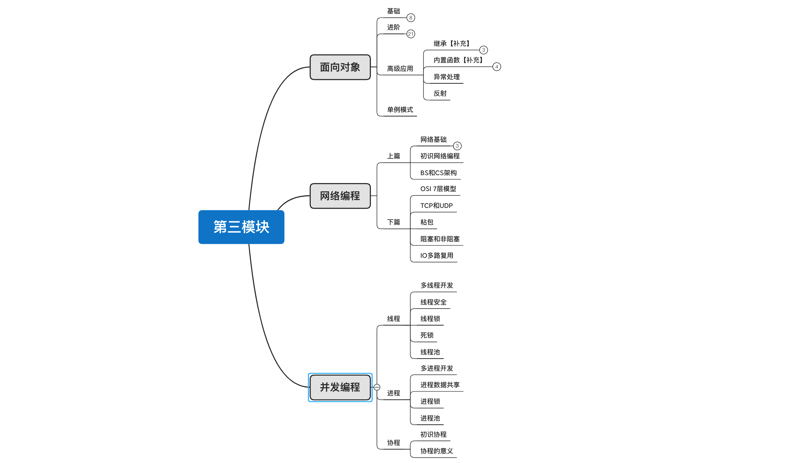

# day24 阶段总结

课程目标：对第三模块   阶段的知识点进行总结和考试，让学员更好的掌握此模块的相关知识。


课程概要：

* 知识补充
* 阶段总结（思维导图）
* 考试题

## 1. 知识点补充

### 1.1 并发编程 & 网络编程

从知识点的角度来看，本身两者其实没有什么关系：

* 网络编程，基于网络基础知识、socket模块实现网络的数据传输。

* 并发编程，基于多进程、多线程等 来提升程序的执行效率。

但是，在很多 “框架” 的内部其实会让两者结合起来，使用多进程、多线程等手段来提高网络编程的处理效率。

#### 案例1：多线程socket服务端

基于多线程实现socket服务端，实现同时处理多个客户端的请求。

* 服务端

  

```python
  import socket
  import threading
  
  
  def task(conn):
      while True:
          client_data = conn.recv(1024)
          data = client_data.decode('utf-8')
          print("收到客户端发来的消息：", data)
          if data.upper() == "Q":
              break
          conn.sendall("收到收到".encode('utf-8'))
      conn.close()
  
  
  def run():
      sock = socket.socket(socket.AF_INET, socket.SOCK_STREAM)
      sock.bind(('127.0.0.1', 8001))
      sock.listen(5)
      while True:
          # 等待客户端来连接（主线程）
          conn, addr = sock.accept()
          # 创建子线程
          t = threading.Thread(target=task, args=(conn,))
          t.start()
          
      sock.close()
  
  
  if __name__ == '__main__':
      run()
  
  ```

* 客户端

  

```python
  import socket
  
  # 1. 向指定IP发送连接请求
  client = socket.socket(socket.AF_INET, socket.SOCK_STREAM)
  client.connect(('127.0.0.1', 8001))
  
  while True:
      txt = input(">>>")
      client.sendall(txt.encode('utf-8'))
      if txt.upper() == 'Q':
          break
      reply = client.recv(1024)
      print(reply.decode("utf-8"))
  
  # 关闭连接，关闭连接时会向服务端发送空数据。
  client.close()
  ```

#### 案例2：多进程socket服务端

基于多进程实现socket服务端，实现同时处理多个客户端的请求。

* 服务端

  

```python
  import socket
  import multiprocessing
  
  
  def task(conn):
      while True:
          client_data = conn.recv(1024)
          data = client_data.decode('utf-8')
          print("收到客户端发来的消息：", data)
          if data.upper() == "Q":
              break
          conn.sendall("收到收到".encode('utf-8'))
      conn.close()
  
  
  def run():
      sock = socket.socket(socket.AF_INET, socket.SOCK_STREAM)
      sock.bind(('127.0.0.1', 8001))
      sock.listen(5)
      while True:
          # 等待客户端来连接
          conn, addr = sock.accept()
          
          # 创建了子进程（至少有个线程）
          t = multiprocessing.Process(target=task, args=(conn,))
          t.start()
          
      sock.close()
  
  
  if __name__ == '__main__':
      run()
  ```

* 客户端

  

```python
  import socket
  
  # 1. 向指定IP发送连接请求
  client = socket.socket(socket.AF_INET, socket.SOCK_STREAM)
  client.connect(('127.0.0.1', 8001))
  
  while True:
      txt = input(">>>")
      client.sendall(txt.encode('utf-8'))
      if txt.upper() == 'Q':
          break
      reply = client.recv(1024)
      print(reply.decode("utf-8"))
  
  # 关闭连接，关闭连接时会向服务端发送空数据。
  client.close()
  ```

### 1.2 并发和并行

如何来理解这些概念呢？

* 串行，多个任务排队按照先后顺序逐一去执行。

* 并发，假设有多个任务，只有一个CPU，那么在同一时刻只能处理一个任务，为了避免串行，可以让将任务切换运行(每个任务运行一点，然后再切换），达到并发效果（看似都在同时运行）。

  

```
  并发在Python代码中体现：协程、多线程（由CPython的GIL锁限制，多个线程无法被CPU调度）。
  ```

* 并行，假设有多个任务，有多个CPU，那么同一时刻每个CPU都是执行一个任务，任务就可以真正的同时运行。

  

```python
  并行在Python代码中的体现：多进程。
  ```

### 1.3 单例模式

在python开发和源码中关于单例模式有两种最常见的编写方式，分别是：

* 基于`__new__`方法实现

  

```python
  import threading
  import time
  
  class Singleton:
      instance = None
      lock = threading.RLock()
  
      def __init__(self):
          self.name = "admin"
          
      def __new__(cls, *args, **kwargs):
  
          if cls.instance:
              return cls.instance
          with cls.lock:
              if cls.instance:
                  return cls.instance
              # time.sleep(0.1)
              cls.instance = object.__new__(cls)
          return cls.instance
      
      
  obj1 = Singleton()
  obj2 = Singleton()
  
  print(obj1 is obj2) # True
  ```

* 基于模块导入方式

  

```python
  # utils.py
  
  class Singleton:
      
      def __init__(self):
          self.name = "admin"
          
      ...
          
  single = Singleton()
  ```

  

```python
  from xx import single
  
  print(single)
  
  from xx import single
  print(single)
  ```

  

## 2. 阶段总结



## 3. 考试题

考试题的目的是让大家对自己近期知识点学习练习及 自测，请务必【独立】完成（切勿翻看笔记 & 切勿网上搜索 ）。

* 第一步：自己独立完成（编程题目可以在pycharm中编写）

* 第二步：做完之后，翻看自己笔记去修改和更正。

* 第三步：觉自己做的没问题了，最后再去看考试题的参考答案和讲解。

  

详情见附件《第三阶段考试题.md》文件。
